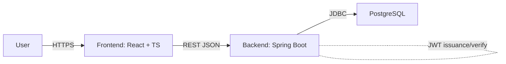
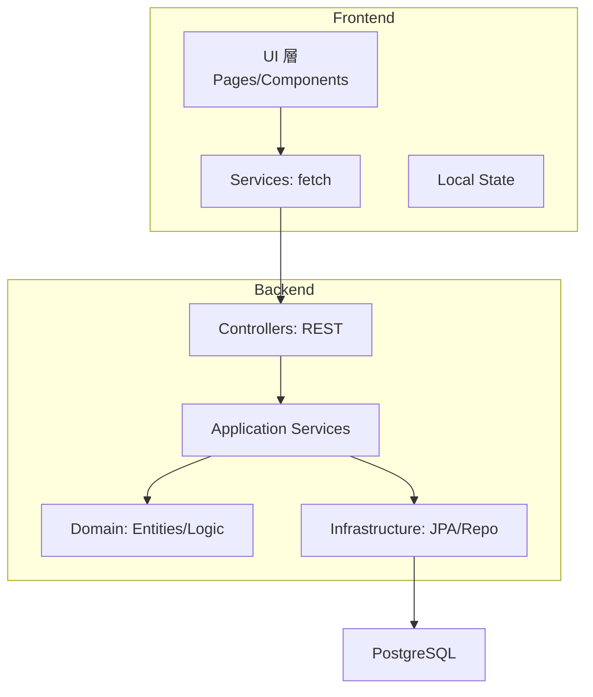
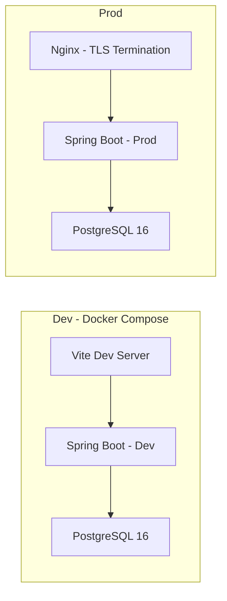
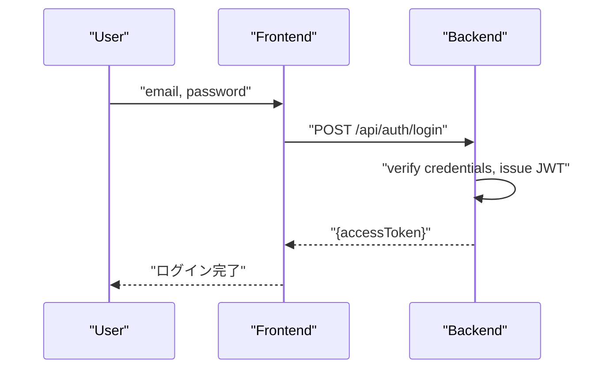
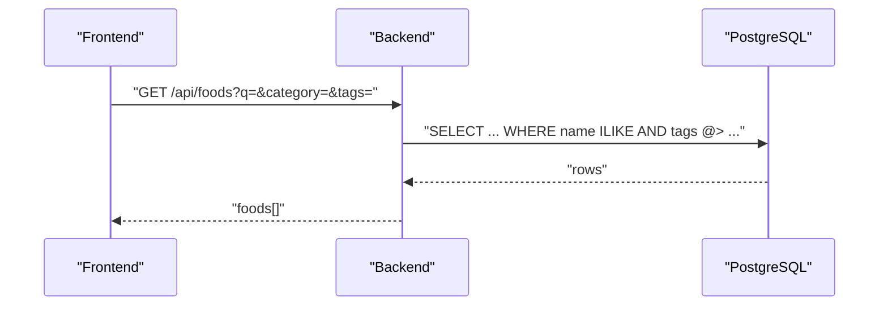
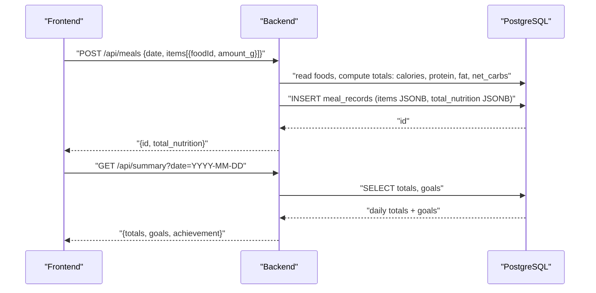

# 01. System Architecture（MVP）

本書は MeatMetrics（カーニボア用栄養計算アプリ）の MVP におけるアーキテクチャを示す。拡張性を重視しつつ、構成は最小限とする。

## 1. 前提・スコープ

- 対象: MVP（食材検索、食事記録、日別サマリー、目標設定）
- 技術: Frontend = React + TypeScript、Backend = Spring Boot (Java)、DB = PostgreSQL
- 認証: JWT（メール確認なし）
- 計算: サーバーアプリ側で実施（DB のストアド/ビューは MVP で未使用）

## 2. コンテキスト図（MVP）

## 3. 論理アーキテクチャ

## 4. デプロイ構成（開発/本番の最小）

## 5. 代表ユースケースのフロー

### 5.1 ログイン

### 5.2 食材検索

### 5.3 食事記録と日別サマリー

## 6. スケーラビリティ/拡張の指針（抜粋）

- DB の正規化/非正規化のバランスは MVP では JSONB 活用で柔軟性を確保
- タグは TEXT[] + GIN で簡便検索。将来はタグマスタへ切り出し可能
- 週/月集計の導入時は集計テーブル/キャッシュレイヤの検討
- メール配信/認証強化（Email 確認/2FA）は別コンポーネントで拡張

---

参照: `02_database.md`, `03_api.md`, `04_security.md`, 既存 `database_design.md`, `feature_specifications.md`
