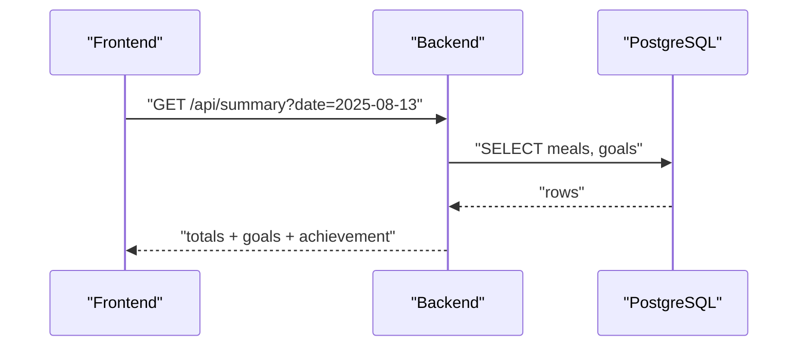

# 03. API Design（MVP）

`feature_specifications.md` 6 章の MVP API を独立文書として整理。糖質は `net_carbs` を使用。

## 1. 共通

- Base URL: `/api`
- 認証: `Authorization: Bearer <JWT>`（認証不要エンドポイントを除く）
- エラー: 共通エラーモデルを使用

```json
// Error
{
  "code": "VALIDATION_ERROR|UNAUTHORIZED|NOT_FOUND|CONFLICT|INTERNAL_ERROR",
  "message": "...",
  "details": {}
}
```

## 2. 認証

```http
POST /api/auth/register
  body: { "email": string, "password": string, "username": string }
  201: { "userId": number }

POST /api/auth/login
  body: { "email": string, "password": string }
  200: { "accessToken": string, "expiresIn": number }

POST /api/auth/logout
  204

POST /api/auth/refresh
  200: { "accessToken": string, "expiresIn": number }
```

## 3. 食材

```http
GET /api/foods?q=&category=&tags=
  200: [
    { "id": number, "name": string, "category": string, "tags": string[],
      "nutrition_per_100g": { "calories": number, "protein": number, "fat": number, "carbohydrates": number, "fiber"?: number } }
  ]

GET /api/foods/{id}
  200: {
    "id": number, "name": string, "category": string, "tags": string[],
    "nutrition_per_100g": { "calories": number, "protein": number, "fat": number, "carbohydrates": number, "fiber"?: number }
  }
```

## 4. 食事記録

```http
GET /api/meals?date=YYYY-MM-DD
  200: [ { "id": number, "date": string, "items": [ { "foodId": number, "amount_g": number } ], "total_nutrition": { "calories": number, "protein": number, "fat": number, "net_carbs": number }, "notes"?: string } ]

POST /api/meals
  body: { "date": "YYYY-MM-DD", "items": [ { "foodId": number, "amount_g": number } ], "notes"?: string }
  201: { "id": number, "total_nutrition": { "calories": number, "protein": number, "fat": number, "net_carbs": number } }

PUT /api/meals/{id}
  body: { "items"?: [ { "foodId": number, "amount_g": number } ], "notes"?: string }
  200: { "id": number, "total_nutrition": { "calories": number, "protein": number, "fat": number, "net_carbs": number } }

DELETE /api/meals/{id}
  204
```

## 5. サマリー

```http
GET /api/summary?date=YYYY-MM-DD
  200: { "date": string, "totals": { "calories": number, "protein": number, "fat": number, "net_carbs": number }, "goals": { "calorie": number, "protein_g": number, "fat_g": number, "net_carbs_g": number }, "achievement": { "calorie": number, "protein": number, "fat": number, "net_carbs": number } }
```

## 6. ユーザー

```http
GET /api/users/goals
  200: { "calorie": number, "protein_g": number, "fat_g": number, "net_carbs_g": number }

PUT /api/users/goals
  body: { "calorie": number, "protein_g": number, "fat_g": number, "net_carbs_g": number }
  200: { "calorie": number, "protein_g": number, "fat_g": number, "net_carbs_g": number }

PUT /api/users/password
  body: { "currentPassword": string, "newPassword": string }
  204
```

## 7. シーケンス（例）



---

参照: `feature_specifications.md`, `01_system_architecture.md`
