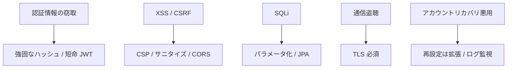

# 04. Security（MVP）

MVP における最小限のセキュリティ設計。メール確認/2FA は拡張で追加。

## 1. 認証/認可

- 認証: JWT（HS256 もしくは RS256）。MVP では短期アクセストークンのみ
- 認可: エンドポイント単位で認証必須（/auth/\* を除く）
- トークン失効: ログアウト時はフロント側破棄。重大時はサーバ側 denylist（拡張）

## 2. パスワード方針

- 保存: Argon2id もしくは BCrypt（コストは本番向け値）
- ポリシー: 8 文字以上、推奨は記号混在
- 変更: ログイン中のみ、現在のパスワード必須
- 再設定: メール送信は拡張で実装

## 3. 通信/ヘッダー

- HTTPS 前提（本番）
- CORS: dev はオリジン限定、prod は必要最小限
- セキュリティヘッダー: X-Content-Type-Options, X-Frame-Options, Referrer-Policy, Content-Security-Policy(簡易)

## 4. 入力バリデーション/エラーハンドリング

- サーバ側で DTO バリデーション（サイズ、形式、境界）
- 詳細情報の漏洩防止（スタックトレース非公開）
- 共通エラーモデルに正規化

## 5. データベース/権限

- DB ユーザーは最小権限（アプリ用ロール、管理用ロール分離）
- SQL インジェクション対策（パラメータ化、JPA 利用）
- 監査ログ（拡張）

## 6. ログ/監視（拡張）

- アクセスログ、アプリログの構造化
- 異常検知（レートリミット、アラート）

## 7. スレットモデル（MVP の想定）

---

参照: `03_api.md`, 既存セキュリティルール
