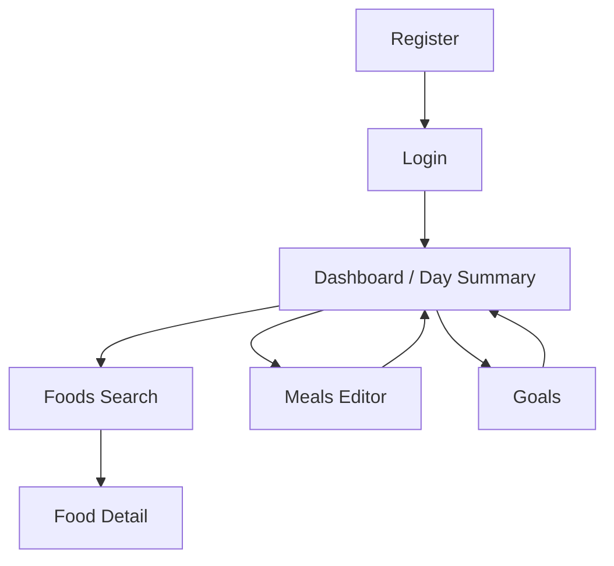
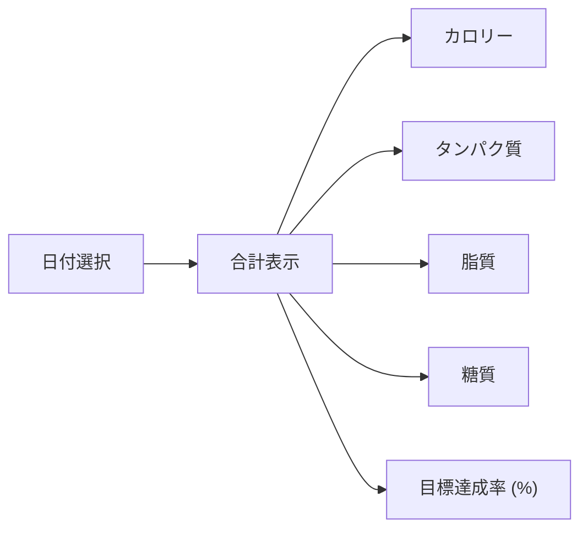

# 05. UI Design（MVP）

MVP で提供する最小画面の情報設計。詳細 UI は別途 Figma 等で補完可能。

## 1. 画面一覧（MVP）

1. 認証
   - ログイン
   - ユーザー登録
   - パスワード変更（ログイン中）
2. 食材
   - 検索/一覧（q, category, tags）
   - 詳細（マクロ表示）
3. 食事記録
   - 日付選択/入力（g 単位）
4. サマリー
   - 日別 合計と目標達成率（calories/protein/fat/net_carbs）
5. 目標設定
   - calorie, protein_g, fat_g, net_carbs_g

## 2. 画面遷移図（MVP）

## 3. サマリー画面の情報構造

## 4. コンポーネント（抜粋）

- SearchBar, TagChips, FoodCard
- MealItemRow (food selector + amount_g input)
- SummaryBars (4 本: calories, protein, fat, net_carbs)
- GoalForm (4 項目)

---

参照: `03_api.md`, `feature_specifications.md`
