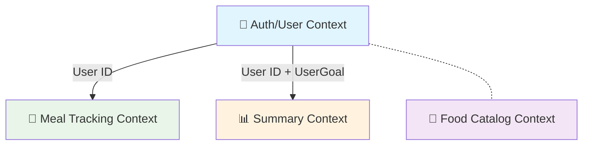
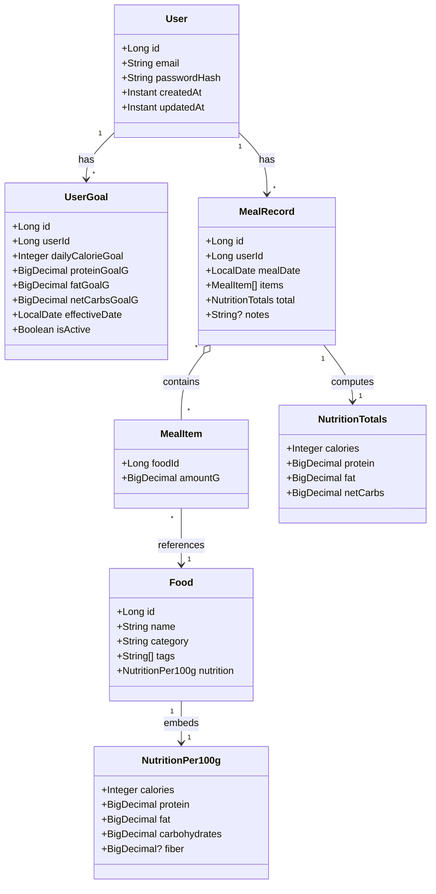

# 06. Domain Model（MVP）

MVP のドメイン境界と主要エンティティ/値オブジェクトを定義する。DDD の 4 層（Presentation, Application, Domain, Infrastructure）に準拠。

## 1. 境界づけられたコンテキスト

- **Authentication/User**: 認証機能（ユーザー登録・ログイン・JWT 管理）、ユーザー管理（プロフィール・アカウント設定）、目標設定機能（栄養目標設定・更新・履歴管理）
- **Food Catalog**: 食材・カテゴリ・タグの管理（Auth/User コンテキストとは独立）
- **Meal Tracking**: 食事記録・合計栄養の計算（User ID を外部参照で使用）
- **Summary**: 日別サマリー・達成率計算（User ID + UserGoal 情報を外部参照で使用、集計はアプリ層で実行）

### コンテキスト関係図

## 2. クラス図（MVP）

## 3. 集計ロジック（要約）

- net_carbs = carbohydrates - fiber（fiber が無い場合は carbohydrates をそのまま採用）
- total は items の food 栄養値を amount_g/100 倍して合算
- 目標達成率は totals/goal × 100 を小数点 1 桁で丸め

## 4. 集約境界と責務定義

### 4.1 User 集約

**集約構成:**

- `User` エンティティ（集約ルート）
- `UserGoal` エンティティ群（子エンティティ）
- `Email`, `Username`, `PasswordHash`（値オブジェクト）

**User 集約ルートの責務:**

1. **アイデンティティ管理**: ユーザーの一意性保証（Email・Username 重複防止）
2. **認証制御**: パスワード認証の実行、パスワード変更時の検証
3. **プロフィール整合性管理**: プロフィール情報の一貫性保証
4. **子エンティティのライフサイクル管理**: UserGoal の生成・管理・削除
5. **集約境界の不変条件維持**: 集約内の全ての不変条件チェック

**UserGoal エンティティの責務:**

1. **栄養目標値の妥当性保証**: 各栄養素の適正範囲チェック
2. **時系列管理**: 有効期間の妥当性チェック
3. **状態管理**: アクティブ/非アクティブ状態の制御
4. **自己整合性維持**: エンティティ内部の不変条件維持

### 4.2 Meal 集約

**集約構成:**

- `MealRecord` エンティティ（集約ルート、items と total を内包）

### 4.3 Food

**性質:**

- 参照専用（整合性は Food Catalog コンテキストで管理）
- 他集約からの外部参照対象

## 5. ユビキタス言語（主要用語）

### Auth/User コンテキスト

- **User (ユーザー)**: システム利用者。認証情報とプロフィール情報を持つ集約ルート
- **UserGoal (ユーザー目標)**: 1 日の栄養目標値。時系列で管理され、1 ユーザーにつき 1 つのアクティブな目標
- **Email (メールアドレス)**: ログイン用識別子。形式バリデーション付きの値オブジェクト
- **User Registration (ユーザー登録)**: 新規ユーザーアカウント作成プロセス
- **User Login (ユーザーログイン)**: Email + Password による認証プロセス
- **Goal Setting (目標設定)**: 新しい栄養目標値の設定

### 共通用語

- **net_carbs (正味糖質)**: carbohydrates - fiber（fiber が無い場合は carbohydrates をそのまま採用）
- **meal_records (食事記録)**: 日付・食材・量の記録データ
- **achievement_rate (達成率)**: totals/goal × 100 を小数点 1 桁で丸めた値

### データ項目の統一表記

- **user_id**: ユーザーの一意識別子 (BIGINT)
- **daily_calorie_goal**: 1 日のカロリー目標値 (INTEGER, 単位: kcal)
- **protein_goal_g**: 1 日のタンパク質目標値 (DECIMAL(6,2), 単位: g)
- **fat_goal_g**: 1 日の脂質目標値 (DECIMAL(6,2), 単位: g)
- **net_carbs_goal_g**: 1 日の糖質目標値 (DECIMAL(6,2), 単位: g)

---

参照: `01_system_architecture.md`, `02_database.md`, `03_api.md`, `auth_context_design.md`
