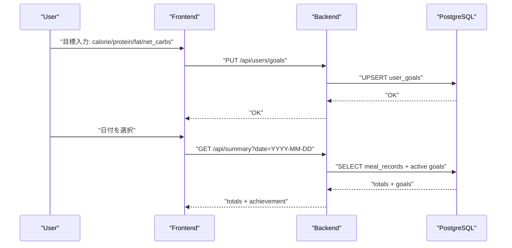
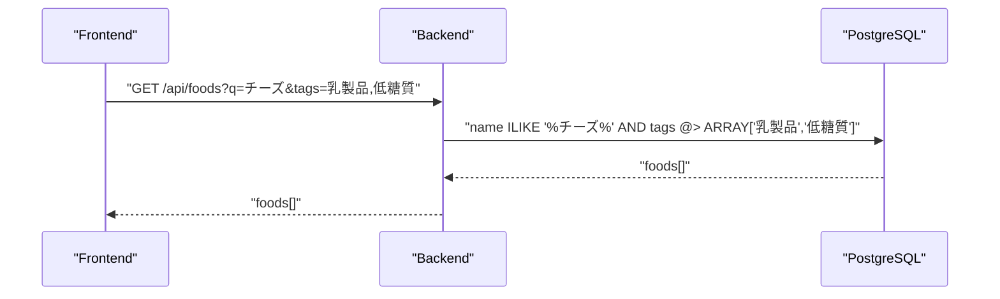
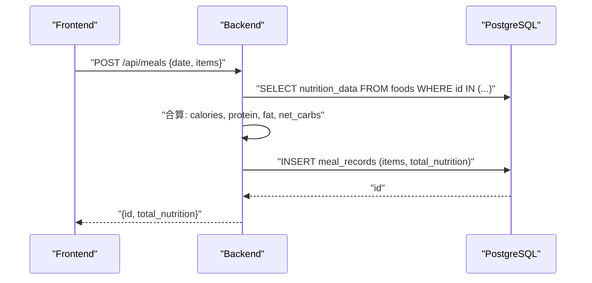

# 07. Sequence Flows（MVP）

主要ユースケースの時系列フローを図示。

## 1. 目標設定と日別サマリー

```mermaid
sequenceDiagram
  participant U as "User"
  participant FE as "Frontend"
  participant BE as "Backend"
  participant DB as "PostgreSQL"

  U->>FE: "目標入力: calorie/protein/fat/net_carbs"
  FE->>BE: "PUT /api/users/goals"
  BE->>DB: "UPSERT user_goals"
  DB-->>BE: "OK"
  BE-->>FE: "OK"
  U->>FE: "日付を選択"
  FE->>BE: "GET /api/summary?date=YYYY-MM-DD"
  BE->>DB: "SELECT meal_records + active goals"
  DB-->>BE: "totals + goals"
  BE-->>FE: "totals + achievement"
```

## 2. 複数タグを用いた食材検索

```mermaid
sequenceDiagram
  participant FE as "Frontend"
  participant BE as "Backend"
  participant DB as "PostgreSQL"

  FE->>BE: "GET /api/foods?q=チーズ&tags=乳製品,低糖質"
  BE->>DB: "name ILIKE '%チーズ%' AND tags @> ARRAY['乳製品','低糖質']"
  DB-->>BE: "foods[]"
  BE-->>FE: "foods[]"
```

## 3. 食事記録の登録

```mermaid
sequenceDiagram
  participant FE as "Frontend"
  participant BE as "Backend"
  participant DB as "PostgreSQL"

  FE->>BE: "POST /api/meals {date, items}"
  BE->>DB: "SELECT nutrition_data FROM foods WHERE id IN (...)"
  BE->>BE: "合算: calories, protein, fat, net_carbs"
  BE->>DB: "INSERT meal_records (items, total_nutrition)"
  DB-->>BE: "id"
  BE-->>FE: "{id, total_nutrition}"
```

---

参照: `03_api.md`, `06_domain_model.md`
