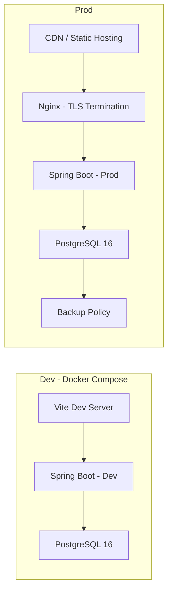

# 10. Infrastructure Design（MVP）

## 1. 構成概要

## 2. ネットワーク/セキュリティ

- 本番は HTTPS 前提、DB はプライベートネットワークのみ公開
- CORS/セキュリティヘッダーはアプリで設定（`04_security.md`）

## 3. デプロイ

- Dev: Docker Compose（フロントは Vite、バックエンドは Spring Boot Dev）
- Prod: Nginx 経由で Spring Boot、静的ファイルは CDN/オブジェクトストレージ

## 4. データベース

- PostgreSQL 16、永続ボリューム
- バックアップ: 日次フル + WAL（保持 7 日）

## 5. ログ/監視（拡張）

- アプリログの構造化、アラート、メトリクス導入

参照: docs/99.Qiita/Docker による開発環境コンテナ化.md, docs/2_detail/04_security.md
