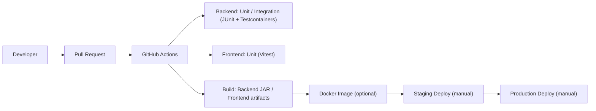

# 11. CI/CD 設計（MVP）

## 1. パイプライン概要



## 2. ジョブ構成（推奨）

- triggers: `pull_request`, `push`（main）
- jobs:
  - setup: checkout, Java 17, Node 18, cache
  - backend-test: `mvn -q -DskipITs=false test`（Testcontainers で PostgreSQL）
  - frontend-test: `npm ci && npm run test:ci`
  - build: `mvn -q -DskipTests package` と `npm run build`
  - docker（任意）: `docker build/push`（要 Secrets）
  - deploy（手動）: staging/prod へデプロイ（環境別ジョブ）

## 3. 成否判定とゲート

- PR は backend-test と frontend-test が Green でなければマージ不可
- main への push で build を実行（必要に応じて docker）

## 4. キャッシュ/最適化

- Maven と npm の依存をキャッシュ
- Testcontainers: Reuse はオフ（安定性優先）、CI では毎回起動

## 5. 成果物

- Backend: `target/*.jar`
- Frontend: `dist/`（静的ファイル）
- Docker: `meatmetrics/backend`, `meatmetrics/frontend`（任意）

## 6. 環境変数/Secrets

- DB 接続、JWT 秘密鍵、Docker Registry 認証は GitHub Secrets を利用

## 7. 参考 YAML（骨子）

```yaml
name: ci
on:
  pull_request:
  push:
    branches: [main]
jobs:
  backend-test:
    runs-on: ubuntu-latest
    steps:
      - uses: actions/checkout@v4
      - uses: actions/setup-java@v4
        with:
          distribution: temurin
          java-version: "17"
      - name: Test (Backend)
        run: mvn -q -DskipITs=false test
  frontend-test:
    runs-on: ubuntu-latest
    steps:
      - uses: actions/checkout@v4
      - uses: actions/setup-node@v4
        with:
          node-version: "18"
      - run: npm ci && npm run test:ci
```

---

参照: `docs/2_detail/09_test_strategy.md`, `docs/2_detail/10_infrastructure.md`
