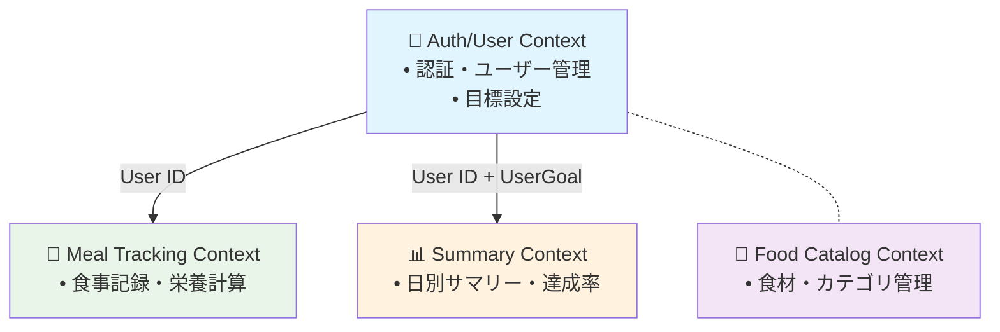
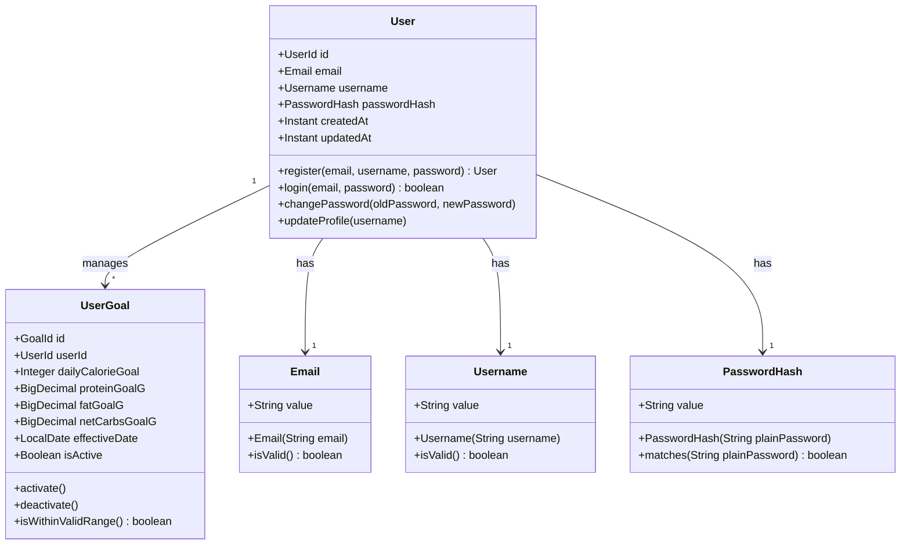

# Auth/User Context Design（MVP）

DDD における Auth/User 境界づけられたコンテキストの詳細設計。認証・ユーザー管理・目標設定の責務を担う。

## 1. コンテキスト概要

### 1.1 責務と境界

**責務 (Responsibilities):**

- 認証機能 (Authentication): ユーザー登録、ログイン認証、JWT 管理
- ユーザー管理 (User Management): プロフィール管理、アカウント設定
- 目標設定機能 (Goal Management): 栄養目標設定・更新、履歴管理

**境界 (Boundaries):**

- 他コンテキストへの User ID 提供（上流コンテキスト）
- Food Catalog コンテキストとは完全独立
- Meal Tracking・Summary コンテキストに対して上流関係

### 1.2 コンテキスト関係図



## 2. ユビキタス言語

### 2.1 コア概念

| 用語               | 英語         | 定義                                                       | 型           |
| ------------------ | ------------ | ---------------------------------------------------------- | ------------ |
| ユーザー           | User         | システム利用者。認証情報とプロフィール情報を持つ集約ルート | Entity       |
| ユーザー目標       | UserGoal     | 1 日の栄養目標値。時系列で管理                             | Entity       |
| メールアドレス     | Email        | ログイン用識別子。形式バリデーション付き                   | Value Object |
| ユーザー名         | Username     | 表示用名前。一意性制約付き                                 | Value Object |
| パスワードハッシュ | PasswordHash | 暗号化されたパスワード                                     | Value Object |

### 2.2 プロセス・アクション

| 用語               | 英語              | 定義                                     |
| ------------------ | ----------------- | ---------------------------------------- |
| ユーザー登録       | User Registration | 新規ユーザーアカウント作成プロセス       |
| ユーザーログイン   | User Login        | Email + Password による認証プロセス      |
| ユーザーログアウト | User Logout       | アクティブセッションの終了               |
| プロフィール更新   | Profile Update    | ユーザー基本情報の変更                   |
| パスワード変更     | Password Change   | 既存パスワードの更新（強度チェック付き） |
| 目標設定           | Goal Setting      | 新しい栄養目標値の設定                   |
| 目標更新           | Goal Update       | 既存目標値の変更（履歴管理）             |

### 2.3 データ項目

| 項目               | 型           | 制約            | 説明                        |
| ------------------ | ------------ | --------------- | --------------------------- |
| user_id            | BIGINT       | PRIMARY KEY     | ユーザーの一意識別子        |
| email              | VARCHAR(255) | UNIQUE NOT NULL | ログイン用メールアドレス    |
| username           | VARCHAR(100) | UNIQUE NOT NULL | 表示用ユーザー名            |
| password_hash      | VARCHAR(255) | NOT NULL        | ハッシュ化されたパスワード  |
| daily_calorie_goal | INTEGER      | 800-5000        | 1 日のカロリー目標値 (kcal) |
| protein_goal_g     | DECIMAL(6,2) | 50-500          | 1 日のタンパク質目標値 (g)  |
| fat_goal_g         | DECIMAL(6,2) | 30-400          | 1 日の脂質目標値 (g)        |
| net_carbs_goal_g   | DECIMAL(6,2) | 0-150           | 1 日の糖質目標値 (g)        |
| effective_date     | DATE         | NOT NULL        | 目標の適用開始日            |
| is_active          | BOOLEAN      | DEFAULT true    | 目標の有効状態              |

### 2.4 ビジネスルール

| ルール名               | 定義                                                    |
| ---------------------- | ------------------------------------------------------- |
| Email Uniqueness       | システム内で同一メールアドレスは 1 ユーザーのみ登録可能 |
| Username Uniqueness    | システム内で同一ユーザー名は 1 ユーザーのみ使用可能     |
| Password Strength      | 最低 8 文字、英数字含有必須                             |
| Active Goal Uniqueness | 1 ユーザーにつき同時にアクティブな目標は 1 つのみ       |
| Goal Value Ranges      | 各栄養素目標値は定められた妥当性範囲内                  |

## 3. ドメインモデル

### 3.1 集約設計



### 3.2 集約ルート: User

**DDD における集約ルートとしての責務:**

**1. アイデンティティ管理 (Identity Management)**

- ユーザーの一意性保証（Email・Username 重複防止）
- ユーザー識別子の管理とライフサイクル制御

**2. 認証制御 (Authentication Control)**

- パスワード認証の実行（`login()`メソッド）
- パスワード変更時の現在パスワード検証（`changePassword()`メソッド）
- 認証状態の管理

**3. プロフィール整合性管理 (Profile Integrity Management)**

- プロフィール情報の一貫性保証
- 更新タイミングの制御（`updateProfile()`メソッド）

**4. 子エンティティのライフサイクル管理 (Child Entity Lifecycle Management)**

- UserGoal の生成・管理・削除（`setGoal()`メソッド）
- アクティブ目標の単一性保証（自動的な既存目標の非アクティブ化）
- 目標履歴の整合性維持

**5. 集約境界の不変条件維持 (Aggregate Invariant Enforcement)**

- 集約内の全ての不変条件チェック
- トランザクション境界の定義

**集約レベルの不変条件:**

**ユーザー一意性制約:**

- Email は システム全体で一意（`validateEmailUniqueness()`で検証）
- Username は システム全体で一意（`validateUsernameUniqueness()`で検証）

**アクティブ目標単一性制約:**

- 同一ユーザーで同時にアクティブな UserGoal は 1 つのみ（`validateGoals()`で検証）
- 新規目標設定時の既存目標自動非アクティブ化

**認証情報整合性制約:**

- PasswordHash は強度要件を満たす必要がある
- Email, Username, PasswordHash は必須（null 不可）

### 3.3 子エンティティ: UserGoal

**エンティティとしての責務:**

**1. 栄養目標値の妥当性保証 (Nutritional Goal Validation)**

- 各栄養素の適正範囲チェック（健康的な範囲内）
  - カロリー: 800-5000 kcal
  - タンパク質: 50-500g
  - 脂質: 30-400g
  - 糖質: 0-150g
- 目標値間の論理的整合性検証
- ビジネスルールに基づく制約実施

**2. 時系列管理 (Temporal Management)**

- 有効期間の妥当性チェック（1 年以内の未来日付まで）
- 目標の時系列整合性保証
- 履歴管理のサポート

**3. 状態管理 (State Management)**

- アクティブ/非アクティブ状態の制御（`activate()`, `deactivate()`メソッド）
- 状態遷移のルール実施
- 状態変更時の副作用処理

**4. 自己整合性維持 (Self-Consistency Maintenance)**

- エンティティ内部の不変条件維持
- 不正状態の防止
- データ整合性の保証

**エンティティレベルの不変条件:**

- 栄養目標値は妥当性範囲内（`validateGoalValues()`で検証）
- 有効期間は 1 年以内の未来日付まで（`validateEffectiveDate()`で検証）
- userId は正の値必須（`validateUserId()`で検証）

**責務の境界:**

- UserGoal は独立したエンティティとして自身の整合性のみを担当
- 他の UserGoal との関係性（アクティブ目標の単一性等）は User 集約ルートが管理
- 外部コンテキストとの整合性は担当しない

### 3.4 集約境界とトランザクション境界

**User 集約の境界:**

```
User集約 {
  - User (集約ルート)
  - UserGoal* (子エンティティ群)
  - Email (値オブジェクト)
  - Username (値オブジェクト)
  - PasswordHash (値オブジェクト)
}
```

**トランザクション境界:**

- 1 つの User 集約全体が 1 つのトランザクション境界
- User 集約の変更は原子的に実行される
- 他の集約との結合度は最小限（ID による外部参照のみ）

**集約間の関係:**

- **Auth/User コンテキスト** → **Meal Tracking コンテキスト**: User ID による参照
- **Auth/User コンテキスト** → **Summary コンテキスト**: User ID + UserGoal 情報による参照
- **Auth/User コンテキスト** ⊥ **Food Catalog コンテキスト**: 完全独立

**不変条件の責務分離:**

- **集約内不変条件**: User 集約ルートが保証
- **集約間不変条件**: アプリケーションサービスが調整
- **グローバル不変条件**: ドメインサービスが管理

## 4. ドメイン例外

```java
// ユーザー関連例外
public class DuplicateEmailException extends DomainException {
    public DuplicateEmailException(String email) {
        super("Email already exists: " + email);
    }
}

public class DuplicateUsernameException extends DomainException {
    public DuplicateUsernameException(String username) {
        super("Username already exists: " + username);
    }
}

public class InvalidPasswordException extends DomainException {
    public InvalidPasswordException(String reason) {
        super("Invalid password: " + reason);
    }
}

public class WeakPasswordException extends DomainException {
    public WeakPasswordException() {
        super("Password does not meet strength requirements");
    }
}

// 目標関連例外
public class InvalidGoalValueException extends DomainException {
    public InvalidGoalValueException(String field, Object value) {
        super("Invalid goal value for " + field + ": " + value);
    }
}

public class MultipleActiveGoalsException extends DomainException {
    public MultipleActiveGoalsException(Long userId) {
        super("User has multiple active goals: " + userId);
    }
}
```

## 5. アプリケーションサービス

### 5.1 UserService

```java
@Service
public class UserService {

    public User registerUser(String email, String username, String password) {
        // 1. 入力検証
        // 2. 重複チェック
        // 3. User集約生成
        // 4. 永続化
    }

    public String loginUser(String email, String password) {
        // 1. 認証処理
        // 2. JWT Token生成
        // 3. 返却
    }

    public void updateUserProfile(Long userId, String newUsername) {
        // 1. User集約取得
        // 2. プロフィール更新
        // 3. 永続化
    }
}
```

### 5.2 GoalService

```java
@Service
public class GoalService {

    public void setUserGoal(Long userId, UserGoalRequest request) {
        // 1. 既存アクティブ目標の無効化
        // 2. 新規目標の生成・検証
        // 3. 永続化
    }

    public UserGoal getActiveGoal(Long userId) {
        // 1. アクティブ目標取得
        // 2. 存在確認
        // 3. 返却
    }
}
```

## 6. インフラストラクチャ

### 6.1 リポジトリインターフェース

```java
public interface UserRepository {
    Optional<User> findById(Long id);
    Optional<User> findByEmail(String email);
    Optional<User> findByUsername(String username);
    User save(User user);
    boolean existsByEmail(String email);
    boolean existsByUsername(String username);
}

public interface UserGoalRepository {
    Optional<UserGoal> findActiveByUserId(Long userId);
    List<UserGoal> findByUserIdOrderByEffectiveDateDesc(Long userId);
    UserGoal save(UserGoal userGoal);
    void deactivateAllByUserId(Long userId);
}
```

### 6.2 JPA 実装

```java
@Entity
@Table(name = "users")
public class UserEntity {
    @Id
    @GeneratedValue(strategy = GenerationType.IDENTITY)
    private Long id;

    @Column(unique = true, nullable = false)
    private String email;

    @Column(unique = true, nullable = false)
    private String username;

    @Column(nullable = false)
    private String passwordHash;

    @CreationTimestamp
    private Instant createdAt;

    @UpdateTimestamp
    private Instant updatedAt;
}

@Entity
@Table(name = "user_goals")
public class UserGoalEntity {
    @Id
    @GeneratedValue(strategy = GenerationType.IDENTITY)
    private Long id;

    @Column(nullable = false)
    private Long userId;

    @Column(nullable = false)
    private Integer dailyCalorieGoal;

    @Column(nullable = false, precision = 6, scale = 2)
    private BigDecimal proteinGoalG;

    @Column(nullable = false, precision = 6, scale = 2)
    private BigDecimal fatGoalG;

    @Column(nullable = false, precision = 6, scale = 2)
    private BigDecimal netCarbsGoalG;

    @Column(nullable = false)
    private LocalDate effectiveDate;

    @Column(nullable = false)
    private Boolean isActive;

    @CreationTimestamp
    private Instant createdAt;

    @UpdateTimestamp
    private Instant updatedAt;
}
```

## 7. API 設計

### 7.1 認証エンドポイント

```yaml
paths:
  /api/auth/register:
    post:
      summary: ユーザー登録
      requestBody:
        required: true
        content:
          application/json:
            schema:
              type: object
              properties:
                email:
                  type: string
                  format: email
                username:
                  type: string
                  minLength: 3
                  maxLength: 20
                password:
                  type: string
                  minLength: 8
      responses:
        201:
          description: 登録成功
          content:
            application/json:
              schema:
                type: object
                properties:
                  userId:
                    type: integer
                    format: int64

  /api/auth/login:
    post:
      summary: ユーザーログイン
      requestBody:
        required: true
        content:
          application/json:
            schema:
              type: object
              properties:
                email:
                  type: string
                  format: email
                password:
                  type: string
      responses:
        200:
          description: ログイン成功
          content:
            application/json:
              schema:
                type: object
                properties:
                  accessToken:
                    type: string
                  expiresIn:
                    type: integer
```

### 7.2 目標管理エンドポイント

```yaml
paths:
  /api/users/{userId}/goals:
    post:
      summary: 目標設定
      security:
        - BearerAuth: []
      parameters:
        - name: userId
          in: path
          required: true
          schema:
            type: integer
            format: int64
      requestBody:
        required: true
        content:
          application/json:
            schema:
              type: object
              properties:
                dailyCalorieGoal:
                  type: integer
                  minimum: 800
                  maximum: 5000
                proteinGoalG:
                  type: number
                  format: decimal
                  minimum: 50
                  maximum: 500
                fatGoalG:
                  type: number
                  format: decimal
                  minimum: 30
                  maximum: 400
                netCarbsGoalG:
                  type: number
                  format: decimal
                  minimum: 0
                  maximum: 150
                effectiveDate:
                  type: string
                  format: date
      responses:
        201:
          description: 目標設定成功

    get:
      summary: アクティブ目標取得
      security:
        - BearerAuth: []
      parameters:
        - name: userId
          in: path
          required: true
          schema:
            type: integer
            format: int64
      responses:
        200:
          description: 目標取得成功
          content:
            application/json:
              schema:
                type: object
                properties:
                  goalId:
                    type: integer
                    format: int64
                  dailyCalorieGoal:
                    type: integer
                  proteinGoalG:
                    type: number
                    format: decimal
                  fatGoalG:
                    type: number
                    format: decimal
                  netCarbsGoalG:
                    type: number
                    format: decimal
                  effectiveDate:
                    type: string
                    format: date
                  isActive:
                    type: boolean
```

## 8. テスト戦略

### 8.1 ユニットテスト

**ドメインロジックのテスト:**

```java
@Test
class UserTest {
    @Test
    void shouldCreateValidUser() {
        // Given
        Email email = new Email("test@example.com");
        Username username = new Username("testuser");
        PasswordHash passwordHash = new PasswordHash("password123");

        // When
        User user = User.create(email, username, passwordHash);

        // Then
        assertThat(user.getEmail()).isEqualTo(email);
        assertThat(user.getUsername()).isEqualTo(username);
    }

    @Test
    void shouldThrowExceptionForInvalidEmail() {
        // Given & When & Then
        assertThatThrownBy(() -> new Email("invalid-email"))
            .isInstanceOf(InvalidEmailException.class);
    }
}

@Test
class UserGoalTest {
    @Test
    void shouldCreateValidGoal() {
        // Given
        Long userId = 1L;
        Integer calorieGoal = 2000;
        BigDecimal proteinGoal = new BigDecimal("150.00");

        // When
        UserGoal goal = UserGoal.create(userId, calorieGoal, proteinGoal, ...);

        // Then
        assertThat(goal.getDailyCalorieGoal()).isEqualTo(calorieGoal);
        assertThat(goal.isWithinValidRange()).isTrue();
    }
}
```

### 8.2 統合テスト

**リポジトリテスト:**

```java
@DataJpaTest
class UserRepositoryTest {
    @Test
    void shouldFindUserByEmail() {
        // Given
        UserEntity user = createTestUser();
        entityManager.persistAndFlush(user);

        // When
        Optional<User> found = userRepository.findByEmail("test@example.com");

        // Then
        assertThat(found).isPresent();
        assertThat(found.get().getEmail().getValue()).isEqualTo("test@example.com");
    }
}
```

## 9. 実装済み詳細（MVP 完了分）

### 9.1 値オブジェクト実装状況

#### Email 値オブジェクト

- **ファイル**: `domain/user/Email.java`
- **実装済み機能**:
  - RFC 5322 準拠のメールアドレス形式バリデーション
  - 255 文字以内の長さ制限
  - 正規化処理（小文字変換）
  - 前後空白の自動除去
  - 等価性比較（値オブジェクト特性）
- **不変条件**: 有効なメールアドレス形式、長さ制限遵守
- **例外**: `InvalidEmailException`

#### Username 値オブジェクト

- **ファイル**: `domain/user/Username.java`
- **実装済み機能**:
  - 3-30 文字の長さ制限
  - 英数字・アンダースコア・ハイフンのみ許可
  - 前後空白の自動除去
  - 等価性比較
- **不変条件**: 文字種制限、長さ制限遵守
- **例外**: `InvalidUsernameException`

#### PasswordHash 値オブジェクト

- **ファイル**: `domain/user/PasswordHash.java`
- **実装済み機能**:
  - BCrypt によるハッシュ化
  - パスワード強度チェック（最低 8 文字、英数字含有）
  - 平文パスワードとの照合
  - データベースからの復元サポート
  - セキュアな toString 実装
- **不変条件**: パスワード強度要件満足
- **例外**: `WeakPasswordException`

### 9.2 エンティティ実装状況

#### UserGoal エンティティ

- **ファイル**: `domain/user/UserGoal.java`
- **実装済み機能**:
  - 栄養目標値の妥当性範囲チェック
    - カロリー: 800-5000 kcal
    - タンパク質: 50-500g
    - 脂質: 30-400g
    - 糖質: 0-150g
  - 有効期間管理（1 年以内の未来日付まで）
  - アクティブ状態管理
  - ファクトリメソッド `createActiveGoal`
- **不変条件**: 栄養目標値範囲内、有効な有効期間
- **例外**: `InvalidGoalValueException`

#### User 集約ルート

- **ファイル**: `domain/user/User.java`
- **実装済み機能**:
  - ユーザー登録（ファクトリメソッド `register`）
  - 認証処理（`login`, `changePassword`）
  - プロフィール管理（`updateProfile`）
  - 目標設定・管理（`setGoal`, `getActiveGoal`）
  - 既存アクティブ目標の自動非アクティブ化
  - 重複チェック支援メソッド
- **不変条件**:
  - Email・Username 一意性
  - アクティブ UserGoal 単一性
  - 必須フィールド非 null
- **例外**: `DuplicateEmailException`, `DuplicateUsernameException`, `MultipleActiveGoalsException`

### 9.3 ドメイン例外体系

#### 基底例外

- **ファイル**: `domain/user/exception/DomainException.java`
- **役割**: 全ドメイン例外の基底クラス

#### 実装済み例外クラス

- `InvalidEmailException`: メールアドレス形式・制約違反
- `InvalidUsernameException`: ユーザー名制約違反
- `WeakPasswordException`: パスワード強度不足
- `DuplicateEmailException`: メールアドレス重複
- `DuplicateUsernameException`: ユーザー名重複
- `InvalidGoalValueException`: 目標値範囲外・制約違反
- `MultipleActiveGoalsException`: 複数アクティブ目標違反

### 9.4 テスト実装状況

#### ユニットテストカバレッジ

- **EmailTest**: 形式バリデーション、制約チェック、正規化処理
- **UsernameTest**: 文字種制限、長さ制限、等価性
- **PasswordHashTest**: 強度チェック、ハッシュ化、照合機能
- **UserGoalTest**: 栄養目標値バリデーション、状態管理
- **UserTest**: 集約の不変条件、認証処理、目標管理

#### テスト方針

- TDD 原則に従った設計駆動テスト
- 境界値テストとエッジケースの網羅
- ビジネスルール違反時の例外テスト
- 不変条件維持の検証

### 9.5 実装完了したビジネスルール

#### Email 重複禁止ルール

- **実装場所**: `User.validateEmailUniqueness()`
- **検証タイミング**: ユーザー登録時、メールアドレス変更時
- **例外**: `DuplicateEmailException`

#### Username 重複禁止ルール

- **実装場所**: `User.validateUsernameUniqueness()`
- **検証タイミング**: ユーザー登録時、ユーザー名変更時
- **例外**: `DuplicateUsernameException`

#### パスワード強度ルール

- **実装場所**: `PasswordHash.isStrongEnough()`
- **要件**: 最低 8 文字、英文字と数字を含む
- **検証タイミング**: パスワード設定・変更時
- **例外**: `WeakPasswordException`

#### アクティブ目標単一性ルール

- **実装場所**: `User.setGoal()`, `User.validateGoals()`
- **要件**: 1 ユーザーにつき同時にアクティブな目標は 1 つのみ
- **自動制御**: 新目標設定時に既存目標を自動非アクティブ化
- **例外**: `MultipleActiveGoalsException`

#### 栄養目標値妥当性ルール

- **実装場所**: `UserGoal.validateGoalValues()`
- **範囲制限**: 各栄養素ごとに健康的な範囲を定義
- **検証タイミング**: 目標設定・更新時
- **例外**: `InvalidGoalValueException`

## 10. 将来拡張

### 10.1 認証機能強化

- **メール確認機能**: EmailVerificationToken エンティティ追加
- **2FA 対応**: TwoFactorAuth 値オブジェクト追加
- **OAuth2 連携**: ExternalAuthProvider エンティティ追加

### 10.2 プロフィール機能拡張

- **UserProfile エンティティ分離**: 基本情報と詳細プロフィールの分離
- **アバター管理**: ProfileImage 値オブジェクト追加
- **設定管理**: UserSettings エンティティ追加

### 10.3 目標管理強化

- **目標テンプレート**: GoalTemplate エンティティ追加
- **目標カテゴリ**: GoalCategory 値オブジェクト追加
- **進捗分析**: GoalProgress エンティティ追加

---

**参照**: `06_domain_model.md`, `01_system_architecture.md`, `02_database.md`, `03_api.md`
