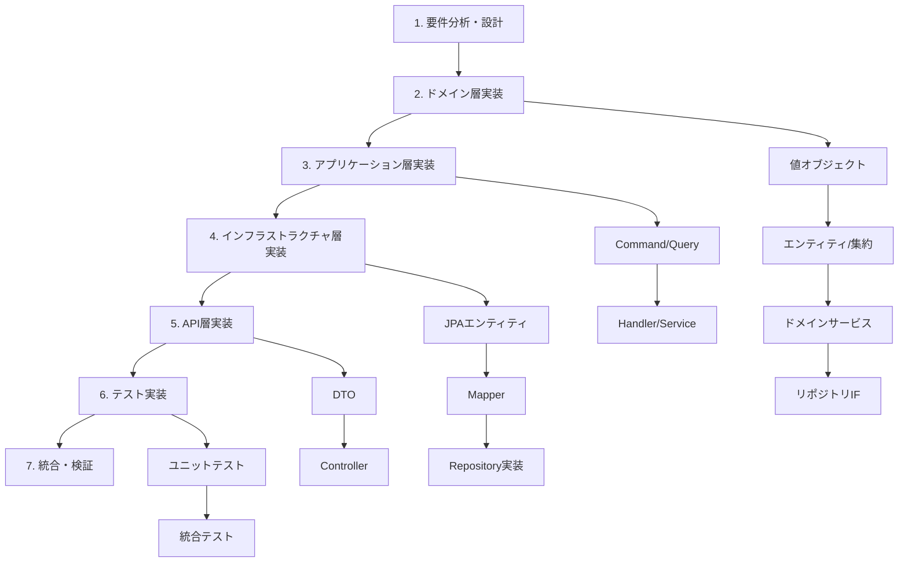

# DDD API 実装手順ガイド（user コンテキスト/profile ドメイン向け）

auth コンテキストの実装パターンを参考に、ドメイン駆動開発時の API 実装手順を標準化。

## 1. 実装手順概要



## 2. 詳細実装手順

### Step 1: 要件分析・設計

#### 1.1 ユビキタス言語の定義

```markdown
## profile ドメインのユビキタス言語例

| 用語         | 英語        | 定義                     | 型           |
| ------------ | ----------- | ------------------------ | ------------ |
| プロフィール | Profile     | ユーザーの基本情報と設定 | Entity       |
| 表示名       | DisplayName | ユーザーの表示用名前     | Value Object |
| アバター     | Avatar      | プロフィール画像 URL     | Value Object |
| 誕生日       | BirthDate   | ユーザーの生年月日       | Value Object |
| 性別         | Gender      | ユーザーの性別情報       | Enum         |
```

#### 1.2 集約境界の設計

```markdown
## Profile 集約の設計

### 集約構成

- Profile（集約ルート）
- ProfileSettings（子エンティティ）
- DisplayName, Avatar, BirthDate（値オブジェクト）

### 不変条件

- ユーザー ID は必須・正の値
- 表示名は 3-50 文字、特殊文字制限
- 誕生日は過去の日付のみ
- アバター画像は有効な URL 形式
```

#### 1.3 API 仕様の定義

```yaml
# API仕様例（profileドメイン）
paths:
  /api/users/{userId}/profile:
    get:
      summary: プロフィール取得
      security:
        - BearerAuth: []
    put:
      summary: プロフィール更新
      security:
        - BearerAuth: []
      requestBody:
        required: true
        content:
          application/json:
            schema:
              type: object
              properties:
                displayName:
                  type: string
                  minLength: 3
                  maxLength: 50
                avatar:
                  type: string
                  format: uri
                birthDate:
                  type: string
                  format: date
                gender:
                  type: string
                  enum: [MALE, FEMALE, OTHER, UNSPECIFIED]
```

### Step 2: ドメイン層実装

#### 2.1 値オブジェクトの実装

```java
// 参考: com.meatmetrics.auth.domain.account.PasswordHash
// 実装場所: src/main/java/com/meatmetrics/user/domain/profile/DisplayName.java

/**
 * 表示名値オブジェクト
 *
 * <p>ユーザーの表示用名前を表現する値オブジェクト。
 * 3-50文字、英数字・日本語・一部記号のみ許可。</p>
 */
public class DisplayName {
    private final String value;

    public DisplayName(String value) {
        validateDisplayName(value);
        this.value = value.trim();
    }

    private void validateDisplayName(String value) {
        if (value == null || value.trim().isEmpty()) {
            throw new InvalidDisplayNameException("表示名は必須です");
        }

        String trimmed = value.trim();
        if (trimmed.length() < 3 || trimmed.length() > 50) {
            throw new InvalidDisplayNameException("表示名は3-50文字で入力してください");
        }

        // 日本語・英数字・一部記号のみ許可
        if (!trimmed.matches("^[\\p{IsHan}\\p{IsHiragana}\\p{IsKatakana}\\w\\s\\-_.]+$")) {
            throw new InvalidDisplayNameException("表示名に使用できない文字が含まれています");
        }
    }

    public String getValue() { return value; }

    @Override
    public boolean equals(Object o) {
        if (this == o) return true;
        if (o == null || getClass() != o.getClass()) return false;
        DisplayName that = (DisplayName) o;
        return Objects.equals(value, that.value);
    }

    @Override
    public int hashCode() {
        return Objects.hash(value);
    }
}
```

#### 2.2 ドメイン例外の実装

```java
// 実装場所: src/main/java/com/meatmetrics/user/domain/exception/

public class InvalidDisplayNameException extends DomainException {
    public InvalidDisplayNameException(String message) {
        super("Invalid display name: " + message);
    }
}

public class InvalidProfileDataException extends DomainException {
    public InvalidProfileDataException(String field, Object value) {
        super("Invalid profile data for " + field + ": " + value);
    }
}
```

#### 2.3 エンティティ/集約ルートの実装

```java
// 参考: com.meatmetrics.auth.domain.account.Account
// 実装場所: src/main/java/com/meatmetrics/user/domain/profile/Profile.java

/**
 * Profile集約ルート
 * ユーザーのプロフィール情報を管理する。
 */
public class Profile {
    private final Long id;
    private final Long userId;
    private DisplayName displayName;
    private Avatar avatar;
    private BirthDate birthDate;
    private Gender gender;
    private final Instant createdAt;
    private Instant updatedAt;

    /**
     * 新規Profileを作成する
     */
    public Profile(Long userId, DisplayName displayName) {
        this(null, userId, displayName, null, null, Gender.UNSPECIFIED,
             Instant.now(), Instant.now());
    }

    /**
     * 既存Profileを復元する
     */
    public Profile(Long id, Long userId, DisplayName displayName, Avatar avatar,
                   BirthDate birthDate, Gender gender, Instant createdAt, Instant updatedAt) {
        validateUserId(userId);
        validateDisplayName(displayName);

        this.id = id;
        this.userId = userId;
        this.displayName = displayName;
        this.avatar = avatar;
        this.birthDate = birthDate;
        this.gender = gender != null ? gender : Gender.UNSPECIFIED;
        this.createdAt = createdAt != null ? createdAt : Instant.now();
        this.updatedAt = updatedAt != null ? updatedAt : Instant.now();
    }

    /**
     * ファクトリメソッド：プロフィール作成
     */
    public static Profile create(Long userId, DisplayName displayName) {
        return new Profile(userId, displayName);
    }

    /**
     * プロフィール更新
     */
    public void updateProfile(DisplayName displayName, Avatar avatar,
                             BirthDate birthDate, Gender gender) {
        if (displayName != null) {
            this.displayName = displayName;
        }
        this.avatar = avatar;
        this.birthDate = birthDate;
        this.gender = gender != null ? gender : this.gender;
        this.updatedAt = Instant.now();
    }

    private void validateUserId(Long userId) {
        if (userId == null || userId <= 0) {
            throw new IllegalArgumentException("User ID must be positive");
        }
    }

    private void validateDisplayName(DisplayName displayName) {
        if (displayName == null) {
            throw new IllegalArgumentException("Display name cannot be null");
        }
    }

    // Getters...
    public Long getId() { return id; }
    public Long getUserId() { return userId; }
    public DisplayName getDisplayName() { return displayName; }
    public Avatar getAvatar() { return avatar; }
    public BirthDate getBirthDate() { return birthDate; }
    public Gender getGender() { return gender; }
    public Instant getCreatedAt() { return createdAt; }
    public Instant getUpdatedAt() { return updatedAt; }
}
```

#### 2.4 リポジトリインターフェース定義

```java
// 参考: com.meatmetrics.auth.domain.repository.AccountRepository
// 実装場所: src/main/java/com/meatmetrics/user/domain/repository/ProfileRepository.java

public interface ProfileRepository {
    Optional<Profile> findByUserId(Long userId);
    Profile save(Profile profile);
    void deleteByUserId(Long userId);
    boolean existsByUserId(Long userId);
}
```

### Step 3: アプリケーション層実装

#### 3.1 Command/Query オブジェクト

```java
// 参考: com.meatmetrics.auth.application.command.RegisterAccountCommand
// 実装場所: src/main/java/com/meatmetrics/user/application/command/

/**
 * プロフィール更新コマンド
 */
public class UpdateProfileCommand {
    private final String displayName;
    private final String avatar;
    private final LocalDate birthDate;
    private final String gender;

    public UpdateProfileCommand(String displayName, String avatar,
                               LocalDate birthDate, String gender) {
        this.displayName = displayName;
        this.avatar = avatar;
        this.birthDate = birthDate;
        this.gender = gender;
    }

    // ドメイン値オブジェクトへの変換メソッド
    public DisplayName toDisplayName() {
        return displayName != null ? new DisplayName(displayName) : null;
    }

    public Avatar toAvatar() {
        return avatar != null ? new Avatar(avatar) : null;
    }

    public BirthDate toBirthDate() {
        return birthDate != null ? new BirthDate(birthDate) : null;
    }

    public Gender toGender() {
        return gender != null ? Gender.valueOf(gender.toUpperCase()) : null;
    }

    // Getters...
    public String getDisplayName() { return displayName; }
    public String getAvatar() { return avatar; }
    public LocalDate getBirthDate() { return birthDate; }
    public String getGender() { return gender; }
}
```

#### 3.2 Handler/Service 実装

```java
// 参考: com.meatmetrics.auth.application.handler.RegisterAccountHandler
// 実装場所: src/main/java/com/meatmetrics/user/application/handler/

/**
 * プロフィール更新ハンドラー
 */
@Service
@Transactional
public class UpdateProfileHandler {
    private final ProfileRepository profileRepository;

    public UpdateProfileHandler(ProfileRepository profileRepository) {
        this.profileRepository = profileRepository;
    }

    /**
     * プロフィール更新処理
     */
    public UpdateProfileResponse updateProfile(Long userId, UpdateProfileCommand command) {
        // 1. 既存プロフィール取得
        Profile profile = profileRepository.findByUserId(userId)
                .orElseThrow(() -> new ProfileNotFoundException(userId));

        // 2. コマンドからドメイン値オブジェクトに変換
        DisplayName displayName = command.toDisplayName();
        Avatar avatar = command.toAvatar();
        BirthDate birthDate = command.toBirthDate();
        Gender gender = command.toGender();

        // 3. ドメインロジックでプロフィール更新
        profile.updateProfile(displayName, avatar, birthDate, gender);

        // 4. 永続化
        Profile updatedProfile = profileRepository.save(profile);

        // 5. レスポンス作成
        return UpdateProfileResponse.from(updatedProfile);
    }
}
```

### Step 4: インフラストラクチャ層実装

#### 4.1 JPA エンティティ

```java
// 参考: com.meatmetrics.auth.infrastructure.persistence.AccountEntity
// 実装場所: src/main/java/com/meatmetrics/user/infrastructure/persistence/

@Entity
@Table(name = "user_profiles")
public class ProfileEntity {
    @Id
    @GeneratedValue(strategy = GenerationType.IDENTITY)
    private Long id;

    @Column(name = "user_id", nullable = false, unique = true)
    private Long userId;

    @Column(name = "display_name", nullable = false, length = 50)
    private String displayName;

    @Column(name = "avatar", length = 255)
    private String avatar;

    @Column(name = "birth_date")
    private LocalDate birthDate;

    @Enumerated(EnumType.STRING)
    @Column(name = "gender", nullable = false)
    private Gender gender;

    @CreationTimestamp
    @Column(name = "created_at", nullable = false)
    private Instant createdAt;

    @UpdateTimestamp
    @Column(name = "updated_at", nullable = false)
    private Instant updatedAt;

    // コンストラクタ、getters、setters...

    public ProfileEntity() {}

    public ProfileEntity(Long userId, String displayName, String avatar,
                        LocalDate birthDate, Gender gender) {
        this.userId = userId;
        this.displayName = displayName;
        this.avatar = avatar;
        this.birthDate = birthDate;
        this.gender = gender != null ? gender : Gender.UNSPECIFIED;
    }
}
```

#### 4.2 マッパー実装

```java
// 参考: com.meatmetrics.auth.infrastructure.persistence.AccountMapper
// 実装場所: src/main/java/com/meatmetrics/user/infrastructure/persistence/

/**
 * ProfileとProfileEntityの変換マッパー
 */
@Component
public class ProfileMapper {

    /**
     * ドメインモデル → JPAエンティティ
     */
    public ProfileEntity toEntity(Profile profile) {
        return new ProfileEntity(
            profile.getUserId(),
            profile.getDisplayName().getValue(),
            profile.getAvatar() != null ? profile.getAvatar().getValue() : null,
            profile.getBirthDate() != null ? profile.getBirthDate().getValue() : null,
            profile.getGender()
        );
    }

    /**
     * JPAエンティティ → ドメインモデル
     */
    public Profile toDomain(ProfileEntity entity) {
        DisplayName displayName = new DisplayName(entity.getDisplayName());
        Avatar avatar = entity.getAvatar() != null ? new Avatar(entity.getAvatar()) : null;
        BirthDate birthDate = entity.getBirthDate() != null ? new BirthDate(entity.getBirthDate()) : null;

        return new Profile(
            entity.getId(),
            entity.getUserId(),
            displayName,
            avatar,
            birthDate,
            entity.getGender(),
            entity.getCreatedAt(),
            entity.getUpdatedAt()
        );
    }
}
```

#### 4.3 リポジトリ実装

```java
// 参考: com.meatmetrics.auth.infrastructure.persistence.AccountRepositoryJpaImpl
// 実装場所: src/main/java/com/meatmetrics/user/infrastructure/persistence/

@Repository
public class ProfileRepositoryJpaImpl implements ProfileRepository {

    private final ProfileJpaRepository jpaRepository;
    private final ProfileMapper mapper;

    public ProfileRepositoryJpaImpl(ProfileJpaRepository jpaRepository, ProfileMapper mapper) {
        this.jpaRepository = jpaRepository;
        this.mapper = mapper;
    }

    @Override
    public Optional<Profile> findByUserId(Long userId) {
        return jpaRepository.findByUserId(userId)
                .map(mapper::toDomain);
    }

    @Override
    public Profile save(Profile profile) {
        ProfileEntity entity = mapper.toEntity(profile);
        ProfileEntity saved = jpaRepository.save(entity);
        return mapper.toDomain(saved);
    }

    @Override
    public void deleteByUserId(Long userId) {
        jpaRepository.deleteByUserId(userId);
    }

    @Override
    public boolean existsByUserId(Long userId) {
        return jpaRepository.existsByUserId(userId);
    }
}

// JPAリポジトリインターフェース
public interface ProfileJpaRepository extends JpaRepository<ProfileEntity, Long> {
    Optional<ProfileEntity> findByUserId(Long userId);
    void deleteByUserId(Long userId);
    boolean existsByUserId(Long userId);
}
```

### Step 5: API 層実装

#### 5.1 DTO 定義

```java
// 参考: com.meatmetrics.auth.dto.request.RegisterRequest
// 実装場所: src/main/java/com/meatmetrics/api/user/dto/request/

/**
 * プロフィール更新リクエスト
 */
public class UpdateProfileRequest {

    @NotBlank(message = "表示名は必須です")
    @Size(min = 3, max = 50, message = "表示名は3-50文字で入力してください")
    private String displayName;

    @Size(max = 255, message = "アバターURLは255文字以内で入力してください")
    private String avatar;

    @Past(message = "誕生日は過去の日付を入力してください")
    private LocalDate birthDate;

    @Pattern(regexp = "MALE|FEMALE|OTHER|UNSPECIFIED", message = "性別が無効です")
    private String gender;

    // コンストラクタ、getters、setters...

    /**
     * Command変換メソッド
     */
    public UpdateProfileCommand toCommand() {
        return new UpdateProfileCommand(
            displayName != null ? displayName.trim() : null,
            avatar != null ? avatar.trim() : null,
            birthDate,
            gender != null ? gender.trim().toUpperCase() : null
        );
    }
}

/**
 * プロフィール更新レスポンス
 */
public class UpdateProfileResponse {
    private Long id;
    private String displayName;
    private String avatar;
    private LocalDate birthDate;
    private String gender;
    private Instant updatedAt;

    /**
     * ドメインモデルからレスポンス作成
     */
    public static UpdateProfileResponse from(Profile profile) {
        UpdateProfileResponse response = new UpdateProfileResponse();
        response.id = profile.getId();
        response.displayName = profile.getDisplayName().getValue();
        response.avatar = profile.getAvatar() != null ? profile.getAvatar().getValue() : null;
        response.birthDate = profile.getBirthDate() != null ? profile.getBirthDate().getValue() : null;
        response.gender = profile.getGender().name();
        response.updatedAt = profile.getUpdatedAt();
        return response;
    }

    // getters、setters...
}
```

#### 5.2 Controller 実装

```java
// 参考: com.meatmetrics.api.auth.AuthController
// 実装場所: src/main/java/com/meatmetrics/api/user/ProfileController.java

/**
 * プロフィールAPI Controller
 */
@RestController
@RequestMapping("/api/users")
public class ProfileController {

    private final UpdateProfileHandler updateProfileHandler;
    private final GetProfileHandler getProfileHandler;
    private final JwtTokenService jwtTokenService;

    public ProfileController(UpdateProfileHandler updateProfileHandler,
                           GetProfileHandler getProfileHandler,
                           JwtTokenService jwtTokenService) {
        this.updateProfileHandler = updateProfileHandler;
        this.getProfileHandler = getProfileHandler;
        this.jwtTokenService = jwtTokenService;
    }

    /**
     * プロフィール取得API
     */
    @GetMapping("/{userId}/profile")
    public ResponseEntity<ApiResponse<GetProfileResponse>> getProfile(
            @PathVariable Long userId,
            HttpServletRequest request) {

        // 認証チェック
        validateUserAccess(userId, request);

        GetProfileResponse response = getProfileHandler.getProfile(userId);

        return ResponseEntity.ok(ApiResponse.success("プロフィール取得完了", response));
    }

    /**
     * プロフィール更新API
     */
    @PutMapping("/{userId}/profile")
    public ResponseEntity<ApiResponse<UpdateProfileResponse>> updateProfile(
            @PathVariable Long userId,
            @Valid @RequestBody UpdateProfileRequest request,
            HttpServletRequest servletRequest) {

        // 認証チェック
        validateUserAccess(userId, servletRequest);

        // リクエストをコマンドに変換
        UpdateProfileCommand command = request.toCommand();

        // サービス層でビジネスロジック実行
        UpdateProfileResponse response = updateProfileHandler.updateProfile(userId, command);

        return ResponseEntity.ok(ApiResponse.success("プロフィール更新完了", response));
    }

    /**
     * ユーザーアクセス権限チェック
     */
    private void validateUserAccess(Long userId, HttpServletRequest request) {
        String authorizationHeader = request.getHeader("Authorization");
        if (authorizationHeader == null || !authorizationHeader.startsWith("Bearer ")) {
            throw new UnauthorizedException("認証トークンが見つかりません");
        }

        String token = authorizationHeader.substring(7);
        if (!jwtTokenService.validateToken(token)) {
            throw new UnauthorizedException("無効なトークンです");
        }

        Long tokenUserId = jwtTokenService.extractUserId(token);
        if (!userId.equals(tokenUserId)) {
            throw new ForbiddenException("アクセス権限がありません");
        }
    }
}
```

### Step 6: テスト実装

#### 6.1 ユニットテスト

```java
// 実装場所: src/test/java/com/meatmetrics/user/domain/profile/

/**
 * DisplayName値オブジェクトのテスト
 */
@Test
class DisplayNameTest {

    @Test
    void 正常な表示名で値オブジェクトが作成できる() {
        // Given
        String validName = "テストユーザー";

        // When
        DisplayName displayName = new DisplayName(validName);

        // Then
        assertThat(displayName.getValue()).isEqualTo(validName);
    }

    @Test
    void 短すぎる表示名で例外が発生する() {
        // Given
        String shortName = "ab";

        // When & Then
        assertThatThrownBy(() -> new DisplayName(shortName))
            .isInstanceOf(InvalidDisplayNameException.class)
            .hasMessageContaining("3-50文字");
    }

    @Test
    void 無効な文字を含む表示名で例外が発生する() {
        // Given
        String invalidName = "test<script>";

        // When & Then
        assertThatThrownBy(() -> new DisplayName(invalidName))
            .isInstanceOf(InvalidDisplayNameException.class)
            .hasMessageContaining("使用できない文字");
    }
}

/**
 * Profile集約のテスト
 */
@Test
class ProfileTest {

    @Test
    void 正常なプロフィールが作成できる() {
        // Given
        Long userId = 1L;
        DisplayName displayName = new DisplayName("テストユーザー");

        // When
        Profile profile = Profile.create(userId, displayName);

        // Then
        assertThat(profile.getUserId()).isEqualTo(userId);
        assertThat(profile.getDisplayName()).isEqualTo(displayName);
        assertThat(profile.getGender()).isEqualTo(Gender.UNSPECIFIED);
    }

    @Test
    void プロフィール更新が正常に行われる() {
        // Given
        Profile profile = Profile.create(1L, new DisplayName("元の名前"));
        DisplayName newDisplayName = new DisplayName("新しい名前");
        Avatar avatar = new Avatar("https://example.com/avatar.jpg");
        BirthDate birthDate = new BirthDate(LocalDate.of(1990, 1, 1));
        Gender gender = Gender.MALE;

        // When
        profile.updateProfile(newDisplayName, avatar, birthDate, gender);

        // Then
        assertThat(profile.getDisplayName()).isEqualTo(newDisplayName);
        assertThat(profile.getAvatar()).isEqualTo(avatar);
        assertThat(profile.getBirthDate()).isEqualTo(birthDate);
        assertThat(profile.getGender()).isEqualTo(gender);
    }
}
```

#### 6.2 統合テスト

```java
// 実装場所: src/test/java/com/meatmetrics/user/infrastructure/persistence/

/**
 * ProfileRepositoryJpaImplの統合テスト
 */
@DataJpaTest
@AutoConfigureTestDatabase(replace = AutoConfigureTestDatabase.Replace.NONE)
@TestPropertySource(locations = "classpath:application-integration.properties")
class ProfileRepositoryJpaImplTest {

    @Autowired
    private TestEntityManager entityManager;

    @Autowired
    private ProfileJpaRepository jpaRepository;

    private ProfileRepositoryJpaImpl repository;

    @BeforeEach
    void setUp() {
        ProfileMapper mapper = new ProfileMapper();
        repository = new ProfileRepositoryJpaImpl(jpaRepository, mapper);
    }

    @Test
    void ユーザーIDでプロフィールが正常に取得できる() {
        // Given
        ProfileEntity entity = new ProfileEntity(1L, "テストユーザー", null, null, Gender.UNSPECIFIED);
        entityManager.persistAndFlush(entity);

        // When
        Optional<Profile> found = repository.findByUserId(1L);

        // Then
        assertThat(found).isPresent();
        assertThat(found.get().getUserId()).isEqualTo(1L);
        assertThat(found.get().getDisplayName().getValue()).isEqualTo("テストユーザー");
    }

    @Test
    void プロフィールが正常に保存できる() {
        // Given
        Profile profile = Profile.create(1L, new DisplayName("新規ユーザー"));

        // When
        Profile saved = repository.save(profile);

        // Then
        assertThat(saved.getId()).isNotNull();
        assertThat(saved.getUserId()).isEqualTo(1L);
        assertThat(saved.getDisplayName().getValue()).isEqualTo("新規ユーザー");
    }
}
```

### Step 7: 統合・検証

#### 7.1 API 統合テスト

```java
// 実装場所: src/test/java/com/meatmetrics/api/user/

@SpringBootTest(webEnvironment = SpringBootTest.WebEnvironment.RANDOM_PORT)
@TestPropertySource(locations = "classpath:application-integration.properties")
class ProfileControllerIntegrationTest {

    @Autowired
    private TestRestTemplate restTemplate;

    @Autowired
    private JwtTokenService jwtTokenService;

    @Test
    void プロフィール更新APIが正常に動作する() {
        // Given
        Long userId = 1L;
        String token = jwtTokenService.generateToken(userId, "test@example.com");

        UpdateProfileRequest request = new UpdateProfileRequest();
        request.setDisplayName("更新後ユーザー");
        request.setGender("MALE");

        HttpHeaders headers = new HttpHeaders();
        headers.setBearerAuth(token);
        HttpEntity<UpdateProfileRequest> entity = new HttpEntity<>(request, headers);

        // When
        ResponseEntity<ApiResponse> response = restTemplate.exchange(
            "/api/users/" + userId + "/profile",
            HttpMethod.PUT,
            entity,
            ApiResponse.class
        );

        // Then
        assertThat(response.getStatusCode()).isEqualTo(HttpStatus.OK);
        assertThat(response.getBody().getMessage()).isEqualTo("プロフィール更新完了");
    }
}
```

## 3. 実装チェックリスト

### ドメイン層チェックリスト

- [ ] 値オブジェクトの不変性確保
- [ ] エンティティの不変条件実装
- [ ] ドメイン例外の適切な定義
- [ ] リポジトリインターフェースの定義
- [ ] ビジネスルールのドメイン層への集約

### アプリケーション層チェックリスト

- [ ] Command/Query の明確な分離
- [ ] Handler でのトランザクション境界設定
- [ ] ドメインサービスの適切な使用
- [ ] 例外変換の実装

### インフラストラクチャ層チェックリスト

- [ ] JPA エンティティの適切な設計
- [ ] Mapper での変換ロジック実装
- [ ] Repository 実装での例外ハンドリング
- [ ] データベース制約の設定

### API 層チェックリスト

- [ ] DTO でのバリデーション設定
- [ ] 認証・認可の実装
- [ ] 統一 API レスポンス形式の使用
- [ ] 適切な HTTP ステータスコード返却

### テストチェックリスト

- [ ] ドメインロジックのユニットテスト
- [ ] リポジトリの統合テスト
- [ ] API エンドポイントのテスト
- [ ] エラーケースのテスト網羅

## 4. 参考実装例

### auth コンテキストからの学習ポイント

1. **値オブジェクトの設計**

   - `Email`, `Username`, `PasswordHash`の実装パターン
   - バリデーション付きコンストラクター
   - 等価性比較の実装

2. **集約ルートの責務**

   - `Account`の不変条件維持
   - ファクトリメソッドの活用
   - 子エンティティのライフサイクル管理

3. **アプリケーションサービスの構成**

   - Command/Handler 分離パターン
   - トランザクション境界の設定
   - ドメインオブジェクトの生成・永続化

4. **インフラ層の実装**
   - JPA エンティティとドメインモデルの分離
   - Mapper による変換の標準化
   - リポジトリ実装での例外処理

## 5. 注意点・ベストプラクティス

### DDD 設計原則

- ドメイン層は他層への依存を持たない
- 集約境界を明確に定義する
- ユビキタス言語を一貫して使用する
- 不変条件はドメイン層で保証する

### パフォーマンス考慮

- 集約の粒度を適切に設計する
- N+1 問題を回避するクエリ設計
- 適切なトランザクション境界の設定

### セキュリティ

- 認証・認可の適切な実装
- 入力バリデーションの徹底
- SQL インジェクション対策

---

**参照**: `auth_context_design.md`, `06_domain_model.md`, `01_system_architecture.md`
