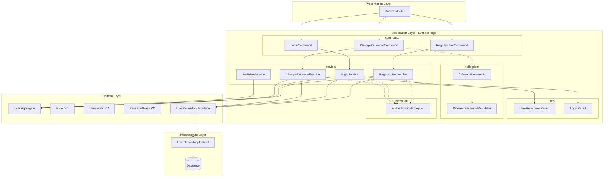
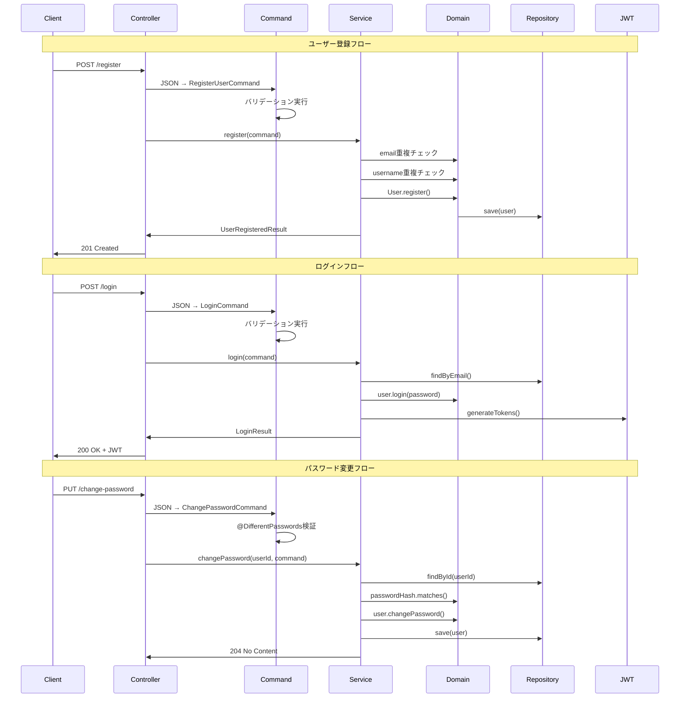
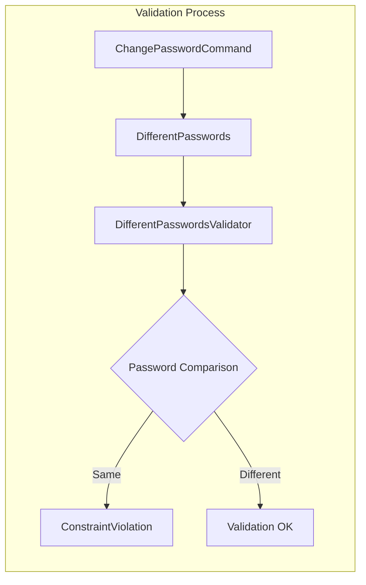
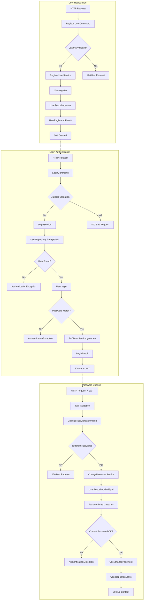

# Spring Boot 認証アーキテクチャ完全解説：DDD による auth 層の責務分離とデータフロー設計

## はじめに

本記事では、現在作成中のアプリケーションの認証部分についてまとめているものです。（備忘録です）

DDD を意識して設計し、認証には JWT を用いています。

## 全体アーキテクチャ概観

サンプルアプリケーションの `auth` パッケージは、以下の 5 つの層で構成されています：



## レイヤー別責務詳解

### 1. Command 層：入力データの受け口

#### 役割と特徴

- **目的**: HTTP リクエストからアプリケーション層への入力データ変換
- **責務**: バリデーション、ドメイン値オブジェクトへの変換
- **特徴**: 不変オブジェクト、一度きりの使用

#### 主要クラス

**RegisterUserCommand**

```java
public class RegisterUserCommand {
    @NotNull @Email @Size(max = 255)
    private String email;

    @NotNull @Size(min = 8, max = 100)
    private String password;

    @NotNull @Size(min = 3, max = 50)
    @Pattern(regexp = "^[a-zA-Z0-9_-]+$")
    private String username;

    // ドメイン変換メソッド
    public Email toEmail() { return new Email(this.email); }
    public Username toUsername() { return new Username(this.username); }
}
```

**設計ポイント**：

- Jakarta Validation による入力検証
- ドメイン値オブジェクトへの変換責務
- Jackson（JSON ↔ Java）のためのデフォルトコンストラクタ

### 2. Service 層：ユースケースの編成

#### 認証フロー全体図



#### RegisterUserService：新規ユーザー登録

```java
@Service
@Transactional
public class RegisterUserService {
    public UserRegisteredResult register(RegisterUserCommand command) {
        // 1. ドメイン値オブジェクト変換
        Email email = command.toEmail();
        Username username = command.toUsername();

        // 2. 重複チェック（ビジネスルール）
        validateEmailUniqueness(email);
        validateUsernameUniqueness(username);

        // 3. ドメインモデル生成
        PasswordHash passwordHash = new PasswordHash(command.getPassword());
        User newUser = User.register(email, username, passwordHash);

        // 4. 永続化
        User savedUser = userRepository.save(newUser);

        // 5. レスポンス生成
        return UserRegisteredResult.from(savedUser);
    }
}
```

**設計ポイント**：

- ドメインロジックは User エンティティに委譲
- アプリケーションサービスは流れの制御に集中
- トランザクション境界の管理

#### LoginService：認証とトークン発行

```java
@Service
@Transactional
public class LoginService {
    public LoginResult login(LoginCommand command) {
        // 1. ユーザー検索
        Email email = command.toEmail();
        User user = userRepository.findByEmail(email)
            .orElseThrow(() -> new AuthenticationException("認証に失敗しました"));

        // 2. パスワード照合（ドメインの責務）
        if (!user.login(command.getPassword())) {
            throw new AuthenticationException("認証に失敗しました");
        }

        // 3. JWT生成
        String accessToken = jwtTokenService.generateAccessToken(user);
        String refreshToken = jwtTokenService.generateRefreshToken(user);

        // 4. レスポンス組み立て
        return LoginResult.from(user, accessToken, refreshToken, expirationSeconds);
    }
}
```

**セキュリティ考慮事項**：

- 認証失敗時のメッセージは統一（情報漏洩防止）
- パスワード照合はドメイン層で実行
- JWT 生成は専用サービスに分離

#### JwtTokenService：JWT 管理の専門化

```java
@Service
public class JwtTokenService {
    // トークン生成
    public String generateAccessToken(User user) { /* ... */ }
    public String generateRefreshToken(User user) { /* ... */ }

    // トークン検証
    public boolean validateToken(String token) { /* ... */ }
    public Long extractUserId(String token) { /* ... */ }

    // 設定値取得
    public Long getAccessTokenExpirationSeconds() { /* ... */ }
}
```

**分離の理由**：

- JWT の複雑性を隠蔽
- 認証ロジックと JWT 技術詳細の分離
- テスタビリティの向上

### 3. DTO 層：出力データの整形

#### 設計原則

- **入力と出力の非対称性**: Command と DTO は別々に最適化
- **セキュリティ**: パスワードハッシュ等の機密情報は含まない
- **API 進化**: フロントエンドの要求に合わせて柔軟に変更可能

#### UserRegisteredResult 例

```java
public class UserRegisteredResult {
    private Long userId;
    private String email;
    private String username;
    private LocalDateTime createdAt;

    // ファクトリメソッドでドメインオブジェクトから変換
    public static UserRegisteredResult from(User user) {
        return new UserRegisteredResult(
            user.getId(),
            user.getEmail().getValue(),
            user.getUsername().getValue(),
            user.getCreatedAt().atZone(ZoneId.systemDefault()).toLocalDateTime()
        );
    }
}
```

### 4. Validation 層：カスタム制約の実装

#### 複数フィールド間の制約



#### 実装詳細

**アノテーション定義**：

```java
@Target(ElementType.TYPE)
@Retention(RetentionPolicy.RUNTIME)
@Constraint(validatedBy = DifferentPasswordsValidator.class)
public @interface DifferentPasswords {
    String message() default "新しいパスワードは現在のパスワードと異なる必要があります";
    Class<?>[] groups() default {};
    Class<? extends Payload>[] payload() default {};
}
```

**バリデーター実装**：

```java
public class DifferentPasswordsValidator
    implements ConstraintValidator<DifferentPasswords, ChangePasswordCommand> {

    @Override
    public boolean isValid(ChangePasswordCommand command, ConstraintValidatorContext context) {
        if (command.getCurrentPassword() == null || command.getNewPassword() == null) {
            return true; // @NotNull に委譲
        }
        return !command.getCurrentPassword().equals(command.getNewPassword());
    }
}
```

### 5. Exception 層：認証エラーの統一処理

#### AuthenticationException の役割

```java
public class AuthenticationException extends RuntimeException {
    public AuthenticationException(String message) {
        super(message);
    }
}
```

**使用場面**：

- ログイン時の認証失敗
- パスワード変更時の現在パスワード不一致
- JWT トークンの不正や期限切れ

## データフロー完全図解

### 登録からログインまでの完全フロー



## アーキテクチャ設計の利点

### 1. 関心の分離

- **Command**: 入力検証に特化
- **Service**: ユースケースの編成
- **DTO**: 出力整形に特化
- **Exception**: エラー処理の統一

### 2. テスタビリティ

- 各層が独立してテスト可能
- モックを使った単体テスト
- 統合テストでの E2E 検証

### 3. 拡張性

- 新しい認証方式の追加が容易
- JWT 以外のトークン方式への切り替え可能
- バリデーションルールの追加・変更が影響範囲限定

### 4. セキュリティ

- パスワードハッシュ化はドメイン層で保証
- 認証情報の漏洩防止
- 入力検証の多層防御

## まとめ

本記事で解説した認証アーキテクチャは、DDD の原則に従って以下を実現しています：

1. **明確な責務分離**: 各クラスが単一の責任を持つ
2. **ドメイン中心設計**: ビジネスロジックはドメイン層に集約
3. **技術詳細の分離**: JWT 等の技術実装を隠蔽
4. **保守性の確保**: 変更影響範囲の限定

このアーキテクチャにより、認証機能の複雑性を管理しつつ、ビジネス要求の変化に柔軟に対応できる設計となっています。
