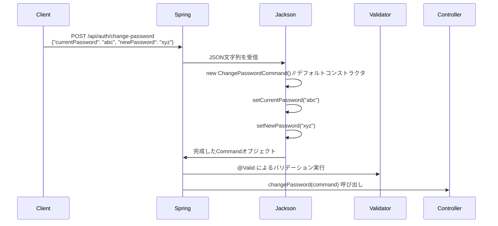
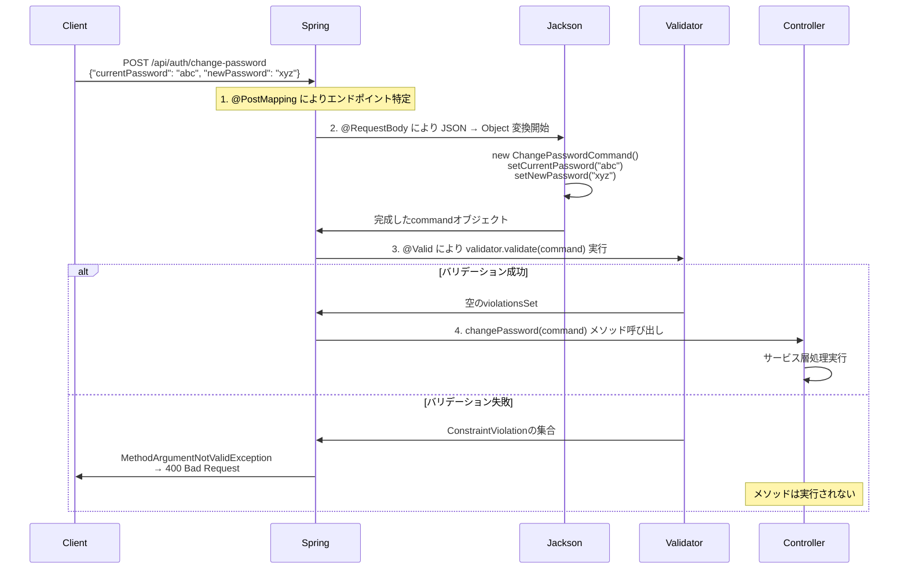

# Spring Boot Bean Validation 完全理解：テストコードから学ぶインスタンス化とバリデーションの仕組み

## はじめに

Spring Boot でテストコードを書いていて、ふと疑問に思ったことはありませんか？

```java
@Test
void validCommand_shouldPassValidation() {
    ChangePasswordCommand cmd = new ChangePasswordCommand("CurrentPass123", "NewPass456");
    Set<ConstraintViolation<ChangePasswordCommand>> violations = validator.validate(cmd);
    assertThat(violations).isEmpty();
}
```

この`validator.validate(cmd)`って一体何をしているの？🤔

そして、もっと疑問なのが...

```java
ChangePasswordCommand cmd = new ChangePasswordCommand(null, "短い"); // 複数エラー
```

**「え、これってインスタンス化した時点で例外が投げられるんじゃないの？」**

実はここに、Spring Boot の Bean Validation とオブジェクト変換の奥深い仕組みが隠されているんです。

今回は、そんな疑問から始まって分かった「Spring Boot の自動変換＆バリデーション」の仕組みを、分かりやすく解説してみます！

## 🔍 まずは基本：Bean Validation って何してるの？

### インスタンス化では例外は投げられない！

多くの人が勘違いしがちなポイントがここです：

```java
// これは普通に成功する（例外なし）
ChangePasswordCommand cmd = new ChangePasswordCommand(null, "短い");
System.out.println("インスタンス化完了！"); // この行は実行される

// バリデーションは明示的に実行したときのみ動作
Set<ConstraintViolation<ChangePasswordCommand>> violations = validator.validate(cmd);
// ↑ ここで初めてバリデーションが実行され、違反が検出される
```

### なぜこの設計なのか？

Bean Validation が「宣言的バリデーション」だからです：

1. **パフォーマンス**: 毎回のインスタンス化でバリデーションが走ると重い
2. **柔軟性**: 段階的にオブジェクトを構築できる
3. **責務分離**: オブジェクトの生成とバリデーションを分離

```java
// 例：段階的にオブジェクトを構築
ChangePasswordCommand cmd = new ChangePasswordCommand(); // OK
cmd.setCurrentPassword("current123");                    // OK
cmd.setNewPassword("new456");                           // OK
// この時点でvalidator.validate(cmd)を実行して初めてバリデーション
```

## 🎭 Spring Boot の魔法：JSON → オブジェクト変換

では、実際の Web アプリケーションではどうなっているのでしょうか？

### Controller での @Valid の謎

```java
@PostMapping("/api/auth/change-password")
public ResponseEntity<?> changePassword(@Valid @RequestBody ChangePasswordCommand command) {
    // ↑ この@Validが重要
    // でも、commandってどこから来たの？？

    changePasswordService.changePassword(userId, command);
    return ResponseEntity.ok().build();
}
```

**「command ってどこにも存在してなかったじゃん！」**

まさにここが、Spring Boot の**自動デシリアライゼーション**の仕組みです。

### 実際の処理フロー



### Step-by-Step で見る変換プロセス

```java
// 1. クライアントから送信されるJSON
{
  "currentPassword": "CurrentPass123",
  "newPassword": "NewPass456"
}

// 2. Spring Boot内部の処理（Jackson ObjectMapperが実行）
ChangePasswordCommand command = new ChangePasswordCommand(); // デフォルトコンストラクタ
command.setCurrentPassword("CurrentPass123");                // JSONのcurrentPasswordをセット
command.setNewPassword("NewPass456");                       // JSONのnewPasswordをセット

// 3. @Validによるバリデーション実行
Set<ConstraintViolation<ChangePasswordCommand>> violations = validator.validate(command);

// 4. バリデーション成功時、Controllerメソッドに渡される
changePassword(command); // ← ここでcommandが利用可能
```

## 🔧 必要な仕組み：デフォルトコンストラクタと Setter

Jackson がオブジェクトを作成するために必要なものがあります：

```java
public class ChangePasswordCommand {
    // 1. デフォルトコンストラクタが必須
    public ChangePasswordCommand(){}

    // 2. setterメソッドが必須（パッケージプライベートでもOK）
    void setCurrentPassword(String currentPassword) {
        this.currentPassword = currentPassword;
    }

    void setNewPassword(String newPassword) {
        this.newPassword = newPassword;
    }
}
```

### なぜ setter が`void`なのか？

```java
// パッケージプライベートのsetterメソッド
void setCurrentPassword(String currentPassword) {
    this.currentPassword = currentPassword;
}
```

- **Jackson アクセス用**: JSON → オブジェクト変換時に使用
- **外部非公開**: 他のクラスからは直接呼び出せない
- **テスト専用**: テスト時のみ利用可能

## ⚡ @Valid アノテーションの本当の役割

### バリデーション実行のタイミング

| タイミング           | 場所                                      | 動作                                  |
| -------------------- | ----------------------------------------- | ------------------------------------- |
| **インスタンス化時** | `new ChangePasswordCommand(null, "短い")` | **例外は投げられない**                |
| **@Valid 実行時**    | Controller の `@Valid @RequestBody`       | `MethodArgumentNotValidException`発生 |
| **手動実行時**       | テストの `validator.validate(cmd)`        | `Set<ConstraintViolation>`が返される  |

### 実際の実行順序

```java
@PostMapping("/change-password")
public ResponseEntity<?> changePassword(@Valid @RequestBody ChangePasswordCommand command) {
    // この時点で command は：
    // ✅ 既にインスタンス化済み
    // ✅ JSONデータがセット済み
    // ✅ バリデーション実行済み（成功したから到達）

    // 安心してcommandを使用可能
    System.out.println(command.getCurrentPassword()); // JSONの値が入っている
}
```

## 🎯 完全な処理フローの理解

### HTTP リクエスト → Controller メソッド実行まで



### 重要な 4 つのアノテーション

1. **`@PostMapping`**: HTTP ルーティング（どのメソッドを呼ぶか決定）
2. **`@RequestBody`**: JSON→ オブジェクト変換の指示
3. **`ChangePasswordCommand command`**: 変換先の型指定
4. **`@Valid`**: 変換後オブジェクトのバリデーション実行

## 🔍 ConstraintViolation って何？

### 複数のバリデーション違反を扱う

```java
// 例：複数のバリデーション違反が発生するケース
ChangePasswordCommand cmd = new ChangePasswordCommand(null, "短い");

Set<ConstraintViolation<ChangePasswordCommand>> violations = validator.validate(cmd);
// violations.size() = 3 の可能性
// 1. currentPassword が null (@NotNull違反)
// 2. currentPassword が空 (@NotBlank違反)
// 3. newPassword が短すぎる (@Size違反)
```

### ConstraintViolation の詳細情報

各バリデーション違反の詳細情報を取得できます：

```java
for (ConstraintViolation<ChangePasswordCommand> violation : violations) {
    // どのプロパティで違反したか
    String property = violation.getPropertyPath().toString(); // "currentPassword"

    // 違反したメッセージ
    String message = violation.getMessage(); // "現在のパスワードは必須です"

    // 違反した値
    Object invalidValue = violation.getInvalidValue(); // null

    // どのアノテーションで違反したか
    Class<? extends Annotation> annotation = violation.getConstraintDescriptor()
        .getAnnotation().annotationType(); // NotNull.class
}
```

## 🛠️ エラーハンドリングの仕組み

### GlobalExceptionHandler との連携

```java
@ExceptionHandler({MethodArgumentNotValidException.class, ConstraintViolationException.class})
public ResponseEntity<ErrorResponse> handleValidation(Exception exception, HttpServletRequest request) {
    // @Validでバリデーション失敗時にここが呼ばれる
    log.warn("Validation error: {} {} - {}", request.getMethod(), request.getRequestURI(),
             exception.getClass().getSimpleName());
    return ResponseEntity.status(HttpStatus.BAD_REQUEST)
        .body(body(request, "入力値が不正です。", ApiErrorCode.VALIDATION_ERROR));
}
```

### バリデーション失敗時の流れ

```java
// バリデーション失敗 → 例外発生 → ExceptionHandler → レスポンス返却
// Controller メソッドは実行されない
```

## 💡 実際のテストでの応用

### テストでの使用例

```java
@Test
@DisplayName("複数バリデーション違反の検証")
void multipleValidationErrors_shouldFail() {
    // このコマンドでは複数のバリデーション違反が発生
    ChangePasswordCommand cmd = new ChangePasswordCommand(null, "abc");

    Set<ConstraintViolation<ChangePasswordCommand>> violations = validator.validate(cmd);

    // 特定のプロパティでエラーが起きたかチェック
    assertThat(violations).anyMatch(v ->
        v.getPropertyPath().toString().equals("currentPassword")
    ); // currentPasswordで@NotNull違反

    assertThat(violations).anyMatch(v ->
        v.getPropertyPath().toString().equals("newPassword")
    ); // newPasswordで@Size違反
}
```

### カスタムバリデーションも同じ仕組み

```java
@DifferentPasswords  // カスタムバリデーション
public class ChangePasswordCommand {
    // 新旧パスワードが同じかどうかをチェック
}
```

## 🎉 まとめ：Spring Boot の美しい設計

今回の学びをまとめると：

### Bean Validation の基本原則

1. **インスタンス化では例外なし**: オブジェクト作成とバリデーションは別物
2. **宣言的バリデーション**: アノテーションでルールを定義、実行は明示的に
3. **段階的構築**: 柔軟にオブジェクトを組み立て可能

### Spring Boot の自動化の仕組み

1. **`@PostMapping`** でエンドポイント発火
2. **`@RequestBody ChangePasswordCommand`** でインスタンス化
3. **`@Valid`** でバリデーション実行
4. **成功時のみ** Controller メソッド実行

### 開発者に優しい設計

```java
// 開発者が書くコード（シンプル）
@PostMapping("/change-password")
public ResponseEntity<?> changePassword(@Valid @RequestBody ChangePasswordCommand command) {
    changePasswordService.changePassword(userId, command);
    return ResponseEntity.ok().build();
}

// Spring Bootが裏でやってくれること（複雑）
// 1. JSON parsing
// 2. Object instantiation
// 3. Property mapping
// 4. Validation execution
// 5. Error handling
```

これが Spring Boot の **「宣言的プログラミング」** の美しさです。アノテーションで「何をしたいか」を宣言するだけで、フレームワークが全部やってくれる！

### 最初の疑問に戻って

```java
Set<ConstraintViolation<ChangePasswordCommand>> violations = validator.validate(cmd);
```

この 1 行の裏には、以下の深い仕組みが隠されていました：

- Bean Validation のライフサイクル
- Spring Boot の自動変換機能
- Jackson ObjectMapper の動作
- エラーハンドリングの統合

テストコードから始まった小さな疑問が、Spring Boot の核心的な仕組みの理解につながりました。

**コードを読む時は「なぜ？」を大切にしましょう。きっと新しい発見があるはずです！** 🚀
