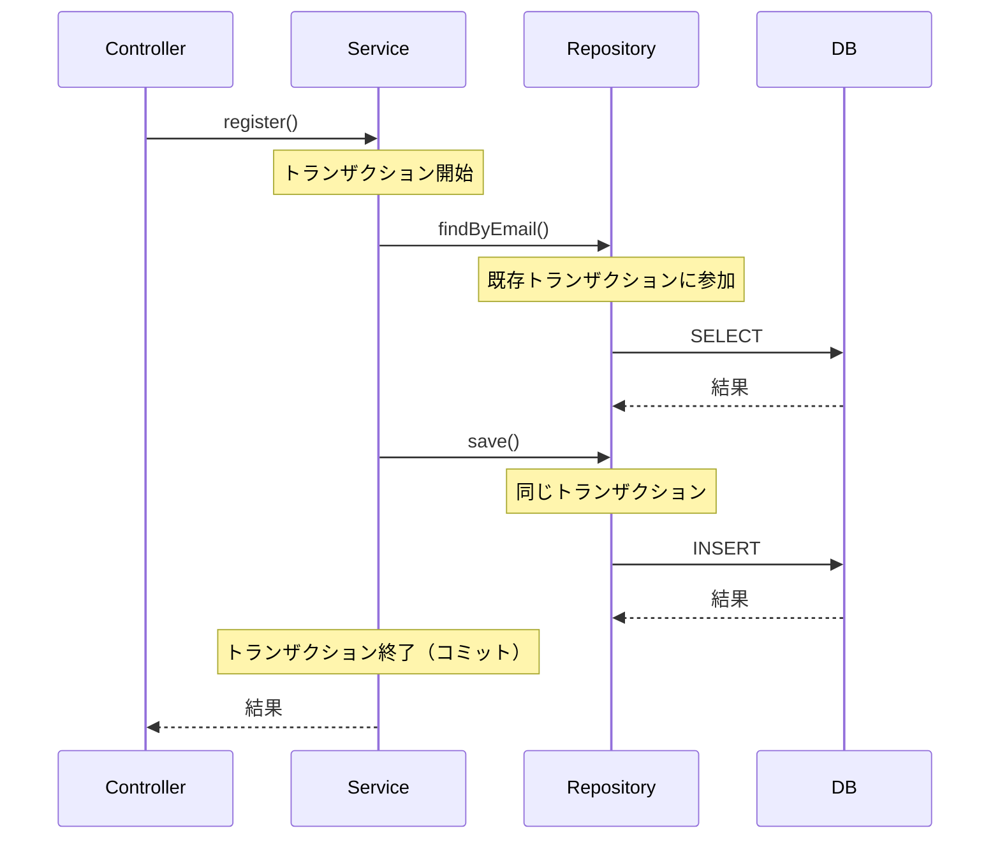

# Spring Boot トランザクション伝播について：@Transactional の重複と分離パターン

## はじめに

Spring Boot 開発において、「Service 層と Repository 層の両方に @Transactional が付いているけど、これって二重管理？」という疑問を持ったことはありませんか？

この記事では、Spring の**トランザクション伝播（Transaction Propagation）**の仕組みを理解し、適切なトランザクション境界の設計パターンを解説します。

## 🎯 核心：二重管理ではなく「伝播」の仕組み

### ❌ 間違った理解

「Service 層と Repository 層でトランザクションが二重に実行される」

### ✅ 正しい理解

「Service 層が主境界、Repository 層は既存トランザクションに参加」

## 📋 実装パターン比較

### Service 層：メインのトランザクション境界

```java
@Service
@Transactional  // ← ここでトランザクション開始
public class RegisterUserService {

    public RegisterResponse register(RegisterUserCommand command) {
        // トランザクション開始
        userRepository.findByEmail(email);    // ← 既存トランザクションに参加
        userRepository.findByUsername(username); // ← 既存トランザクションに参加
        userRepository.save(newUser);         // ← 既存トランザクションに参加
        // メソッド完了でコミット（またはエラー時ロールバック）
    }
}
```

### Repository 層：補完的なトランザクション保証

```java
@Repository
@Transactional  // ← デフォルト：PROPAGATION_REQUIRED
public class UserRepositoryJpaImpl {

    @Override
    @Transactional(readOnly = true)  // ← 読み取り専用の最適化
    public Optional<User> findByEmail(Email email) {
        // Service層のトランザクションがあれば参加
        // なければ新しいトランザクション開始（独立実行時の保証）
    }
}
```

## 🔍 詳細解説：トランザクション伝播の仕組み

### 1. デフォルトの伝播方式（PROPAGATION_REQUIRED）



### 2. 実行フローの詳細

```java
// 実際の動作フロー
1. RegisterUserService.register() 呼び出し
2. Service層でトランザクション開始 ←── メイン境界
3. userRepository.findByEmail() → 既存トランザクションに参加
4. userRepository.findByUsername() → 既存トランザクションに参加
5. userRepository.save() → 既存トランザクションに参加
6. Service層メソッド完了でコミット ←── 全体の成功/失敗を決定
```

## 🚀 応用パターン：トランザクション分離

### ケース 1：ログ記録を別トランザクションで実行

```java
@Service
public class RegisterUserService {

    @Transactional
    public RegisterResponse register(RegisterUserCommand command) {
        try {
            // メイントランザクション
            User user = userRepository.save(newUser);

            // 別トランザクションでログ（失敗してもメイン処理に影響しない）
            auditService.logUserRegistration(user);

            return RegisterResponse.from(user);
        } catch (Exception e) {
            // メイントランザクションはロールバック
            // でもログは残る
            throw e;
        }
    }
}

@Service
public class AuditService {

    @Transactional(propagation = Propagation.REQUIRES_NEW)
    public void logUserRegistration(User user) {
        // 新しいトランザクション開始
        // メイン処理の成功/失敗に関係なく実行される
        auditRepository.save(new AuditLog(user));
    }
}
```

### ケース 2：エラー通知を確実に実行

```java
@Service
public class PaymentService {

    @Transactional
    public PaymentResult processPayment(PaymentCommand command) {
        try {
            // 決済処理（メイントランザクション）
            Payment payment = paymentRepository.save(newPayment);
            return PaymentResult.success(payment);

        } catch (PaymentException e) {
            // エラー通知は別トランザクションで確実に実行
            notificationService.notifyPaymentFailure(command);
            throw e;
        }
    }
}

@Service
public class NotificationService {

    @Transactional(propagation = Propagation.REQUIRES_NEW)
    public void notifyPaymentFailure(PaymentCommand command) {
        // 決済が失敗してもエラー通知は確実に記録される
        errorLogRepository.save(new ErrorLog(command));
        emailService.sendErrorNotification(command.getUserEmail());
    }
}
```

## 📊 トランザクション伝播の種類

| 伝播タイプ               | 動作                               | 用途                       |
| ------------------------ | ---------------------------------- | -------------------------- |
| `REQUIRED`（デフォルト） | 既存があれば参加、なければ新規作成 | 通常のビジネスロジック     |
| `REQUIRES_NEW`           | 常に新しいトランザクション作成     | ログ記録、監査、エラー通知 |
| `NOT_SUPPORTED`          | トランザクションなしで実行         | 読み取り専用の重い処理     |
| `MANDATORY`              | 既存トランザクション必須           | 呼び出し元での事前チェック |

### 実装例

```java
@Service
public class UserService {

    // 1. デフォルト：既存トランザクションに参加
    @Transactional(propagation = Propagation.REQUIRED)
    public void updateUser(User user) { ... }

    // 2. 新しいトランザクション：独立実行
    @Transactional(propagation = Propagation.REQUIRES_NEW)
    public void logUserActivity(User user) { ... }

    // 3. トランザクションなし：重い読み取り処理
    @Transactional(propagation = Propagation.NOT_SUPPORTED)
    public List<User> generateHeavyReport() { ... }

    // 4. 必須：呼び出し元にトランザクションが必要
    @Transactional(propagation = Propagation.MANDATORY)
    public void criticalOperation(User user) { ... }
}
```

## 🛡️ 設計指針とベストプラクティス

### 1. 基本原則

```java
// ✅ Service層：ビジネストランザクションの境界
@Service
@Transactional  // クラスレベルでデフォルト指定
public class UserService {

    @Transactional(readOnly = true)  // 読み取り専用は明示
    public User findUser(Long id) { ... }

    // 書き込み系はクラスレベルの設定を継承
    public User createUser(CreateUserCommand command) { ... }
}

// ✅ Repository層：技術的な保証
@Repository
@Transactional  // 独立実行時の保証
public class UserRepositoryJpaImpl {

    @Override
    @Transactional(readOnly = true)  // 読み取り最適化
    public Optional<User> findById(Long id) { ... }
}
```

### 2. 分離が必要なケース

```java
// ログ・監査・通知など、メイン処理と独立させたい場合
@Transactional(propagation = Propagation.REQUIRES_NEW)
public void auditOperation(String operation, Object data) {
    // メイン処理が失敗してもログは残る
}

// 外部API呼び出しなど、トランザクションが不要な場合
@Transactional(propagation = Propagation.NOT_SUPPORTED)
public void callExternalApi(String data) {
    // トランザクションなしで実行
}
```

## 🎯 まとめ

1. **Service 層と Repository 層の@Transactional は二重管理ではない**

   - Service 層：メインのトランザクション境界
   - Repository 層：既存トランザクションに参加（補完的保証）

2. **デフォルトは PROPAGATION_REQUIRED**

   - 既存トランザクションがあれば参加
   - なければ新しいトランザクション開始

3. **分離が必要な場合は明示的に指定**

   - `REQUIRES_NEW`：ログ記録、監査、エラー通知
   - `NOT_SUPPORTED`：重い読み取り処理、外部 API 呼び出し

4. **設計の基本方針**
   - Service 層：ビジネスロジックの整合性を保証
   - Repository 層：技術的な安全性を保証
   - 特別な要件がある場合のみ伝播方式を変更

Spring のトランザクション伝播について分からない部分を調べてみました。

以上です。

---
