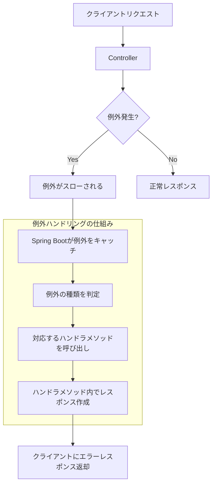
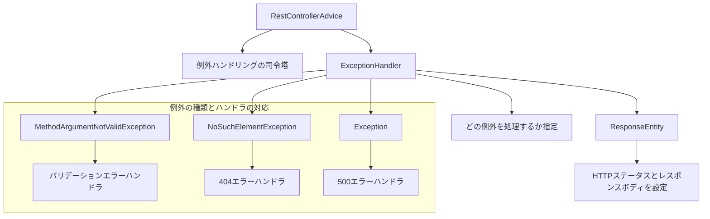
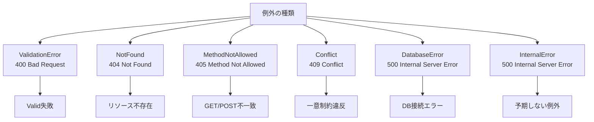

# Spring Boot の例外ハンドリング徹底解説（アノテーション編）

## 概要

Spring Boot で例外ハンドリングを行う際の主要アノテーションとその使い分けを図解で分かりやすく解説します。

## 例外ハンドリングの基本的な流れ

### 1. 例外が発生したときの処理の流れ



### 2. アノテーションの役割



---

## 例外ハンドリングの仕組みを詳しく解説

### ステップ 1: 例外が発生する

```java
@PostMapping("/api/users")
public ResponseEntity<?> create(@Valid @RequestBody CreateUserRequest request) {
    // バリデーション失敗時は自動的に MethodArgumentNotValidException が発生
    // この例外がスローされる
    return ResponseEntity.status(201).build();
}
```

### ステップ 2: Spring Boot が例外をキャッチ

Spring Boot は`@RestControllerAdvice`が付いたクラスを探し、その中の`@ExceptionHandler`が付いたメソッドで例外を処理します。

### ステップ 3: 対応するハンドラメソッドが呼び出される

```java
@RestControllerAdvice
public class GlobalExceptionHandler {

    @ExceptionHandler({MethodArgumentNotValidException.class, ConstraintViolationException.class})
    public ResponseEntity<ErrorResponse> handleValidation(Exception exception, HttpServletRequest request) {
        // このメソッドが呼び出される
        log.warn("Validation error: {} {} - {}", request.getMethod(), request.getRequestURI(), exception.getClass().getSimpleName());
        return ResponseEntity.status(HttpStatus.BAD_REQUEST)
                .body(body(request, "入力値が不正です。", ApiErrorCode.VALIDATION_ERROR));
    }
}
```

### ステップ 4: レスポンスボディが作成される

ハンドラメソッド内で：

- エラーメッセージの作成
- HTTP ステータスコードの設定
- レスポンスボディの構築

### ステップ 5: クライアントに返却

作成されたエラーレスポンスがクライアントに返されます。

---

## ステータスコードごとのハンドリング活用

### なぜステータスコードごとに分けるのか？

**目的**: クライアント側がエラーの種類を理解し、適切な対応を取れるようにする

### 1. 400 Bad Request - クライアントの入力ミス

```java
@ExceptionHandler({MethodArgumentNotValidException.class, ConstraintViolationException.class})
public ResponseEntity<ErrorResponse> handleValidation(Exception exception, HttpServletRequest request) {
    // バリデーションエラー → 400 Bad Request
    return ResponseEntity.status(HttpStatus.BAD_REQUEST)
            .body(body(request, "入力値が不正です。", ApiErrorCode.VALIDATION_ERROR));
}
```

**クライアント側の対応**: 入力値を修正して再送信

### 2. 404 Not Found - リソースが存在しない

```java
@ExceptionHandler({NoSuchElementException.class})
public ResponseEntity<ErrorResponse> handleNotFound(NoSuchElementException exception, HttpServletRequest request) {
    // リソース不存在 → 404 Not Found
    return ResponseEntity.status(HttpStatus.NOT_FOUND)
            .body(body(request, "指定されたリソースが見つかりません。", ApiErrorCode.NOT_FOUND));
}
```

**クライアント側の対応**: リソース ID の確認、または新規作成

### 3. 405 Method Not Allowed - 間違った HTTP メソッド

```java
@ExceptionHandler(HttpRequestMethodNotSupportedException.class)
public ResponseEntity<ErrorResponse> handleMethodNotAllowed(HttpServletRequest request) {
    // メソッド不一致 → 405 Method Not Allowed
    return ResponseEntity.status(HttpStatus.METHOD_NOT_ALLOWED)
            .body(body(request, "許可されていないメソッドです。", ApiErrorCode.METHOD_NOT_ALLOWED));
}
```

**クライアント側の対応**: 正しい HTTP メソッド（GET/POST/PUT/DELETE）を使用

### 4. 409 Conflict - データの整合性制約違反

```java
@ExceptionHandler(DataIntegrityViolationException.class)
public ResponseEntity<ErrorResponse> handleConflict(DataIntegrityViolationException exception, HttpServletRequest request) {
    // 整合性制約違反 → 409 Conflict
    return ResponseEntity.status(HttpStatus.CONFLICT)
            .body(body(request, "リソースの整合性制約に違反しました。", ApiErrorCode.CONFLICT));
}
```

**クライアント側の対応**: 重複データの確認、一意性の確保

### 5. 500 Internal Server Error - サーバー側の問題

```java
@ExceptionHandler({SQLException.class, DataAccessException.class})
public ResponseEntity<ErrorResponse> handleDbError(HttpServletRequest request) {
    // データベースエラー → 500 Internal Server Error
    return ResponseEntity.status(HttpStatus.INTERNAL_SERVER_ERROR)
            .body(body(request, "データベース処理でエラーが発生しました。", ApiErrorCode.DB_ERROR));
}
```

**クライアント側の対応**: しばらく待ってから再試行

---

## 実装例

### 基本的なグローバルハンドラ

```java
@RestControllerAdvice
public class GlobalExceptionHandler {

    @ExceptionHandler(MethodArgumentNotValidException.class)
    public ResponseEntity<ErrorResponse> handleValidation(HttpServletRequest request) {
        ErrorResponse body = new ErrorResponse(
            Instant.now().toString(),
            request.getRequestURI(),
            "入力値が不正です",
            "VALIDATION_ERROR"
        );
        return ResponseEntity.badRequest().body(body);
    }

    @ExceptionHandler(Exception.class)
    public ResponseEntity<ErrorResponse> handleGeneral(HttpServletRequest request) {
        ErrorResponse body = new ErrorResponse(
            Instant.now().toString(),
            request.getRequestURI(),
            "サーバー内部エラーが発生しました",
            "INTERNAL_ERROR"
        );
        return ResponseEntity.status(500).body(body);
    }
}

// 共通エラーレスポンス
public record ErrorResponse(String timestamp, String path, String message, String code) {}
```

### バリデーション例

```java
public record CreateUserRequest(@NotBlank String name, @Email String email) {}

@PostMapping("/api/users")
public ResponseEntity<?> create(@Valid @RequestBody CreateUserRequest request) {
    // バリデーション失敗時は自動的に MethodArgumentNotValidException が発生
    // GlobalExceptionHandler で 400 エラーとして処理される
    return ResponseEntity.status(201).build();
}
```

---

## 例外の種類とステータスコードの対応



---

## ベストプラクティス

### 実装の順序

1. `@RestControllerAdvice` + `@ExceptionHandler` の基盤を作成
2. 代表的な例外パターン（バリデーション、404、405、500）を網羅
3. 共通エラーフォーマットを統一
4. ログ出力を適切に設定（WARN/ERROR レベル）

### 注意点

- **MVC 外の例外**: フィルター層の例外は `@ExceptionHandler` で捕捉できない
- **情報漏洩**: 例外メッセージをそのまま返さず、ユーザー向け文言に変換
- **テスト**: MockMvc でエラーレスポンスの形式を検証

---

## まとめ

Spring Boot の例外ハンドリングは以下の流れで動作します：

1. **例外発生** → 例外がスローされる
2. **例外キャッチ** → Spring Boot が例外を検知
3. **ハンドラ呼び出し** → 対応する`@ExceptionHandler`メソッドが実行
4. **レスポンス作成** → エラーレスポンスを構築
5. **クライアント返却** → 適切な HTTP ステータスと共にエラーを返却

この仕組みを活用することで、**ステータスコードごとに適切なエラーメッセージを返し、クライアント側がエラーの種類を理解して適切な対応を取れるようになります**。

重要なのは**一貫性**です。どの API でも同じエラーフォーマットを返すことで、フロントエンド開発や API 利用者の利便性が大幅に向上します。
