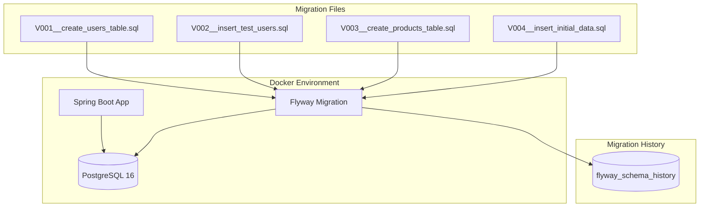
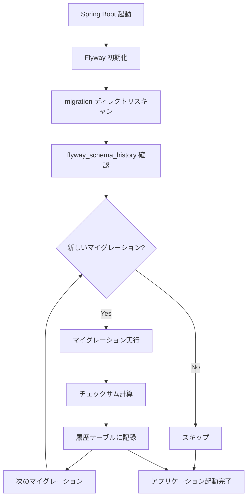

# Spring Boot + Flyway でデータベースマイグレーション実践（Docker + PostgreSQL 環境）

Spring Boot アプリケーションで Flyway を使ったデータベースマイグレーションの実装と運用について、実際のプロジェクト環境をベースに詳しく解説します。Docker + PostgreSQL 環境での実践的な設定から、マイグレーションファイルの作成・管理まで一気通貫でカバーします。

---

## プロジェクト構成

### ディレクトリ構造

```
sample-app/
├── backend/                              # Spring Boot アプリケーション
│   ├── pom.xml                          # Maven依存関係定義
│   ├── src/main/
│   │   ├── java/com/example/sampleapp/  # Javaソースコード
│   │   └── resources/
│   │       ├── application.properties            # 基本設定
│   │       ├── application-dev.properties        # 開発環境設定
│   │       └── db/migration/                     # マイグレーションファイル
│   │           ├── V001__create_users_table.sql
│   │           ├── V002__insert_test_users.sql
│   │           ├── V003__create_products_table.sql
│   │           └── V004__insert_initial_data.sql
│   └── target/                          # ビルド成果物
├── frontend/                            # フロントエンド（React等）
├── infrastructure/docker/               # Docker関連ファイル
│   ├── dev/docker-compose.yml          # 開発環境用Compose
│   ├── prod/docker-compose.yml         # 本番環境用Compose
│   ├── backend/Dockerfile              # Spring Boot用Dockerfile
│   ├── frontend/Dockerfile             # フロントエンド用Dockerfile
│   └── postgres/Dockerfile.dev         # PostgreSQL開発用
└── docs/                               # ドキュメント
```

---

## 全体構成とマイグレーションの位置づけ

### システム構成図



### マイグレーションの実行タイミング

- **Spring Boot 起動時**：自動実行（新しいマイグレーションのみ）
- **既存マイグレーション**：`flyway_schema_history` テーブルで管理・スキップ
- **追加マイグレーション**：連番で追加・自動実行

---

## 環境設定

### 1. 依存関係の設定（pom.xml）

```xml
<dependencies>
    <!-- Spring Boot Data JPA -->
    <dependency>
        <groupId>org.springframework.boot</groupId>
        <artifactId>spring-boot-starter-data-jpa</artifactId>
    </dependency>

    <!-- PostgreSQL Driver -->
    <dependency>
        <groupId>org.postgresql</groupId>
        <artifactId>postgresql</artifactId>
        <scope>runtime</scope>
    </dependency>

    <!-- Flyway Core -->
    <dependency>
        <groupId>org.flywaydb</groupId>
        <artifactId>flyway-core</artifactId>
        <version>10.21.0</version>
    </dependency>

    <!-- Flyway PostgreSQL Support -->
    <dependency>
        <groupId>org.flywaydb</groupId>
        <artifactId>flyway-database-postgresql</artifactId>
        <version>10.21.0</version>
    </dependency>
</dependencies>
```

### 2. アプリケーション設定

**application.properties**

```properties
spring.application.name=sample-app

# デフォルトプロファイル（開発環境）
spring.profiles.active=dev

# Flyway 基本設定
spring.flyway.enabled=true
spring.flyway.locations=classpath:db/migration
```

**application-dev.properties**

```properties
# データベース接続（Docker環境）
spring.datasource.url=jdbc:postgresql://localhost:15432/sampledb
spring.datasource.username=sampleuser
spring.datasource.password=samplepass123

# JPA/Hibernate 設定
spring.jpa.hibernate.ddl-auto=none
spring.jpa.open-in-view=false
spring.jpa.properties.hibernate.dialect=org.hibernate.dialect.PostgreSQLDialect

# Flyway 詳細設定
spring.flyway.enabled=true
spring.flyway.locations=classpath:db/migration
spring.flyway.baseline-on-migrate=true    # 既存DBでも実行可能
spring.flyway.validate-on-migrate=true    # 実行前検証
spring.flyway.out-of-order=false          # 順序実行を強制
spring.flyway.table=flyway_schema_history  # 履歴テーブル名
```

### 3. Docker 環境（PostgreSQL）

**docker-compose.yml（開発用）**

```yaml
version: "3.8"

services:
  postgres:
    image: postgres:16
    container_name: sample-postgres-dev
    environment:
      POSTGRES_DB: sampledb
      POSTGRES_USER: sampleuser
      POSTGRES_PASSWORD: samplepass123
    ports:
      - "15432:5432" # 外部からアクセス可能
    volumes:
      - postgres_data:/var/lib/postgresql/data
    networks:
      - sample-network

volumes:
  postgres_data:

networks:
  sample-network:
    driver: bridge
```

---

## マイグレーションファイルの実装

### ファイル命名規則

```
src/main/resources/db/migration/
├── V001__create_users_table.sql       # ユーザーテーブル作成
├── V002__insert_test_users.sql        # テストユーザー投入
├── V003__create_products_table.sql    # 商品テーブル作成
├── V004__insert_initial_products.sql  # 初期商品データ
├── V005__create_categories_table.sql  # カテゴリテーブル作成
├── V006__insert_initial_categories.sql # 初期カテゴリデータ
├── V007__add_products_category_constraint.sql # 外部キー制約追加
├── V008__create_orders_table.sql      # 注文テーブル作成
├── V009__create_order_items_table.sql # 注文詳細テーブル
└── V010__insert_sample_orders.sql     # サンプル注文データ
```

**命名規則**：`V{連番}__{説明}.sql`

- 連番は必ず 3 桁以上（V001, V002...）
- アンダースコア 2 つで区切る
- 説明は英語、スネークケース推奨

### 実際のマイグレーションファイル例

**V001\_\_create_users_table.sql**

```sql
-- ユーザーテーブル（users）の作成
-- 基本的なユーザー情報と設定を含む

CREATE TABLE IF NOT EXISTS users (
    -- 基本情報
    id BIGSERIAL PRIMARY KEY,
    email VARCHAR(255) UNIQUE NOT NULL,
    username VARCHAR(100) UNIQUE NOT NULL,
    password_hash VARCHAR(255) NOT NULL,
    created_at TIMESTAMP WITH TIME ZONE DEFAULT CURRENT_TIMESTAMP,
    updated_at TIMESTAMP WITH TIME ZONE DEFAULT CURRENT_TIMESTAMP,

    -- ユーザー設定
    status VARCHAR(20) DEFAULT 'ACTIVE',
    role VARCHAR(20) DEFAULT 'USER',
    last_login_at TIMESTAMP WITH TIME ZONE,
    email_verified BOOLEAN DEFAULT FALSE,

    -- バリデーション制約
    CONSTRAINT users_email_format CHECK (email ~* '^[A-Za-z0-9._%+-]+@[A-Za-z0-9.-]+\.[A-Za-z]{2,}$'),
    CONSTRAINT users_username_length CHECK (char_length(username) >= 3 AND char_length(username) <= 30),
    CONSTRAINT users_status_valid CHECK (status IN ('ACTIVE', 'INACTIVE', 'SUSPENDED')),
    CONSTRAINT users_role_valid CHECK (role IN ('USER', 'ADMIN', 'MODERATOR'))
);

-- インデックス設計
CREATE INDEX idx_users_email ON users(email);
CREATE INDEX idx_users_username ON users(username);
CREATE INDEX idx_users_created_at ON users(created_at);

-- 更新日時の自動更新トリガー
CREATE OR REPLACE FUNCTION update_updated_at_column()
RETURNS TRIGGER AS $$
BEGIN
    NEW.updated_at = CURRENT_TIMESTAMP;
    RETURN NEW;
END;
$$ language 'plpgsql';

CREATE TRIGGER update_users_updated_at BEFORE UPDATE ON users
    FOR EACH ROW EXECUTE FUNCTION update_updated_at_column();
```

**V002\_\_insert_test_users.sql**

```sql
-- テストユーザーデータの投入
-- 開発・テスト用の初期データ

INSERT INTO users (email, username, password_hash, status, role, email_verified) VALUES
('admin@example.com', 'admin', '$2a$10$92IXUNpkjO0rOQ5byMi.Ye4oKoEa3Ro9llC/.og/at2uheWG/igi.', 'ACTIVE', 'ADMIN', true),
('user1@example.com', 'user1', '$2a$10$92IXUNpkjO0rOQ5byMi.Ye4oKoEa3Ro9llC/.og/at2uheWG/igi.', 'ACTIVE', 'USER', true),
('user2@example.com', 'user2', '$2a$10$92IXUNpkjO0rOQ5byMi.Ye4oKoEa3Ro9llC/.og/at2uheWG/igi.', 'ACTIVE', 'USER', false);

-- パスワードは全て 'password123' （BCryptハッシュ）
```

**V007\_\_add_products_category_constraint.sql**

```sql
-- 商品テーブルにカテゴリ外部キー制約を追加
-- categories テーブル作成後に実行

-- 外部キー制約の追加
ALTER TABLE products
ADD CONSTRAINT fk_products_category
FOREIGN KEY (category_id) REFERENCES categories(id);

-- カテゴリ検索用インデックス
CREATE INDEX idx_products_category_id ON products(category_id);
```

---

## マイグレーションの動作仕組み

### 1. 履歴管理テーブル（flyway_schema_history）

Flyway は実行済みマイグレーションを `flyway_schema_history` テーブルで管理します：

```sql
-- 自動生成されるテーブル構造
CREATE TABLE flyway_schema_history (
    installed_rank INTEGER NOT NULL,      -- 実行順序
    version VARCHAR(50),                   -- バージョン（V001, V002...）
    description VARCHAR(200) NOT NULL,    -- 説明文
    type VARCHAR(20) NOT NULL,            -- SQL/JAVA等
    script VARCHAR(1000) NOT NULL,        -- ファイル名
    checksum INTEGER,                      -- ファイル内容のハッシュ値
    installed_by VARCHAR(100) NOT NULL,   -- 実行ユーザー
    installed_on TIMESTAMP NOT NULL,      -- 実行日時
    execution_time INTEGER NOT NULL,      -- 実行時間（ミリ秒）
    success BOOLEAN NOT NULL               -- 成功/失敗
);
```

### 2. マイグレーション実行フロー



### 3. チェックサム検証

既存のマイグレーションファイルが変更されると、チェックサム不一致でエラーになります：

```
ERROR: Migration checksum mismatch for migration version 1
-> Applied to database : 1234567890
-> Resolved locally    : 9876543210
```

**対処法**：

- **推奨**：新しいマイグレーションファイルで修正
- **緊急時**：`flyway repair` コマンドで修復（本番非推奨）

---

## 開発フロー

### 1. 新しいマイグレーション追加

```bash
# 1. 新しいマイグレーションファイル作成
touch src/main/resources/db/migration/V011__add_user_profiles_table.sql

# 2. SQL を記述
cat > src/main/resources/db/migration/V011__add_user_profiles_table.sql << EOF
-- ユーザープロフィールテーブルの追加
CREATE TABLE user_profiles (
    id BIGSERIAL PRIMARY KEY,
    user_id BIGINT NOT NULL REFERENCES users(id),
    bio TEXT,
    avatar_url VARCHAR(500),
    phone VARCHAR(20),
    address TEXT,
    created_at TIMESTAMP WITH TIME ZONE DEFAULT CURRENT_TIMESTAMP
);

CREATE INDEX idx_user_profiles_user_id ON user_profiles(user_id);
EOF

# 3. アプリケーション起動（自動的にマイグレーション実行）
./mvnw spring-boot:run
```

### 2. マイグレーション状況の確認

```sql
-- マイグレーション履歴確認
SELECT installed_rank, version, description, installed_on, success
FROM flyway_schema_history
ORDER BY installed_rank;

-- 結果例
-- installed_rank | version | description              | installed_on        | success
-- 1              | 1       | create users table       | 2024-01-15 10:00:00 | t
-- 2              | 2       | insert test users        | 2024-01-15 10:00:01 | t
-- 3              | 3       | create products table    | 2024-01-15 10:00:02 | t
-- ...
-- 11             | 11      | add user profiles table  | 2024-01-15 15:30:00 | t
```

### 3. ロールバック（データ修正）

Flyway はロールバック機能がないため、データ修正は新しいマイグレーションで実行：

```sql
-- V012__fix_user_data.sql
-- 間違って投入したデータの修正

-- 不正なユーザーデータを削除
DELETE FROM users WHERE email LIKE '%invalid%';

-- ステータスの修正
UPDATE users SET status = 'ACTIVE' WHERE status IS NULL;
```

---

## Docker 環境での実行手順

### 1. 環境起動

```bash
# PostgreSQL コンテナ起動
cd infrastructure/docker/dev
docker compose up -d postgres

# データベース接続確認
docker compose logs postgres

# 接続テスト
psql -h localhost -p 15432 -U sampleuser -d sampledb -c "SELECT version();"
```

### 2. Spring Boot アプリケーション起動

```bash
# マイグレーション付きで起動
cd backend
./mvnw spring-boot:run

# または Docker コンテナで起動
docker compose up -d backend
```

### 3. マイグレーション結果確認

```bash
# ログでマイグレーション実行を確認
docker compose logs backend | grep -i flyway

# 出力例
# 2024-01-15 10:00:00.123  INFO 1 --- [main] o.f.core.internal.command.DbMigrate      : Migrating schema "public" to version "010 - insert sample orders"
# 2024-01-15 10:00:00.234  INFO 1 --- [main] o.f.core.internal.command.DbMigrate      : Successfully applied 10 migrations to schema "public"

# データベースで直接確認
psql -h localhost -p 15432 -U sampleuser -d sampledb
\dt  -- テーブル一覧
SELECT * FROM flyway_schema_history;  -- マイグレーション履歴
```

---

## トラブルシューティング

### 1. よくあるエラーと対処法

**チェックサム不一致**

```
Migration checksum mismatch for migration version 1
```

→ 解決策：既存ファイルは変更せず、新しいマイグレーションで修正

**マイグレーション失敗**

```
Migration V005__create_categories_table.sql failed
```

→ 解決策：

1. エラー原因を特定（SQL 構文、制約違反など）
2. 失敗したマイグレーションを削除またはスキップ
3. 修正版を新しいバージョンで作成

**順序違反**

```
Migration V003 was not applied as V004 was already applied
```

→ 解決策：`spring.flyway.out-of-order=true` で許可（開発時のみ）

### 2. マイグレーション修復コマンド

```bash
# Spring Boot アプリケーション経由でのマイグレーション情報確認
curl http://localhost:8080/actuator/flyway

# Docker 経由での直接操作（緊急時）
docker exec -it sample-postgres-dev psql -U sampleuser -d sampledb
```

### 3. バックアップとリストア

```bash
# データベースバックアップ
docker exec sample-postgres-dev pg_dump -U sampleuser sampledb > backup.sql

# リストア
docker exec -i sample-postgres-dev psql -U sampleuser sampledb < backup.sql
```

---

## 本番環境での考慮事項

### 1. 本番用設定

**application-prod.properties**

```properties
# 本番データベース接続
spring.datasource.url=jdbc:postgresql://production-db:5432/sampledb
spring.datasource.username=${DB_USERNAME}
spring.datasource.password=${DB_PASSWORD}

# Flyway 本番設定
spring.flyway.enabled=true
spring.flyway.baseline-on-migrate=false  # 厳密なバージョン管理
spring.flyway.validate-on-migrate=true
spring.flyway.clean-disabled=true        # 本番でのcleanコマンド無効化
```

### 2. CI/CD での自動化

**GitHub Actions 例**

```yaml
name: Database Migration

on:
  push:
    branches: [main]
    paths: ["backend/src/main/resources/db/migration/**"]

jobs:
  migrate:
    runs-on: ubuntu-latest
    steps:
      - uses: actions/checkout@v3

      - name: Setup Java
        uses: actions/setup-java@v3
        with:
          java-version: "17"

      - name: Run Flyway Migration
        run: |
          cd backend
          ./mvnw flyway:migrate -Dflyway.url=${{ secrets.DB_URL }}
```

### 3. セキュリティ考慮事項

- **機密情報の分離**：データベース認証情報は環境変数で管理
- **権限最小化**：マイグレーション用とアプリケーション用で DB 権限を分離
- **監査ログ**：マイグレーション実行履歴の記録と監視

---

## まとめ

Spring Boot + Flyway によるマイグレーション管理の要点：

### ✅ メリット

- **自動実行**：アプリケーション起動時に自動マイグレーション
- **履歴管理**：`flyway_schema_history` による完全な実行履歴
- **整合性保証**：チェックサムによるファイル変更検知
- **Docker 親和性**：コンテナ環境での確実な実行

### 🔧 ベストプラクティス

1. **命名規則の徹底**：`V{連番}__{説明}.sql` 形式
2. **段階的な構築**：テーブル作成 → データ投入 → 制約追加
3. **テスト環境での事前検証**：本番適用前の十分な動作確認
4. **バックアップの習慣化**：マイグレーション前の必須作業

### ⚠️ 注意点

- **既存ファイルの変更禁止**：チェックサム不一致を避ける
- **ロールバック機能なし**：修正は新しいマイグレーションで実行
- **順序の重要性**：依存関係を考慮した連番管理

この構成により、**安全で確実なデータベーススキーマ管理**が実現でき、チーム開発での一貫性と本番環境での信頼性を両立できます。
