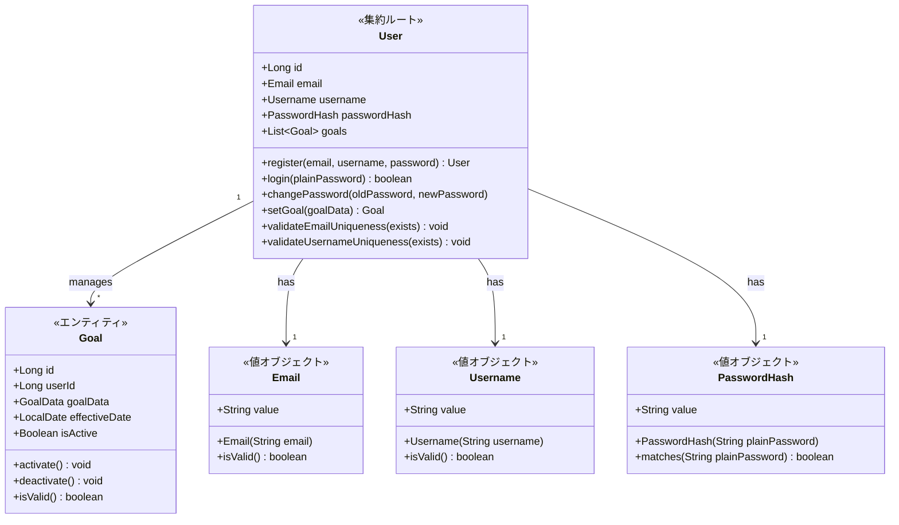
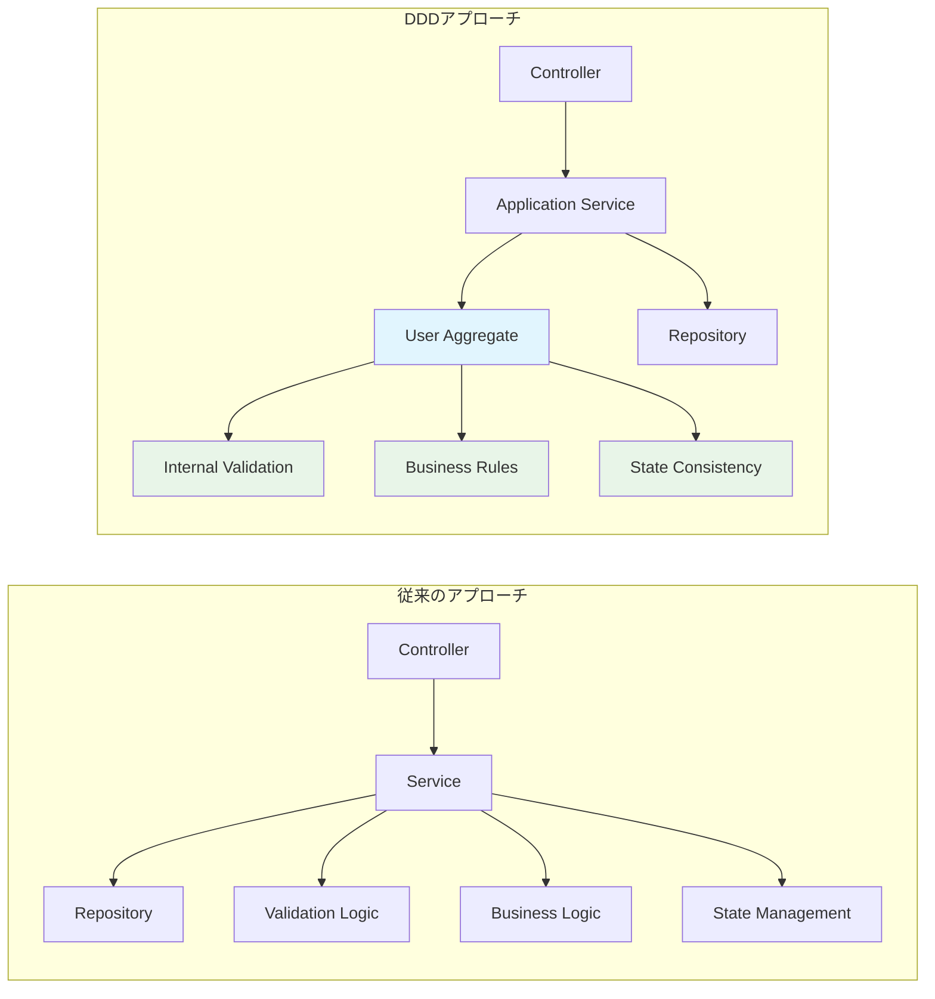

# 初めての DDD 実装：User 集約ルートで学んだ「値オブジェクト」と「責務分離」の威力

## はじめに

「DDD って難しそう...」と思っていた私が、実際に User 集約ルートを実装してみて気づいた**値オブジェクトの威力**と**責務分離の効果**について書いてみます。

正直、最初は「わざわざ Email クラス作る必要ある？」って思ってましたが、実装してみると**バグが激減**して「これは使える！」となった体験談です。

---

## 従来の実装で感じていた課題

まず、DDD を導入する前の実装で感じていた課題から。

### こんなコードを書いていませんか？

```java
// ❌ 従来の実装（よくあるパターン）
@Service
public class UserService {

    public void registerUser(String email, String username, String password) {
        // バリデーションがService層に散在
        if (email == null || !email.contains("@")) {
            throw new IllegalArgumentException("Invalid email");
        }

        if (username == null || username.length() < 3) {
            throw new IllegalArgumentException("Invalid username");
        }

        // ビジネスロジックもService層に散在
        if (userRepository.findByEmail(email).isPresent()) {
            throw new IllegalArgumentException("Email already exists");
        }

        // エンティティが貧血状態
        User user = new User();
        user.setEmail(email);
        user.setUsername(username);
        user.setPassword(password); // 平文パスワード...？

        userRepository.save(user);
    }
}
```

**このコードの問題点：**

- バリデーションロジックがあちこちに散在
- ビジネスルールが Service 層に混在
- エンティティがただのデータ入れ物（貧血状態）
- パスワードのハッシュ化忘れなどのヒューマンエラーが発生しやすい

## DDD で構築した User 集約ルートの構造

そこで、DDD の考え方を取り入れて設計し直してみました。

### 1. 集約の全体像



### 2. 「なぜ値オブジェクトが必要だったのか」

最初は「`String email`で十分じゃない？」と思っていましたが、実装してみて**値オブジェクトの威力**を実感しました。

#### Before: String 型での実装問題

```java
// ❌ これだと...
public void someMethod(String email, String username) {
    // 引数の順番を間違えやすい！
    anotherMethod(username, email); // バグ！
}

public void anotherMethod(String email, String username) {
    // どっちがemailかわからない...
}
```

#### After: 値オブジェクトでの解決

```java
// ✅ 値オブジェクトなら型安全！
public void someMethod(Email email, Username username) {
    // 間違った順番で渡せない
    anotherMethod(email, username); // コンパイルエラーで気づける
}

public void anotherMethod(Email email, Username username) {
    // 型で意図が明確
}
```

**値オブジェクトの効果：**

- **型安全性**: 引数の順番間違いをコンパイル時に検出
- **バリデーション集約**: メール形式チェックが 1 箇所に集まる
- **ビジネスルール明示**: 「このシステムでの Email」の定義が明確
- **テストしやすさ**: 値オブジェクト単体でテスト可能

### 3. User 集約ルートの責務分離

実装してみて気づいたのは、**責務を明確に分けることで迷いがなくなる**こと。

| 何をする？             | どこが担当？    | 実装メソッド                   |
| ---------------------- | --------------- | ------------------------------ |
| **メール重複チェック** | User 集約ルート | `validateEmailUniqueness()`    |
| **パスワード認証**     | User 集約ルート | `login()`, `changePassword()`  |
| **プロフィール更新**   | User 集約ルート | `updateProfile()`              |
| **目標の追加・変更**   | User 集約ルート | `setGoal()`, `getActiveGoal()` |
| **データ整合性の維持** | User 集約ルート | `validateGoals()`              |

---

## 実装してみた：体験談付きコード例

### 1. 値オブジェクトから始めよう

まずは値オブジェクトから実装しました。「こんなに簡単なのに効果絶大！」と感じた順番で紹介します。

#### Email 値オブジェクト：最初に実装して効果を実感

```java
/**
 * 実装してみた感想：
 * - 「メール形式チェック」が1箇所に集約されて管理が楽！
 * - 引数の順番間違いがコンパイルエラーで気づけるようになった
 * - テストも書きやすい
 */
public class Email {
    private static final String EMAIL_PATTERN =
        "^[a-zA-Z0-9._%+-]+@[a-zA-Z0-9.-]+\\.[a-zA-Z]{2,}$";

    private final String value;

    public Email(String email) {
        if (email == null || email.trim().isEmpty()) {
            throw new InvalidEmailException("Email cannot be null or empty");
        }

        String normalized = email.trim().toLowerCase();

        if (!Pattern.matches(EMAIL_PATTERN, normalized)) {
            throw new InvalidEmailException("Invalid email format");
        }

        this.value = normalized;
    }

    public String getValue() { return value; }

    // equals, hashCode は省略
}
```

#### PasswordHash 値オブジェクト：セキュリティのミスが激減

```java
/**
 * 実装してみた感想：
 * - 「パスワードのハッシュ化忘れ」が完全になくなった！
 * - パスワード照合ロジックが集約されて、間違いが起きにくい
 * - コンストラクタで自動的にハッシュ化されるので安心
 */
public class PasswordHash {
    private final String value;

    public PasswordHash(String plainPassword) {
        if (plainPassword == null || plainPassword.length() < 8) {
            throw new WeakPasswordException("Password must be at least 8 characters");
        }

        // 自動的にハッシュ化（ハッシュ化忘れが発生しない）
        this.value = hashPassword(plainPassword);
    }

    public boolean matches(String plainPassword) {
        return checkPassword(plainPassword, this.value);
    }

    private String hashPassword(String plainPassword) {
        // BCryptなどを使用（実装は省略）
        return "hashed_" + plainPassword;
    }

    private boolean checkPassword(String plainPassword, String hashedPassword) {
        // パスワード照合（実装は省略）
        return hashedPassword.equals("hashed_" + plainPassword);
    }
}
```

### 2. User 集約ルートの実装：ビジネスロジックを守る

```java
/**
 * 実装してみた感想：
 * - ビジネスロジックがUser内に集約されて「どこに何があるか」が明確に！
 * - Service層がスッキリして、テストしやすくなった
 * - 「アクティブな目標は1つだけ」みたいなルールを確実に守れる
 */
public class User {
    private final Long id;
    private final Email email;
    private Username username;
    private PasswordHash passwordHash;
    private final List<Goal> goals;
    private final Instant createdAt;
    private Instant updatedAt;

    /**
     * ファクトリメソッド：ユーザー登録
     * 「どうやってUserを作るか」が明確
     */
    public static User register(Email email, Username username, PasswordHash passwordHash) {
        return new User(email, username, passwordHash);
    }

    /**
     * ログイン認証
     * 認証ロジックはUser自身が知っている
     */
    public boolean login(String plainPassword) {
        return passwordHash.matches(plainPassword);
    }

    /**
     * 新しい目標を設定
     * ビジネスルール「アクティブな目標は1つだけ」を自動的に守る
     */
    public Goal setGoal(GoalData goalData, LocalDate effectiveDate) {
        // ビジネスルールを確実に実行
        deactivateAllGoals();

        Goal newGoal = Goal.createActiveGoal(this.id, goalData, effectiveDate);
        this.goals.add(newGoal);
        this.updatedAt = Instant.now();

        return newGoal;
    }

    /**
     * 不変条件の検証
     * User集約ルートが責任を持つ
     */
    public void validateEmailUniqueness(boolean emailExists) {
        if (emailExists) {
            throw new DuplicateEmailException(email.getValue());
        }
    }

    // ビジネスルールを守るためのprivateメソッド
    private void deactivateAllGoals() {
        goals.stream()
             .filter(Goal::isActive)
             .forEach(Goal::deactivate);
    }

    // getters...
}
```

### 2. Goal エンティティの実装

```java
/**
 * Goalエンティティ
 * ユーザーの目標値を管理する。
 * 時系列で管理され、1ユーザーにつき1つのアクティブな目標を持つ。
 */
public class Goal {
    private final Long id;
    private final Long userId;
    private final GoalData goalData;
    private final LocalDate effectiveDate;
    private Boolean isActive;
    private final Instant createdAt;
    private Instant updatedAt;

    /**
     * ファクトリメソッド：新規アクティブ目標を作成
     */
    public static Goal createActiveGoal(Long userId, GoalData goalData, LocalDate effectiveDate) {
        return new Goal(userId, goalData, effectiveDate, true);
    }

    /**
     * 目標をアクティブにする
     */
    public void activate() {
        this.isActive = true;
        this.updatedAt = Instant.now();
    }

    /**
     * 目標を非アクティブにする
     */
    public void deactivate() {
        this.isActive = false;
        this.updatedAt = Instant.now();
    }

    /**
     * 目標値が妥当性範囲内かチェックする
     */
    public boolean isValid() {
        return goalData.isValid() && effectiveDate != null;
    }

    public boolean isActive() {
        return isActive;
    }

    // getters...
}

/**
 * 目標データを表す値オブジェクト
 */
public class GoalData {
    private final Map<String, Object> values;

    public GoalData(Map<String, Object> values) {
        this.values = new HashMap<>(values);
        validate();
    }

    public boolean isValid() {
        try {
            validate();
            return true;
        } catch (InvalidGoalValueException e) {
            return false;
        }
    }

    private void validate() {
        // 具体的な目標値のバリデーションロジック
        // ビジネスルールに応じて実装
    }

    // getters...
}
```

### 3. 値オブジェクトの実装例

```java
/**
 * Email値オブジェクト
 * メールアドレス形式バリデーション付き
 */
public class Email {
    private static final String EMAIL_PATTERN =
        "^[a-zA-Z0-9._%+-]+@[a-zA-Z0-9.-]+\\.[a-zA-Z]{2,}$";

    private final String value;

    public Email(String email) {
        if (email == null || email.trim().isEmpty()) {
            throw new InvalidEmailException("Email cannot be null or empty");
        }

        String normalized = email.trim().toLowerCase();

        if (!Pattern.matches(EMAIL_PATTERN, normalized)) {
            throw new InvalidEmailException("Invalid email format");
        }

        this.value = normalized;
    }

    public String getValue() {
        return value;
    }

    @Override
    public boolean equals(Object o) {
        if (this == o) return true;
        if (o == null || getClass() != o.getClass()) return false;
        Email email = (Email) o;
        return Objects.equals(value, email.value);
    }

    @Override
    public int hashCode() {
        return Objects.hash(value);
    }
}

/**
 * Username値オブジェクト
 */
public class Username {
    private final String value;

    public Username(String username) {
        if (username == null || username.trim().isEmpty()) {
            throw new InvalidUsernameException("Username cannot be null or empty");
        }

        String trimmed = username.trim();
        if (trimmed.length() < 3 || trimmed.length() > 30) {
            throw new InvalidUsernameException("Username must be between 3 and 30 characters");
        }

        this.value = trimmed;
    }

    public String getValue() {
        return value;
    }

    // equals, hashCode...
}

/**
 * PasswordHash値オブジェクト
 */
public class PasswordHash {
    private final String value;

    public PasswordHash(String plainPassword) {
        if (plainPassword == null || plainPassword.length() < 8) {
            throw new WeakPasswordException("Password must be at least 8 characters");
        }

        // パスワードハッシュ化（BCryptなど）
        this.value = hashPassword(plainPassword);
    }

    public boolean matches(String plainPassword) {
        return checkPassword(plainPassword, this.value);
    }

    private String hashPassword(String plainPassword) {
        // ハッシュ化実装
        return "hashed_" + plainPassword; // 簡略化
    }

    private boolean checkPassword(String plainPassword, String hashedPassword) {
        // パスワード照合実装
        return hashedPassword.equals("hashed_" + plainPassword); // 簡略化
    }

    // equals, hashCode...
}
```

---

## API との連携と DDD の効果

### 1. アプリケーションサービスでの使用例

```java
@Service
@Transactional
public class UserService {
    private final UserRepository userRepository;

    /**
     * ユーザー登録のユースケース
     */
    public UserRegistrationResponse registerUser(UserRegistrationRequest request) {
        // 1. 値オブジェクトによる入力検証
        Email email = new Email(request.getEmail());
        Username username = new Username(request.getUsername());
        PasswordHash passwordHash = new PasswordHash(request.getPassword());

        // 2. User集約を生成
        User user = User.register(email, username, passwordHash);

        // 3. 一意性制約の検証（集約ルートが責任を持つ）
        user.validateEmailUniqueness(userRepository.existsByEmail(email.getValue()));
        user.validateUsernameUniqueness(userRepository.existsByUsername(username.getValue()));

        // 4. 永続化
        User savedUser = userRepository.save(user);

        return new UserRegistrationResponse(savedUser.getId());
    }

    /**
     * 目標設定のユースケース
     */
    public void setUserGoal(Long userId, SetGoalRequest request) {
        // 1. User集約を取得
        User user = userRepository.findById(userId)
                                 .orElseThrow(() -> new UserNotFoundException(userId));

        // 2. 集約ルートに目標設定を委譲（ビジネスロジックは集約内で実行）
        GoalData goalData = new GoalData(request.getGoalValues());
        Goal newGoal = user.setGoal(goalData, request.getEffectiveDate());

        // 3. 永続化（集約全体の整合性が保証される）
        userRepository.save(user);
    }

    /**
     * ログイン認証のユースケース
     */
    public LoginResponse login(LoginRequest request) {
        // 1. 値オブジェクトによる入力検証
        Email email = new Email(request.getEmail());

        // 2. User集約を取得
        User user = userRepository.findByEmail(email.getValue())
                                 .orElseThrow(() -> new InvalidCredentialsException());

        // 3. 認証ロジックを集約に委譲
        if (!user.login(request.getPassword())) {
            throw new InvalidCredentialsException();
        }

        // 4. JWT トークン生成
        String token = generateToken(user.getId());

        return new LoginResponse(token, user.getId());
    }
}
```

### 2. REST Controller での使用例

```java
@RestController
@RequestMapping("/api/users")
@Validated
public class UserController {
    private final UserService userService;

    @PostMapping("/register")
    public ResponseEntity<UserRegistrationResponse> register(@Valid @RequestBody UserRegistrationRequest request) {
        UserRegistrationResponse response = userService.registerUser(request);
        return ResponseEntity.status(HttpStatus.CREATED).body(response);
    }

    @PostMapping("/{userId}/goals")
    public ResponseEntity<Void> setGoal(@PathVariable Long userId, @Valid @RequestBody SetGoalRequest request) {
        userService.setUserGoal(userId, request);
        return ResponseEntity.status(HttpStatus.CREATED).build();
    }

    @PostMapping("/login")
    public ResponseEntity<LoginResponse> login(@Valid @RequestBody LoginRequest request) {
        LoginResponse response = userService.login(request);
        return ResponseEntity.ok(response);
    }
}
```

### 3. データ転送オブジェクト（DTO）の例

```java
// リクエストDTO
public class UserRegistrationRequest {
    @NotBlank(message = "Email is required")
    @Email(message = "Invalid email format")
    private String email;

    @NotBlank(message = "Username is required")
    @Size(min = 3, max = 30, message = "Username must be between 3 and 30 characters")
    private String username;

    @NotBlank(message = "Password is required")
    @Size(min = 8, message = "Password must be at least 8 characters")
    private String password;

    // getters and setters
}

public class SetGoalRequest {
    @NotNull(message = "Daily calorie goal is required")
    @Min(value = 800, message = "Calorie goal must be at least 800")
    @Max(value = 5000, message = "Calorie goal must not exceed 5000")
    private Integer dailyCalorieGoal;

    @NotNull(message = "Protein goal is required")
    @DecimalMin(value = "50.0", message = "Protein goal must be at least 50g")
    @DecimalMax(value = "500.0", message = "Protein goal must not exceed 500g")
    private BigDecimal proteinGoalG;

    @NotNull(message = "Effective date is required")
    @Future(message = "Effective date must be in the future")
    private LocalDate effectiveDate;

    // getters and setters
}

// レスポンスDTO
public class UserRegistrationResponse {
    private Long userId;

    public UserRegistrationResponse(Long userId) {
        this.userId = userId;
    }

    // getter
}

public class LoginResponse {
    private String accessToken;
    private Long userId;
    private Instant expiresAt;

    // constructors, getters
}
```

---

## DDD を適用しない場合との比較

### 1. 従来のアプローチ（アンチパターン）

```java
// ❌ アンチパターン：Service層にビジネスロジックが散在
@Service
public class UserService {

    public void setUserGoal(Long userId, SetGoalRequest request) {
        // バリデーションがService層に散在
        if (request.getDailyCalorieGoal() < 800 || request.getDailyCalorieGoal() > 5000) {
            throw new IllegalArgumentException("Invalid calorie goal");
        }

        // ビジネスルールがService層に散在
        List<UserGoal> activeGoals = userGoalRepository.findActiveByUserId(userId);
        for (UserGoal goal : activeGoals) {
            goal.setIsActive(false);  // 直接状態変更
            userGoalRepository.save(goal);
        }

        // エンティティが貧血モデル
        UserGoal newGoal = new UserGoal();
        newGoal.setUserId(userId);
        newGoal.setDailyCalorieGoal(request.getDailyCalorieGoal());
        newGoal.setIsActive(true);
        userGoalRepository.save(newGoal);
    }
}
```

### 2. DDD アプローチの利点

| 観点                       | 従来のアプローチ | DDD アプローチ       | 効果                   |
| -------------------------- | ---------------- | -------------------- | ---------------------- |
| **ビジネスロジックの場所** | Service 層に散在 | 集約ルート内に集約   | ロジックの一元化・保護 |
| **不変条件の維持**         | 手動・属人的     | 集約が自動保証       | バグの減少             |
| **コードの可読性**         | 手続き的・複雑   | 宣言的・意図明確     | 保守性向上             |
| **テストの容易さ**         | 依存関係多数     | 集約単体でテスト可能 | テスト効率向上         |
| **変更への影響範囲**       | 広範囲に影響     | 集約内に限定         | 安全な変更             |

### 3. 実際の効果測定



---

## テスト戦略と実装

### 1. 集約ルートのユニットテスト

```java
@Test
class UserTest {

    @Test
    void shouldCreateValidUser() {
        // Given
        Email email = new Email("test@example.com");
        Username username = new Username("testuser");
        PasswordHash passwordHash = new PasswordHash("password123");

        // When
        User user = User.register(email, username, passwordHash);

        // Then
        assertThat(user.getEmail()).isEqualTo(email);
        assertThat(user.getUsername()).isEqualTo(username);
        assertThat(user.getPasswordHash()).isEqualTo(passwordHash);
    }

    @Test
    void shouldSetGoalAndDeactivateExistingActiveGoals() {
        // Given
        User user = createTestUser();
        UserGoal existingGoal = UserGoal.createActiveGoal(
            user.getId(), 2000, new BigDecimal("100"), new BigDecimal("80"), new BigDecimal("50"), LocalDate.now()
        );
        user.setGoal(2000, new BigDecimal("100"), new BigDecimal("80"), new BigDecimal("50"), LocalDate.now());

        // When
        UserGoal newGoal = user.setGoal(2200, new BigDecimal("120"), new BigDecimal("90"), new BigDecimal("30"), LocalDate.now().plusDays(1));

        // Then
        assertThat(newGoal.getIsActive()).isTrue();
        assertThat(user.getActiveGoal()).contains(newGoal);

        // 既存の目標が非アクティブになることを確認
        List<UserGoal> inactiveGoals = user.getAllGoals().stream()
                                          .filter(goal -> !goal.getIsActive())
                                          .toList();
        assertThat(inactiveGoals).hasSize(1);
    }

    @Test
    void shouldThrowExceptionWhenEmailAlreadyExists() {
        // Given
        User user = createTestUser();

        // When & Then
        assertThatThrownBy(() -> user.validateEmailUniqueness(true))
            .isInstanceOf(DuplicateEmailException.class)
            .hasMessageContaining("test@example.com");
    }

    @Test
    void shouldAuthenticateWithCorrectPassword() {
        // Given
        User user = createTestUser();

        // When
        boolean result = user.login("password123");

        // Then
        assertThat(result).isTrue();
    }

    @Test
    void shouldNotAuthenticateWithIncorrectPassword() {
        // Given
        User user = createTestUser();

        // When
        boolean result = user.login("wrongpassword");

        // Then
        assertThat(result).isFalse();
    }

    private User createTestUser() {
        return User.register(
            new Email("test@example.com"),
            new Username("testuser"),
            new PasswordHash("password123")
        );
    }
}
```

### 2. 統合テスト例

```java
@SpringBootTest
@TestMethodOrder(OrderAnnotation.class)
class UserIntegrationTest {

    @Autowired
    private UserService userService;

    @Test
    @Order(1)
    void shouldRegisterNewUser() {
        // Given
        UserRegistrationRequest request = new UserRegistrationRequest(
            "integration@test.com", "integrationuser", "password123"
        );

        // When
        UserRegistrationResponse response = userService.registerUser(request);

        // Then
        assertThat(response.getUserId()).isNotNull();
    }

    @Test
    @Order(2)
    void shouldLoginWithValidCredentials() {
        // Given
        LoginRequest request = new LoginRequest("integration@test.com", "password123");

        // When
        LoginResponse response = userService.login(request);

        // Then
        assertThat(response.getAccessToken()).isNotBlank();
        assertThat(response.getUserId()).isNotNull();
    }

    @Test
    @Order(3)
    void shouldSetUserGoal() {
        // Given - 先ほど登録したユーザーを使用
        LoginRequest loginRequest = new LoginRequest("integration@test.com", "password123");
        LoginResponse loginResponse = userService.login(loginRequest);

        SetGoalRequest goalRequest = new SetGoalRequest(
            2000, new BigDecimal("150"), new BigDecimal("80"), new BigDecimal("50"), LocalDate.now().plusDays(1)
        );

        // When & Then - 例外がスローされないことを確認
        assertDoesNotThrow(() -> userService.setUserGoal(loginResponse.getUserId(), goalRequest));
    }
}
```

---

## 実装してみてわかった「DDD のリアルな効果」

### 1. 実際に体感した効果

正直に言うと、**最初は「面倒くさいな...」と思っていました**。でも実装してみると：

#### 🎯 バグが激減した

**Before（文字列ベース）:**

```java
// こんなバグが頻発していた
userService.updateUser(username, email); // 引数逆！
userService.savePassword(plainPassword); // ハッシュ化忘れ！
```

**After（値オブジェクト + 集約）:**

```java
// コンパイルエラーで気づける & ハッシュ化自動
userService.updateUser(email, username); // ✅ 型が違うのでコンパイルエラー
user.changePassword(oldPassword, newPasswordHash); // ✅ 自動ハッシュ化
```

#### 🚀 新機能追加が楽になった

- **どこに何を書けばいいか迷わない**：「ユーザー関連のロジック → User 集約」
- **既存機能を壊す心配が減った**：不変条件が自動的に守られる
- **テストが書きやすい**：集約単体でテスト可能

#### 🤝 チームでの開発がスムーズに

- **「このバリデーションどこに書く？」で悩まない**
- **レビューで「ビジネスロジックの場所」について議論しなくて済む**
- **新メンバーでも「User 関連は User クラス見れば分かる」**

### 2. 「これはやってよかった」と思うポイント

#### ✅ 値オブジェクトから始める

- **Email クラスだけ**作ってみる → 効果を実感 → 他にも適用
- 小さく始めて効果を体感するのが重要

#### ✅ ビジネスルールを集約に閉じ込める

- 「アクティブな目標は 1 つだけ」みたいなルールを User.setGoal() に封じ込める
- Service 層に散らばっていたロジックが整理される

#### ✅ テストファーストで実装

- 値オブジェクトは特にテストしやすい
- 集約のテストでビジネスルールを確認できる

## これから DDD を始める人へのアドバイス

### 🚀 まずは小さく始めよう

```java
// ステップ1: 最初はEmailクラスだけ作ってみる
public class Email {
    private final String value;
    // バリデーション付きコンストラクタだけ
}

// ステップ2: 効果を実感したらUsernameクラスも
public class Username {
    private final String value;
    // 長さチェック付きコンストラクタ
}

// ステップ3: 慣れてきたらUser集約ルートに挑戦
public class User {
    // ビジネスロジックを集約内に
}
```

---

## まとめ：「DDD は思ったより実用的だった」

最初は「理論的で難しそう」と思っていた DDD ですが、実際に User 集約ルートを実装してみると：

- **値オブジェクトでバグが激減**
- **ビジネスロジックの場所に迷わなくなった**
- **テストが書きやすくなった**
- **チーム開発がスムーズになった**

特に**値オブジェクト**は導入コストが低いのに効果絶大でした。「わざわざ Email クラス作る必要ある？」と思っていた過去の自分に「絶対作った方がいいよ！」と伝えたいです。

これから DDD を始める方は、ぜひ**小さい値オブジェクトから**始めてみてください。きっと効果を実感できるはずです！

---

## 参考リソース

- [Domain-Driven Design: Tackling Complexity in the Heart of Software](https://www.amazon.co.jp/dp/0321125215)
- [実装ドメイン駆動設計](https://www.amazon.co.jp/dp/479815121X)
- [Spring Boot 公式ガイド](https://spring.io/guides)
