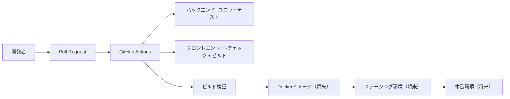

# GitHub Actions による CI 基盤構築 - Spring Boot + React アプリの段階的導入とテスト戦略

この記事では、Spring Boot バックエンドと React フロントエンドを持つサンプルアプリケーションに対して、GitHub Actions を活用した CI パイプラインを段階的に構築する方法を解説します。

## はじめに

CI/CD パイプラインは現代のソフトウェア開発において必須の要素ですが、複雑なアプリケーションで一度にすべてを構築しようとするとガチむずでやる気なくなります。

とりあえず、**段階的な導入アプローチ**を採用し、まずは最小限の構成で CI 基盤を構築し、徐々に機能を拡張していきます。

## 技術スタック

- **バックエンド**: Spring Boot 3.5.4, Java 17, Maven
- **フロントエンド**: React 19, TypeScript, Vite
- **データベース**: PostgreSQL（CI 環境未構築）
- **テスト**: JUnit 5, Testcontainers（CI 環境未構築）
- **CI/CD**: GitHub Actions

## アーキテクチャ概要



## 段階的導入戦略

### Phase 1: 最小構成（現在の実装）

最初のフェーズでは、基本的なテストとビルド検証のみを実装します。

```yaml
name: Sample App CI Pipeline

on:
  pull_request:
    branches: [main, develop]
    paths-ignore:
      - "docs/**"
      - "*.md"
      - ".gitignore"
  push:
    branches: [main]
    paths-ignore:
      - "docs/**"
      - "*.md"
      - ".gitignore"

env:
  JAVA_VERSION: "17"
  NODE_VERSION: "22"
  MAVEN_OPTS: "-Dmaven.repo.local=.m2/repository -Xmx1024m"
```

#### トリガー設定のポイント

- **paths-ignore**: ドキュメントの変更では CI を実行しない（コスト削減）
- **複数ブランチ対応**: main と develop ブランチの両方でテスト実行
- **環境変数の一元管理**: Java や Node のバージョンを環境変数で管理

### バックエンドテストジョブ

```yaml
jobs:
  backend-test:
    name: 🧪 Backend Domain Unit Tests
    runs-on: ubuntu-latest

    defaults:
      run:
        working-directory: ./backend

    steps:
      - name: 📥 Checkout Repository
        uses: actions/checkout@v4

      - name: ☕ Setup Java 17
        uses: actions/setup-java@v4
        with:
          distribution: "temurin"
          java-version: ${{ env.JAVA_VERSION }}
          cache: "maven"

      - name: 📦 Cache Maven Dependencies
        uses: actions/cache@v4
        with:
          path: ~/.m2/repository
          key: ${{ runner.os }}-maven-${{ hashFiles('**/pom.xml') }}
          restore-keys: |
            ${{ runner.os }}-maven-

      - name: 🔍 Verify Maven Configuration
        run: |
          mvn --version
          mvn help:effective-pom -q

      - name: 🧪 Run Domain Unit Tests
        run: |
          mvn clean test \
            -B \
            -Dtest="com.sampleapp.sampleapp.domain.**.*Test" \
            -DfailIfNoTests=false \
            --fail-at-end
```

#### 実装のポイント

**1. キャッシュ戦略**

- Maven 依存関係をキャッシュしてビルド時間を短縮
- `pom.xml` のハッシュ値をキーにして適切にキャッシュを無効化

**2. テスト範囲の限定**

- Phase 1 では純粋なドメインテスト（データベース不要）のみ実行
- `-Dtest` パラメータでテスト対象を明示的に指定

**3. エラーハンドリング**

- `--fail-at-end`: すべてのテストを実行してから失敗判定
- `-DfailIfNoTests=false`: テストが見つからない場合でも失敗しない

### フロントエンドチェックジョブ

```yaml
frontend-check:
  name: 🎨 Frontend Basic Check
  runs-on: ubuntu-latest
  defaults:
    run:
      working-directory: ./frontend

  steps:
    - name: 📥 Checkout Repository
      uses: actions/checkout@v4

    - name: 🟢 Setup Node.js 22
      uses: actions/setup-node@v4
      with:
        node-version: ${{ env.NODE_VERSION }}
        cache: "npm"
        cache-dependency-path: "frontend/package-lock.json"

    - name: 📦 Install Dependencies
      run: |
        npm ci --prefer-offline --no-audit

    - name: 🔍 TypeScript Check
      run: |
        npm run type-check || npx tsc --noEmit

    - name: 🏗️ Build Verification
      run: |
        npm run build
```

#### 実装のポイント

**1. 段階的なチェック**

- TypeScript の型チェックで静的解析
- ビルド検証で実際の成果物生成を確認

**2. npm 最適化**

- `npm ci`: package-lock.json に基づいた確実なインストール
- `--prefer-offline --no-audit`: CI 環境での高速化

**3. フォールバック対応**

- `npm run type-check || npx tsc --noEmit`: スクリプトがない場合の代替実行

## 段階的拡張計画

### Phase 2: 統合テスト追加（計画）

```yaml
# PostgreSQL統合テストの追加例
services:
  postgres:
    image: postgres:16
    env:
      POSTGRES_DB: sampleapp_test
      POSTGRES_USER: sampleapp
      POSTGRES_PASSWORD: test123
    options: >-
      --health-cmd pg_isready
      --health-interval 10s
      --health-timeout 5s
      --health-retries 5
    ports:
      - 5432:5432
```

**追加予定の機能:**

- Testcontainers を使った統合テスト
- Spring Security の認証・認可テスト
- API エンドポイントのテスト

### Phase 3: 品質ゲート（計画）

```yaml
# セキュリティスキャンの追加例
security-scan:
  name: 🔒 Security & Dependency Scan
  runs-on: ubuntu-latest
  steps:
    - name: 🔍 Run OSSAR (GitHub Security Scanner)
      uses: github/ossar-action@v1
    - name: 📊 Upload SARIF Results
      uses: github/codeql-action/upload-sarif@v3
```

**追加予定の機能:**

- 依存関係の脆弱性スキャン
- コードカバレッジ測定
- 静的コード解析

### Phase 4: デプロイメント（計画）

**追加予定の機能:**

- Docker イメージのビルドとプッシュ
- ステージング環境への自動デプロイ
- 本番環境への手動承認デプロイ

## 現在の設定で実現できること

### 1. Pull Request の品質保証

- バックエンドのドメインロジックテスト
- フロントエンドの型安全性チェック
- ビルド成功の検証

### 2. 開発効率の向上

- 自動化されたテスト実行
- 早期のエラー検出
- 一貫した品質基準

### 3. コスト効率

- 必要最小限のリソース使用
- キャッシュによる高速化
- 段階的な機能追加

## Maven とテスト設定

プロジェクトの `pom.xml` では、テストに必要な依存関係を適切に設定しています：

```xml
<properties>
    <java.version>17</java.version>
    <testcontainers.version>1.20.4</testcontainers.version>
</properties>

<dependencies>
    <!-- テスト関連の依存関係 -->
    <dependency>
        <groupId>org.springframework.boot</groupId>
        <artifactId>spring-boot-starter-test</artifactId>
        <scope>test</scope>
    </dependency>
    <dependency>
        <groupId>org.testcontainers</groupId>
        <artifactId>junit-jupiter</artifactId>
        <scope>test</scope>
    </dependency>
    <dependency>
        <groupId>org.testcontainers</groupId>
        <artifactId>spring-security-test</artifactId>
        <scope>test</scope>
    </dependency>
</dependencies>
```

## フロントエンドの設定

`package.json` では、CI に必要なスクリプトを定義：

```json
{
  "scripts": {
    "build": "tsc -b && vite build",
    "type-check": "tsc --noEmit",
    "lint": "eslint .",
    "format:check": "prettier --check ."
  }
}
```

## CI 実行フロー

### 1. トリガー

- Pull Request 作成時
- main ブランチへのプッシュ時
- ドキュメントファイルの変更は除外

### 2. 並列実行

バックエンドテストとフロントエンドチェックが並列で実行され、全体の実行時間を短縮

### 3. 結果レポート

- テスト結果は GitHub の Checks タブで確認可能
- 失敗時は詳細なログが提供される

## ベストプラクティス

### 1. 段階的導入

```yaml
# コメントアウトで将来の拡張計画を明示
# integration-test:
#   - Testcontainers + PostgreSQL
#   - @DataJpaTest, @SpringBootTest
#   - Spring Security統合テスト
```

### 2. 適切なキャッシュ戦略

```yaml
- name: 📦 Cache Maven Dependencies
  uses: actions/cache@v4
  with:
    path: ~/.m2/repository
    key: ${{ runner.os }}-maven-${{ hashFiles('**/pom.xml') }}
    restore-keys: |
      ${{ runner.os }}-maven-
```

### 3. エラーの詳細化

```yaml
- name: 🔍 Verify Maven Configuration
  run: |
    mvn --version
    mvn help:effective-pom -q
```

## トラブルシューティング

### よくある問題と対処法

**1. Maven 依存関係の問題**

```bash
# 設定確認
mvn help:effective-pom -q
# キャッシュクリア
mvn clean
```

**2. Node.js バージョンの不整合**

```yaml
# package.json と CI の Node バージョンを一致させる
node-version: ${{ env.NODE_VERSION }}
```

**3. テスト実行時間の長期化**

```yaml
# 並列実行とキャッシュで最適化
cache: "maven"
```

## まとめ

本記事では、GitHub Actions を使った CI パイプラインの段階的構築手法を紹介しました。

**重要なポイント:**

1. **最小構成から始める**: 複雑さを避け、確実に動作する基盤を構築
2. **段階的な拡張**: 必要に応じて機能を追加し、リスクを最小化
3. **適切なキャッシュ戦略**: 実行時間とコストを最適化
4. **明確な設計文書**: 将来の拡張計画をコメントで明示

この手法により、安定性と拡張性を両立した CI/CD パイプラインを構築できます。プロジェクトの成長に合わせて、統合テスト、セキュリティスキャン、デプロイメント機能を順次追加していくことで、継続的に品質向上を図ることができます。

---

**参考リンク:**

- [GitHub Actions Documentation](https://docs.github.com/en/actions)
- [Spring Boot Testing](https://spring.io/guides/gs/testing-web/)
- [Testcontainers](https://www.testcontainers.org/)
- [Vite Build Tool](https://vitejs.dev/)
