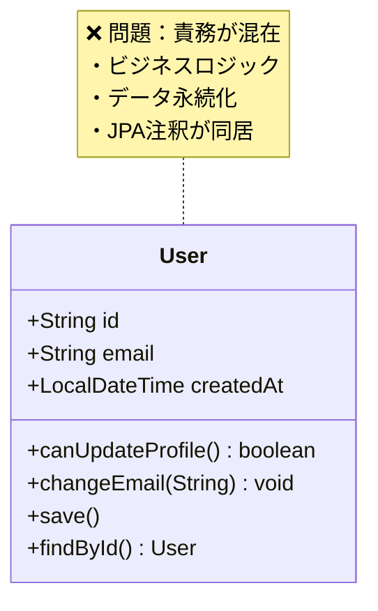
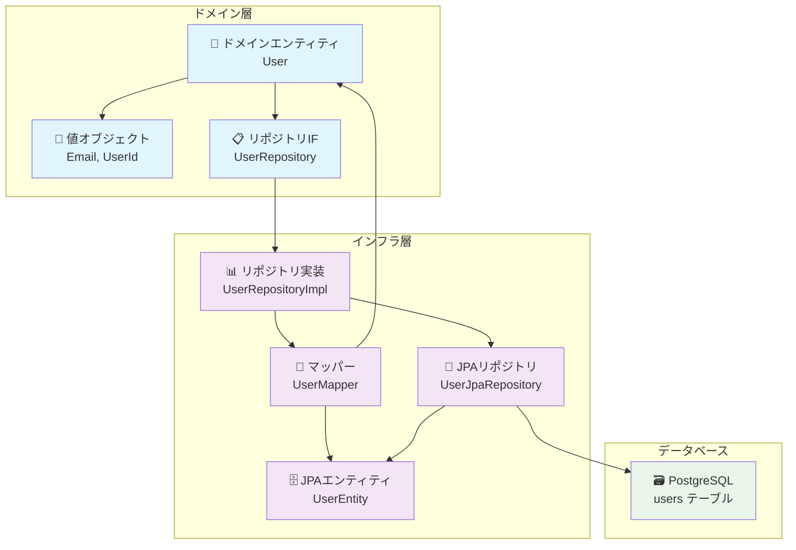
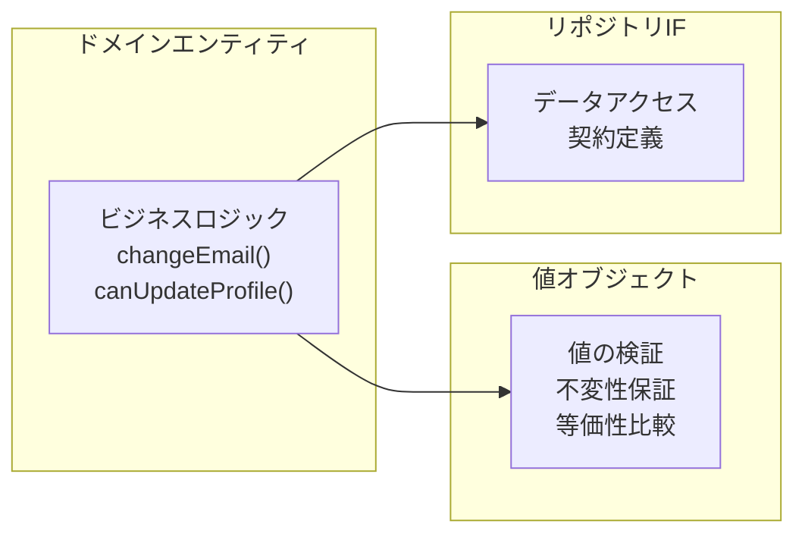
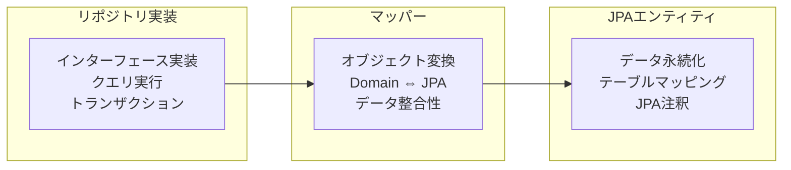
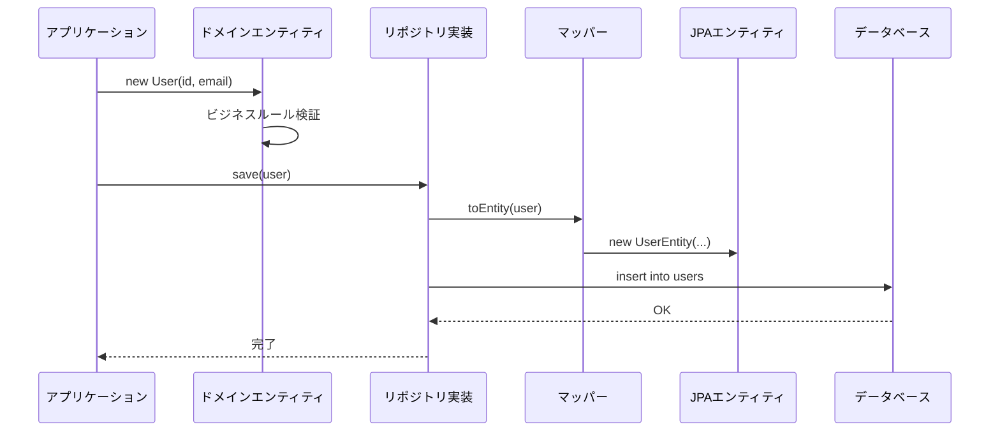
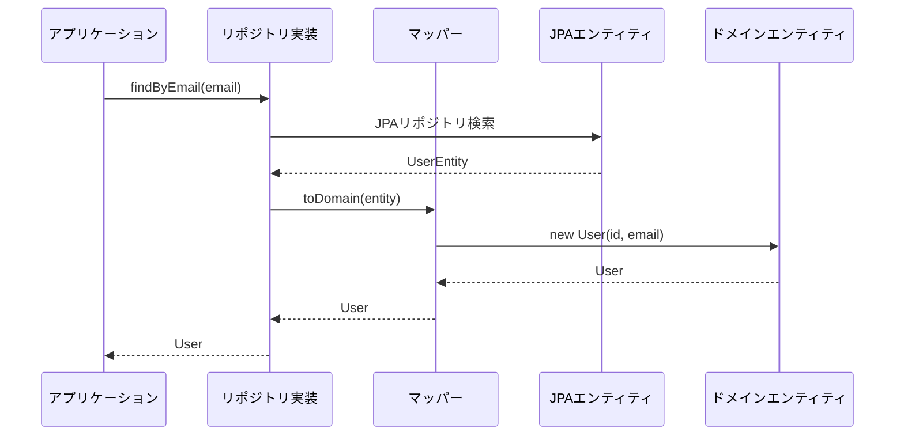
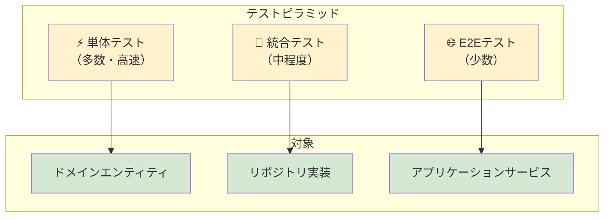
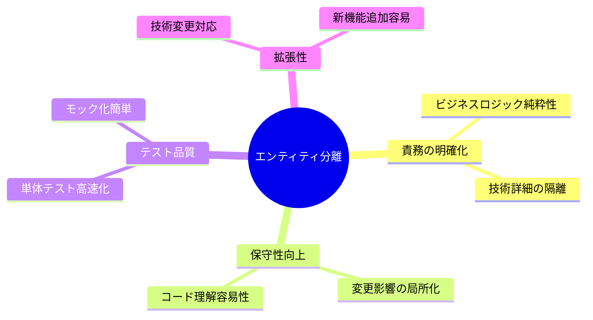

# DDD におけるエンティティの二層分離：ドメインエンティティと JPA エンティティの責務分離

## はじめに

ドメイン駆動設計（DDD）を実践する際、「エンティティ」という用語が複数の文脈で使われることがあります。

- **ドメインエンティティ**: ビジネスロジックを持つドメイン層のオブジェクト
- **JPA エンティティ**: データベースとのマッピングを担うインフラ層のオブジェクト

本記事では、これら 2 つのエンティティを明確に分離し、それぞれの責務を適切に配置する実装パターンについて図解で解説します。

## 問題：責務が混在したエンティティ

### アンチパターンの構造



### 問題点

1. **責務の混在**: ビジネスロジックとデータアクセスが同一クラス
2. **技術依存**: ドメインロジックが JPA 技術に依存
3. **テスト困難**: 単体テストでデータベース接続が必要

## 解決策：エンティティの二層分離

### アーキテクチャ全体図



## 各コンポーネントの責務

### ドメイン層の責務



### インフラ層の責務



## 実装のポイント

### 1. ドメインエンティティ（純粋なビジネスロジック）

```java
public class User {
    private final UserId id;
    private Email email;

    // ✅ ビジネスルールのみに集中
    public void changeEmail(Email newEmail) {
        if (this.email.equals(newEmail)) {
            throw new DomainException("同じメールアドレスには変更できません");
        }
        this.email = newEmail;
    }
}
```

### 2. 値オブジェクト（検証とカプセル化）

```java
public class Email {
    private final String value;

    public Email(String value) {
        // ✅ 作成時に必ず検証
        validateFormat(value);
        this.value = normalize(value);
    }
}
```

### 3. マッパー（変換の責務分離）

```java
@Component
public class UserMapper {
    // ✅ 双方向変換を担当
    public UserEntity toEntity(User user) { /* ... */ }
    public User toDomain(UserEntity entity) { /* ... */ }
}
```

## データの流れ

### ユーザー登録のシーケンス



### 検索時のデータ変換



## テスト戦略

### 各層のテスト方針



詳細なテスト実装については、別記事「DDD アプリケーションのテスト戦略：モックテストと Testcontainers による統合テスト」をご参照ください。

## この分離パターンの価値

### ✅ メリット



### ⚠️ 注意点

- **小規模プロジェクト**: 設計の複雑さが開発効率を下げる可能性
- **チーム習熟度**: DDD 理解不足による設計の乱れ
- **変換コスト**: マッパーによる軽微なパフォーマンス影響

## まとめ

DDD におけるエンティティの二層分離は、**責務の明確な分離**により以下を実現します：

1. **ドメインロジックの純粋性保持**
2. **技術変更への高い耐性**
3. **効率的なテスト戦略**

プロジェクトの規模と要件に応じて、適切なレベルで導入することで、保守性と拡張性に優れたシステムを構築できます。

## 参考資料

- [ドメイン駆動設計 エリック・エヴァンス](https://www.amazon.co.jp/dp/4798121967)
- [実践ドメイン駆動設計 ヴァーン・ヴァーノン](https://www.amazon.co.jp/dp/479813161X)
- [Spring Data JPA Reference Documentation](https://docs.spring.io/spring-data/jpa/docs/current/reference/html/)
