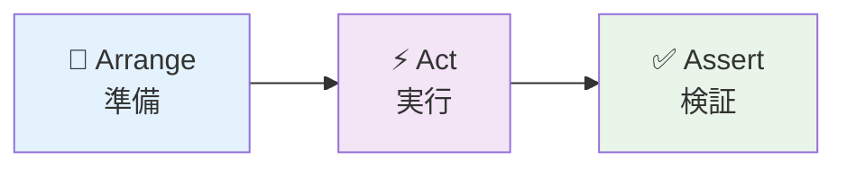
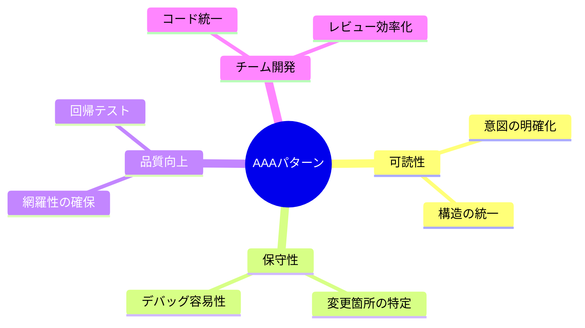

# JUnit5 によるテストクラス作成：AAA パターンで学ぶ効果的なテスト実装

## はじめに

本記事では、JUnit5 を使用したテストクラスの作成方法と、**AAA パターン**（Arrange-Act-Assert）を活用した効果的なテスト実装について解説します。

## テストクラスの基本構成

### 1. テストクラスの作成

```java
@ExtendWith(MockitoExtension.class)
@DisplayName("UserRepository Mock単体テスト")
class UserRepositoryTest {

    @Mock
    private UserRepository userRepository;

    // テストデータの準備
    private User testUser;
    private Email testEmail;

    @BeforeEach
    void setUp() {
        // 各テスト前の共通準備処理
        testEmail = new Email("test@example.com");
        testUser = User.register(testEmail, username, password);
    }
}
```

### 重要なアノテーション

| アノテーション                        | 役割                     |
| ------------------------------------- | ------------------------ |
| `@ExtendWith(MockitoExtension.class)` | Mockito との統合         |
| `@DisplayName`                        | テストの説明（日本語可） |
| `@Mock`                               | モックオブジェクトの作成 |
| `@BeforeEach`                         | 各テスト前の初期化       |
| `@Test`                               | テストメソッドの識別     |

## AAA パターンの実践

### AAA パターンとは

**AAA（Triple A）パターン**は、テストコードを以下の 3 つのフェーズに分けて記述する手法です：



### 1. 基本的な AAA パターン

```java
@Test
@DisplayName("findByEmail: 存在するメールアドレスでユーザーが見つかる")
void findByEmail_UserExists_ReturnsUser() {
    // 🔧 Arrange（準備）- テストデータとモックの設定
    when(userRepository.findByEmail(testEmail))
        .thenReturn(Optional.of(testUserWithId));

    // ⚡ Act（実行）- テスト対象メソッドの実行
    Optional<User> result = userRepository.findByEmail(testEmail);

    // ✅ Assert（検証）- 結果の検証
    assertThat(result).isPresent();
    assertThat(result.get().getEmail()).isEqualTo(testEmail);
    assertThat(result.get().getId()).isEqualTo(1L);

    verify(userRepository).findByEmail(testEmail);
}
```

### 2. 異常系テストの AAA パターン

```java
@Test
@DisplayName("findByEmail: 存在しないメールアドレスで空のOptionalが返る")
void findByEmail_UserNotExists_ReturnsEmpty() {
    // 🔧 Arrange - 存在しないメールアドレスの準備
    Email notFoundEmail = new Email("notfound@example.com");
    when(userRepository.findByEmail(notFoundEmail))
        .thenReturn(Optional.empty());

    // ⚡ Act - 検索の実行
    Optional<User> result = userRepository.findByEmail(notFoundEmail);

    // ✅ Assert - 空の結果であることを検証
    assertThat(result).isEmpty();
    verify(userRepository).findByEmail(notFoundEmail);
}
```

### 3. 例外テストの AAA パターン

```java
@Test
@DisplayName("findByEmail: nullメールアドレスで例外が発生する")
void findByEmail_NullEmail_ThrowsException() {
    // 🔧 Arrange - 例外を発生させるモック設定
    when(userRepository.findByEmail(null))
        .thenThrow(new IllegalArgumentException("Email cannot be null"));

    // ⚡ Act & ✅ Assert - 例外の実行と検証を同時に
    assertThatThrownBy(() -> userRepository.findByEmail(null))
        .isInstanceOf(IllegalArgumentException.class)
        .hasMessageContaining("Email cannot be null");

    verify(userRepository).findByEmail(null);
}
```

## テストメソッドの命名規則

### 推奨命名パターン

```
メソッド名_テスト条件_期待結果()
```

### 実例

```java
// ✅ 良い例：意図が明確
void findByEmail_UserExists_ReturnsUser()
void findByEmail_UserNotExists_ReturnsEmpty()
void save_NewUser_ReturnsUserWithId()
void save_NullUser_ThrowsException()

// ❌ 悪い例：意図が不明確
void testFindByEmail()
void testSave()
void userTest()
```

## テストデータ準備のベストプラクティス

### @BeforeEach での共通データ準備

```java
@BeforeEach
void setUp() {
    // 各テストで使用する共通データを準備
    testEmail = new Email("test@example.com");
    testUsername = new Username("testuser");
    testPasswordHash = new PasswordHash("password123");

    // ID未設定の新規ユーザー
    testUser = User.register(testEmail, testUsername, testPasswordHash);

    // ID設定済みの既存ユーザー
    testUserWithId = new User(
        1L, testEmail, testUsername, testPasswordHash,
        new ArrayList<>(), Instant.now(), Instant.now()
    );
}
```

### テスト固有データの準備

```java
@Test
@DisplayName("save: 既存ユーザーの更新が成功する")
void save_ExistingUser_ReturnsUpdatedUser() {
    // 🔧 Arrange - このテスト専用のデータを準備
    User updatedUser = new User(
        1L,
        testEmail,
        new Username("updateduser"), // ユーザー名を変更
        testPasswordHash,
        new ArrayList<>(),
        Instant.now().minusSeconds(3600), // 1時間前に作成
        Instant.now() // 現在時刻で更新
    );

    when(userRepository.save(testUserWithId)).thenReturn(updatedUser);

    // ⚡ Act
    User result = userRepository.save(testUserWithId);

    // ✅ Assert
    assertThat(result.getUsername().getValue()).isEqualTo("updateduser");
}
```

## アサーション（検証）のポイント

### AssertJ の活用

```java
// ✅ 読みやすいアサーション
assertThat(result).isPresent();
assertThat(result.get().getEmail()).isEqualTo(testEmail);
assertThat(result.get().getId()).isNotNull();

// ✅ 例外の詳細検証
assertThatThrownBy(() -> userRepository.findByEmail(null))
    .isInstanceOf(IllegalArgumentException.class)
    .hasMessageContaining("Email cannot be null");

// ✅ コレクションの検証
assertThat(userList)
    .hasSize(3)
    .extracting(User::getEmail)
    .containsExactly(email1, email2, email3);
```

### Mockito の検証

```java
// メソッド呼び出しの検証
verify(userRepository).findByEmail(testEmail);
verify(userRepository, times(1)).save(any(User.class));
verify(userRepository, never()).delete(any());

// 引数の詳細検証
verify(userRepository).save(argThat(user ->
    user.getEmail().equals(testEmail) &&
    user.getUsername().equals(testUsername)
));
```

## テスト実行とレポート

### Maven/Gradle でのテスト実行

```bash
# 全テストの実行
mvn test

# 特定のテストクラスのみ実行
mvn test -Dtest=UserRepositoryTest

# 特定のテストメソッドのみ実行
mvn test -Dtest=UserRepositoryTest#findByEmail_UserExists_ReturnsUser
```

### テストレポートの確認

```
target/surefire-reports/
├── TEST-UserRepositoryTest.xml     # JUnit XMLレポート
└── UserRepositoryTest.txt          # テキストレポート
```

## まとめ

### AAA パターンの効果



### 実装のポイント

1. **命名規則の徹底**: `メソッド名_条件_期待結果`
2. **AAA パターンの遵守**: 準備 → 実行 → 検証の明確な分離
3. **適切なアサーション**: AssertJ と Mockito の効果的な活用
4. **テストデータ管理**: 共通データと個別データの使い分け

JUnit5 と AAA パターンを組み合わせることで、**読みやすく、保守しやすく、信頼性の高い**テストコードを作成できます。テスト駆動開発（TDD）の実践にも欠かせない技術です。

## 参考資料

- [JUnit 5 User Guide](https://junit.org/junit5/docs/current/user-guide/)
- [Mockito Documentation](https://javadoc.io/doc/org.mockito/mockito-core/latest/org/mockito/Mockito.html)
- [AssertJ Documentation](https://assertj.github.io/doc/)
