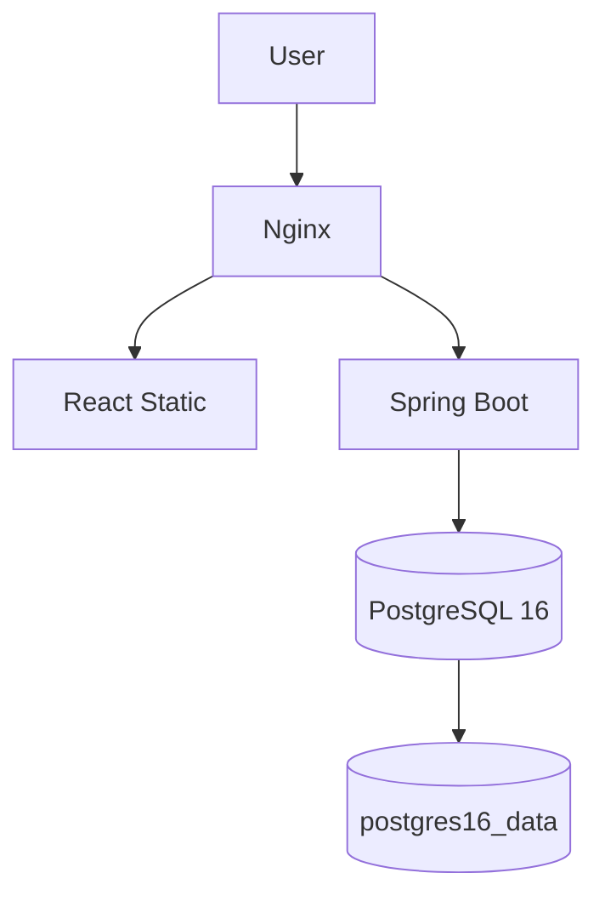
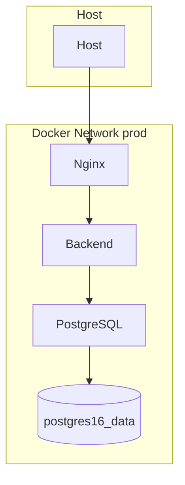
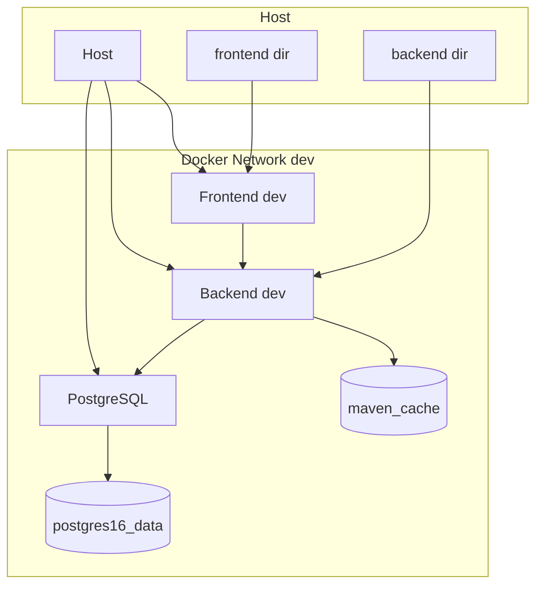

### Spring Boot + React を Docker Compose で開発環境コンテナ化する（PostgreSQL + Nginx 構成）

Spring Boot（Backend）と React（Frontend）に PostgreSQL、Nginx を組み合わせた構成を、Docker Compose でサクッと立ち上げる方法を要点中心に解説します。実際の設定ファイルをベースに、図（Mermaid）と手順、トラブルシュートまで一気通貫でまとめました。

---

## 全体アーキテクチャ



- **Nginx**: フロントの静的ファイル配信＋`/api/*` を Spring Boot にプロキシ
- **Spring Boot**: REST API（DB 接続含む）
- **React**: 本番ビルドを Nginx で配信
- **PostgreSQL**: データ永続化（Docker Volume）

---

## 主要ファイルと役割

- `infrastructure/docker/dev/docker-compose.yml`: 開発用（ホットリロード・volumes マウント、DB は 15432→5432 公開）
- `infrastructure/docker/prod/docker-compose.yml`: 本番用（マルチステージビルド、DB は内部ネットワークのみ）
- `infrastructure/docker/backend/Dockerfile`: Spring Boot のビルド＆実行（JAR）
- `infrastructure/docker/frontend/Dockerfile`: React をビルドし Nginx で配信
- `infrastructure/docker/nginx/nginx.conf`: 静的配信・API プロキシ・SPA ルーティング
- `infrastructure/docker/postgres/Dockerfile`: PostgreSQL(本番) 用ベース（公式 image をビルド元に採用）
- `infrastructure/docker/postgres/Dockerfile.dev`: PostgreSQL(開発) 用ベース（必要に応じて追加ツール）

開発用途では以下も用意（任意で活用）

- `infrastructure/docker/backend/Dockerfile.dev`
- `infrastructure/docker/frontend/Dockerfile.dev`

## ディレクトリ構成（参考）

```
infrastructure/docker/
├── backend/
│   ├── Dockerfile
│   └── Dockerfile.dev
├── frontend/
│   ├── Dockerfile
│   └── Dockerfile.dev
├── nginx/
│   └── nginx.conf
├── postgres/
│   ├── Dockerfile          # 本番用（ベースは postgres:16）
│   └── Dockerfile.dev      # 開発用（必要時にツール追加など）
├── dev/
│   └── docker-compose.yml  # 開発用 compose（DB: 15432→5432 を公開）
├── prod/
│   └── docker-compose.yml  # 本番用 compose（DB ポートは公開しない）
└── init/                   # DB 初期化 SQL など
```

---

## Compose（prod: DB / Backend / Frontend[Nginx]）

```yaml
# infrastructure/docker/prod/docker-compose.yml（抜粋）
version: "3.8"

services:
  # データベース（PostgreSQL 16）
  postgres:
    build:
      context: ..
      dockerfile: ./postgres/Dockerfile
    container_name: sample-postgres
    environment:
      # 初期DB名/ユーザー/パスワード（サンプル値）
      POSTGRES_DB: sample
      POSTGRES_USER: sample
      POSTGRES_PASSWORD: sample123
    volumes:
      # DB データの永続化と初期化 SQL の投入
      - postgres16_data:/var/lib/postgresql/data
      - ../init:/docker-entrypoint-initdb.d
    restart: unless-stopped
    networks:
      - sample-network

  # バックエンド（Spring Boot / OpenJDK 17）
  backend:
    image: sample-backend
    container_name: sample-backend
    build:
      # リポジトリの backend ディレクトリをビルドコンテキストに指定
      context: ../../../backend
      dockerfile: ../backend/Dockerfile
    environment:
      # 実行プロファイルと DB 接続先（サービス名 postgres を使用）
      SPRING_PROFILES_ACTIVE: prod
      SPRING_DATASOURCE_URL: jdbc:postgresql://postgres:5432/sample
      SPRING_DATASOURCE_USERNAME: sample
      SPRING_DATASOURCE_PASSWORD: sample123
    depends_on:
      # DB 起動後にバックエンドを起動
      - postgres
    networks:
      - sample-network
    restart: unless-stopped

  # フロント配信＋API リバプロ（Nginx）
  nginx:
    image: sample-frontend
    container_name: sample-nginx
    build:
      # フロントのビルド（Node）→ Nginx で静的配信
      context: ../../../frontend
      dockerfile: ../frontend/Dockerfile
    volumes:
      # Nginx の設定をマウント（/api を backend にプロキシ）
      - ../nginx/nginx.conf:/etc/nginx/nginx.conf:ro
    ports:
      # 外部公開は 80 のみ
      - "80:80"
    depends_on:
      # API が先に立ち上がるよう依存関係を宣言
      - backend
    networks:
      - sample-network
    restart: unless-stopped

volumes:
  # PostgreSQL データ永続化用の匿名ボリューム
  postgres16_data:

networks:
  sample-network:
    driver: bridge
```

---

## Compose（dev: ホットリロード構成）

```yaml
# infrastructure/docker/dev/docker-compose.yml（抜粋）
version: "3.8"

services:
  postgres:
    build:
      context: ..
      dockerfile: ./postgres/Dockerfile.dev
    container_name: sample-postgres-dev
    environment:
      POSTGRES_DB: sample
      POSTGRES_USER: sample
      POSTGRES_PASSWORD: sample123
    ports:
      - "15432:5432"
    volumes:
      - postgres16_data:/var/lib/postgresql/data
      - ../init:/docker-entrypoint-initdb.d
    networks:
      - sample-network

  backend:
    build:
      context: ../../../backend
      dockerfile: ../backend/Dockerfile.dev
    container_name: sample-backend-dev
    environment:
      SPRING_PROFILES_ACTIVE: dev
      SPRING_DATASOURCE_URL: jdbc:postgresql://postgres:5432/sample
      SPRING_DATASOURCE_USERNAME: sample
      SPRING_DATASOURCE_PASSWORD: sample123
    volumes:
      - ../../../backend:/app # ホストのコードを共有（ホットリロード）
      - maven_cache:/root/.m2 # Maven キャッシュ
    depends_on:
      - postgres
    ports:
      - "8080:8080"
    networks:
      - sample-network

  frontend:
    build:
      context: ../../../frontend
      dockerfile: ../frontend/Dockerfile.dev
    container_name: sample-frontend-dev
    volumes:
      - ../../../frontend:/app # ホストのコードを共有（ホットリロード）
      - /app/node_modules # node_modules はコンテナ側
    ports:
      - "3000:3000"
    networks:
      - sample-network

volumes:
  postgres16_data:
  maven_cache:

networks:
  sample-network:
    driver: bridge
```

---

## 開発と本番の構成差の理由（本記事の方針）

- 開発では Nginx を使わず、Vite の開発サーバ（:3000）をそのまま利用します。
  - フロントの HMR（Hot Module Replacement）を最大限に活かすため
  - 変更のたびにビルド・再配信が必要になる静的配信（Nginx 配信）を避けるため
  - Vite の `server.proxy` で `/api` → `http://localhost:8080` に中継し、同一オリジン相当で CORS を回避
    ```ts
    // vite.config.ts（再掲）
    import { defineConfig } from "vite";
    export default defineConfig({
      server: {
        proxy: {
          "/api": { target: "http://localhost:8080", changeOrigin: true },
        },
      },
    });
    ```
- 本番では Nginx が静的配信と `/api` プロキシを担当します。
  - マルチステージビルドで軽量かつ安全なイメージを配布
  - キャッシュ・圧縮・ヘッダー・TLS などの運用設定を一元化

この差分は「開発の回転速度（DX）」と「本番の再現性・安全性」という別々の最適化を行うためです。必要なら、開発でも Nginx を前段に置いて frontend:3000 へプロキシさせることで、本番とほぼ同じ挙動に寄せることも可能です（HMR 維持には Upgrade ヘッダー等の設定が必要）。

## ホストとコンテナの関係図（prod）



補足

- Host → Nginx は 80 のみ公開。PostgreSQL は内部ネットワークのみ（直接公開しない）。
- Backend は同ネットワーク内で `postgres` ホスト名で DB に接続。
- データは `postgres16_data` ボリュームに永続化。

## ホストとコンテナの関係図（dev）



補足

- Host の `frontend`/`backend` ディレクトリは、それぞれコンテナの `/app` にマウント（ホットリロード）。
- Backend の Maven キャッシュは `maven_cache` ボリュームを使用。
- ポート公開により、Host から Frontend:3000、Backend:8080、PostgreSQL:15432 にアクセス可能。

ポイント

- DB は `postgres:16` を利用。`./init` に初期化 SQL を置けば起動時に自動適用。
- Backend は JAR をマルチステージでビルド。`SPRING_DATASOURCE_URL` は Compose のサービス名 `postgres` を使用。
- Frontend は Node ビルド → Nginx で配信。`nginx` サービスとして 80 番を公開。

---

## Backend（Spring Boot, Maven → JAR）

```dockerfile
# infrastructure/docker/backend/Dockerfile
# 1) build ステージ: 依存解決と JAR 作成（最終イメージに Maven は含めない）
FROM maven:latest AS build
WORKDIR /app
COPY pom.xml .               # 依存キャッシュのため先にコピー
RUN mvn dependency:go-offline -B
COPY src ./src               # アプリのソースをコピー
RUN mvn clean package -DskipTests -B  # JAR を生成

# 2) runtime ステージ: 軽量な OpenJDK で JAR を実行
FROM openjdk:17 AS runtime
WORKDIR /app
COPY --from=build /app/target/*.jar app.jar  # 成果物のみコピー
ENV JAVA_OPTS="-Xmx512m -Xms256m"            # メモリ最適化例
EXPOSE 8080                                   # アプリの公開ポート
CMD ["sh", "-c", "java $JAVA_OPTS -jar app.jar"]
```

ポイント

- 依存取得を先に行い、ビルドキャッシュを最大化。
- ランタイムは `openjdk:17`。必要に応じて `JAVA_OPTS` を調整可能。

---

## Frontend（React → 静的配信 in Nginx）

```dockerfile
# infrastructure/docker/frontend/Dockerfile
FROM node:22-bookworm-slim AS build       # 1) Node で本番ビルド
WORKDIR /app
COPY package*.json ./                    # 依存定義を先にコピー
RUN npm ci                               # lockfile 尊重で再現性の高い install
COPY . .                                 # 残りのソースをコピー
ENV NODE_ENV=production
RUN npm run build                        # dist/ を生成

FROM nginx:alpine                        # 2) Nginx で静的配信
COPY --from=build /app/dist /usr/share/nginx/html
EXPOSE 80
CMD ["nginx", "-g", "daemon off;"]
```

ポイント

- React を本番ビルドして、Nginx で静的配信。
- API 呼び出しは Nginx の `/api/*` プロキシへ任せる（フロントからは相対パス `/api/...` 推奨）。

---

## 補足：マルチステージビルドとは？

マルチステージビルドは、1 つの Dockerfile の中で「ビルド用ステージ」と「実行用ステージ」を分け、ビルドに使う重いツール類（Maven/Node など）を最終イメージに含めない設計です。完成物（JAR や `dist/`）だけを軽量ランタイムへコピーします。

- うれしい効果

  - 小さく軽い最終イメージ（配布が速い・脆弱性表面が小さい）
  - セキュリティ向上（ビルドツールが実行環境に残らない）
  - キャッシュ効率（依存解決とソース変更の差分を活かせる）
  - 責務分離（作るステージと動かすステージを明確化）

- Backend の例（Maven → OpenJDK）

```dockerfile
# build ステージ（Maven を含む）: 依存解決とビルド
FROM maven:latest AS build
WORKDIR /app
COPY pom.xml .
RUN mvn dependency:go-offline -B
COPY src ./src
RUN mvn clean package -DskipTests -B

# runtime ステージ（OpenJDK のみ）: 成果物だけを実行
FROM openjdk:17
WORKDIR /app
COPY --from=build /app/target/*.jar app.jar
CMD ["java", "-jar", "app.jar"]
```

- Frontend の例（Node → Nginx）

```dockerfile
FROM node:22-bookworm-slim AS build   # Node を含むビルド用ステージ
WORKDIR /app
COPY package*.json ./
RUN npm ci
COPY . .
RUN npm run build

FROM nginx:alpine                     # 実行（配信）は Nginx のみ
COPY --from=build /app/dist /usr/share/nginx/html
CMD ["nginx", "-g", "daemon off;"]
```

- ベストプラクティス
  - 依存マニフェスト（`pom.xml` / `package.json`）を先にコピーして依存解決し、キャッシュを効かせる
  - `.dockerignore` で `node_modules` など不要物を除外
  - ベースイメージは用途別に分ける（build: `maven`/`node`、runtime: `openjdk`/`nginx`）
  - `COPY --from=<stage>` で「成果物だけ」を抽出

---

## Nginx（静的配信＋ API プロキシ＋ SPA ルーティング）

```nginx
# infrastructure/docker/nginx/nginx.conf（抜粋）
worker_processes auto;

events { worker_connections 1024; }

http {
  include       mime.types;
  default_type  application/octet-stream;
  sendfile      on;
  keepalive_timeout  65;
  gzip on;

  upstream backend { server backend:8080; }

  server {
    listen 80;

    # 静的配信（React build）
    root /usr/share/nginx/html;
    index index.html;

    # API → Spring Boot
    location /api/ {
      proxy_pass http://backend/;
      proxy_http_version 1.1;
      proxy_set_header Host $host;
      proxy_set_header X-Real-IP $remote_addr;
      proxy_set_header X-Forwarded-For $proxy_add_x_forwarded_for;
      proxy_set_header X-Forwarded-Proto $scheme;
    }

    # アセットは長期キャッシュ
    location /assets/ {
      try_files $uri =404;
      access_log off;
      expires 1y;
      add_header Cache-Control "public, immutable";
    }

    # SPA ルーティング
    location / { try_files $uri /index.html; }
  }
}
```

ポイント

- `/api/*` は Backend にプロキシ。フロントはルート配信＋ SPA の再書き戻し。
- 静的アセットはキャッシュ最適化済み。

## なぜ本番で CORS が不要なのか（今回の構成）

- ブラウザの同一オリジン判定は「スキーム＋ホスト＋ポート」で行われます。
- 今回の構成では、Nginx がフロントの静的配信と `/api/*` のプロキシを同じオリジン（例: `http://localhost/`）で受け持ちます。
- 結果として、フロントも API もブラウザからは同一オリジンに見えるため、CORS は発動せず設定不要です。

## 開発環境での違いと選択肢

開発では、フロント開発サーバ（例: `http://localhost:3000`）とバックエンド（例: `http://localhost:8080`）を別ポートで直叩きしがちで、クロスオリジンになります。次のどちらかで解消できます。

- 同一オリジン化（推奨）

  - Nginx 前段で `/`→ フロント、`/api`→ バックエンドにプロキシする
  - あるいは Vite の開発プロキシで `/api` をバックエンドへ転送し、フロントは相対パス `/api/...` に統一

    ```ts
    // vite.config.ts（例）
    import { defineConfig } from "vite"; // Vite 設定の型補助

    export default defineConfig({
      server: {
        // フロントからの /api リクエストをバックエンドへ中継し、
        // ブラウザからは同一オリジンに見せる（CORS 回避）
        proxy: {
          "/api": { target: "http://localhost:8080", changeOrigin: true },
        },
      },
    });
    ```

- CORS を許可（クロスオリジン前提）
  - Spring Boot 側で dev プロファイル時のみ `@CrossOrigin` や `WebMvcConfigurer` によるグローバル CORS 設定を有効化
  - 本番は同一オリジン運用に戻し、CORS はオフにするのがシンプルで安全

---

## ヘルスチェック（API と DB）

```java
// backend/src/main/java/com/meatmetrics/meatmetrics/HealthController.java（抜粋）
@RestController
public class HealthController {
    private final DataSource dataSource;
    public HealthController(DataSource dataSource) { this.dataSource = dataSource; }

    @GetMapping({"/health", "/api/health"})
    public ResponseEntity<Map<String, Object>> health() { /* 200 OK & タイムスタンプ */ }

    @GetMapping({"/health/db", "/api/health/db"})
    public ResponseEntity<Map<String, Object>> healthDb() { /* DB への接続可否を返す */ }
}
```

---

## クイックスタート（Windows）

前提

- Docker Desktop（Windows）

起動

開発環境（dev）

```bash
cd infrastructure/docker/dev
docker compose up -d --build
```

本番相当（prod）

```bash
cd infrastructure/docker/prod
docker compose up -d --build
```

動作確認

```bash
# フロント（Nginx 経由の静的配信; prod 起動時）
curl http://localhost

# バックエンド ヘルス
curl http://localhost/api/health

# DB ヘルス（DB 接続確認; Backend→DB の疎通）
curl http://localhost/api/health/db

# コンテナ一覧
docker compose ps

# ログ（例：backend）
docker compose logs -f backend
```

停止・削除

```bash
docker compose down
```

---

## よくあるハマりどころと対処

- **API パス不整合**: Nginx は `/api/` を Backend にプロキシ。フロントからは相対パス `/api/...` を使用し、CORS を避ける。
- **DB 接続先の誤り**: Backend からは `postgres` で接続（`jdbc:postgresql://postgres:5432/...`）。`localhost` ではない。
- **80（prod）/15432（dev）ポート競合**: 使用状況を確認して停止。
  ```bash
  # 80 番
  netstat -an | findstr :80
  # DB の公開は（開発のみ）15432→5432
  netstat -an | findstr :15432
  # 必要ならプロセス停止（PID は適宜）
  taskkill /F /PID <PID>
  ```
- **静的キャッシュ**: フロントのアセットは長期キャッシュ。更新直後に表示が古い場合はブラウザキャッシュをクリア。

---

## ちょい足し（開発向け）

- リポジトリにはホットリロード想定の `Dockerfile.dev` もあります。
  - React: `CHOKIDAR_USEPOLLING=true` で Docker 上でもファイル監視を安定化
  - Spring Boot: `mvn spring-boot:run` 起動に合わせて `/app` をマウントする dev 用 Compose を別途用意すると快適

---

## まとめ

- Nginx で静的配信と API プロキシを一元化し、React と Spring Boot を疎結合で運用。
- Docker Compose により依存順（DB → Backend → Nginx）が整理され、設定がシンプルに。
- `/api/health` と `/api/health/db` のヘルスチェックで運用時の監視・検証も容易。

この最小構成なら、最小コマンドで一括起動できて、拡張も容易です。
