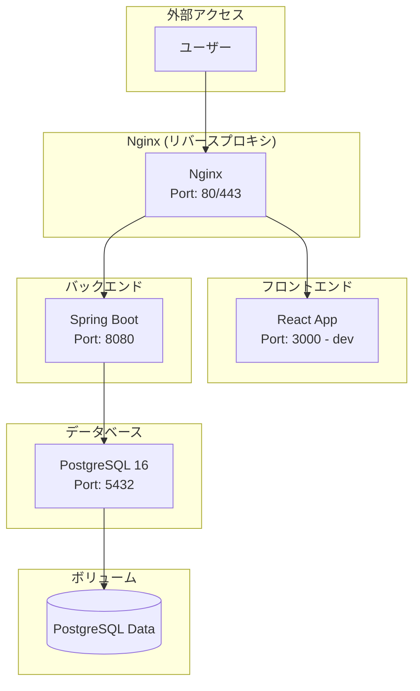
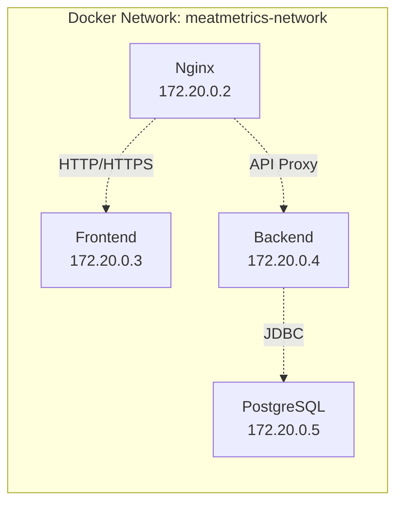
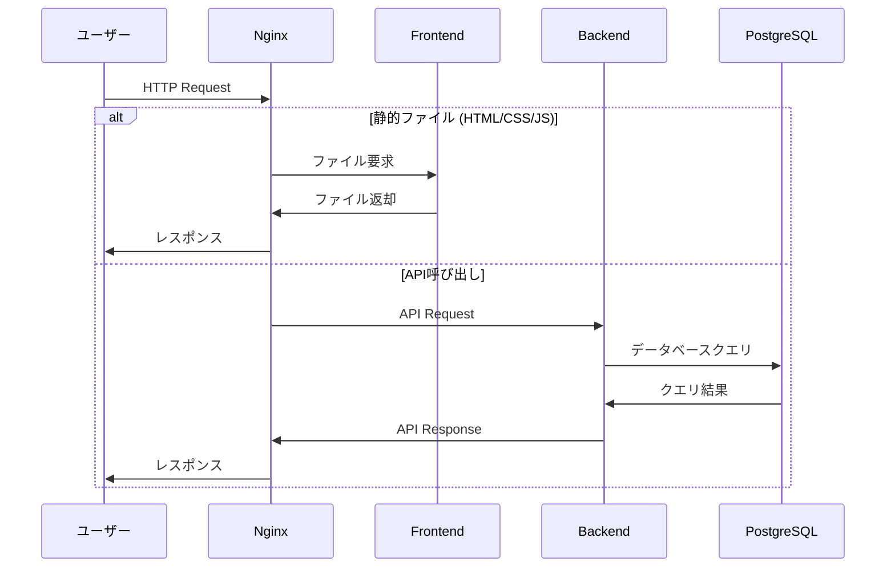

# Docker 環境アーキテクチャ 🐳

## 概要

MeatMetrics プロジェクトの Docker 環境構成について説明します。開発環境と本番環境の両方に対応した、スケーラブルなコンテナ構成を採用しています。

## アーキテクチャ図

### 全体構成

### ネットワーク構成

### データフロー

## コンテナの役割

### 1. Nginx (リバースプロキシ)

**主要な役割:**

- **リバースプロキシ**: フロントエンドとバックエンドの振り分け
- **静的ファイル配信**: React のビルド成果物配信
- **ロードバランシング**: 将来的なスケーラビリティ対応
- **SSL 終端**: HTTPS 通信の処理

**設定内容:**

- ポート 80/443 で外部からのアクセスを受け付け
- `/api/*` → バックエンド（Spring Boot）
- `/` → フロントエンド（React）
- 静的ファイル（CSS、JS、画像）の配信

### 2. Frontend (React)

**開発環境:**

- 開発サーバーとして動作（ポート 3000）
- ホットリロード対応
- ソースコードの変更を即座に反映

**本番環境:**

- ビルド成果物を Nginx に提供
- 最適化された静的ファイル生成

### 3. Backend (Spring Boot)

**主要な役割:**

- RESTful API の提供
- ビジネスロジックの実行
- データベースとの連携

**設定内容:**

- ポート 8080 で API サーバーとして動作
- Nginx からのプロキシリクエストを処理
- データベース接続の管理

### 4. PostgreSQL

**主要な役割:**

- データの永続化
- トランザクション管理
- データ整合性の保証

**設定内容:**

- ポート 5432 でデータベースサーバーとして動作
- Docker ボリュームによるデータ永続化
- 初期化スクリプトによる初期データ投入

## ポート設定

| サービス       | 内部ポート | 外部ポート  | 用途                               |
| -------------- | ---------- | ----------- | ---------------------------------- |
| Frontend (dev) | 5173       | 5173 (dev)  | React 開発サーバー（Vite）         |
| Backend        | 8080       | 8081 (dev)  | Spring Boot API                    |
| PostgreSQL     | 5432       | 15432 (dev) | データベース（開発時のみ外部公開） |
| Nginx          | 80         | 80 (prod)   | リバースプロキシ・静的ファイル配信 |

### 開発環境でのアクセス

- **フロントエンド**: http://localhost:5173
- **バックエンド API**: http://localhost:8081
- **データベース**: localhost:15432（IDE 接続用）

### 注意点

- 開発環境では Nginx は使用せず、各サービスに直接アクセス
- フロントエンドは Vite の開発サーバーでホットリロード対応
- バックエンドは Spring Boot DevTools で自動再起動対応

## ボリューム構成

| ボリューム名      | 用途                       | 永続化対象           |
| ----------------- | -------------------------- | -------------------- |
| `postgres16_data` | PostgreSQL データ          | データベースファイル |
| `backend_logs`    | バックエンドログ           | アプリケーションログ |
| `frontend_build`  | フロントエンドビルド成果物 | 静的ファイル         |

## 環境別の動作

### 開発環境

- **ホットリロード対応**: ソースコード変更の即座反映
- **デバッグ情報の出力**: 詳細なログとデバッグ機能
- **外部ポートの公開**: Frontend: 5173 / Backend: 8081 / PostgreSQL: 15432
- **ボリュームマウント**: ローカルファイルとコンテナの同期

### 本番環境

- 最適化されたビルド
- ログレベルの調整
- セキュリティ設定の強化
- 外部ポートの制限（Nginx:80 のみ公開、PostgreSQL は非公開）

---

**最終更新**: 2025 年 8 月 11 日  
**更新者**: 開発チーム  
**次回更新予定**: 環境構築完了後
